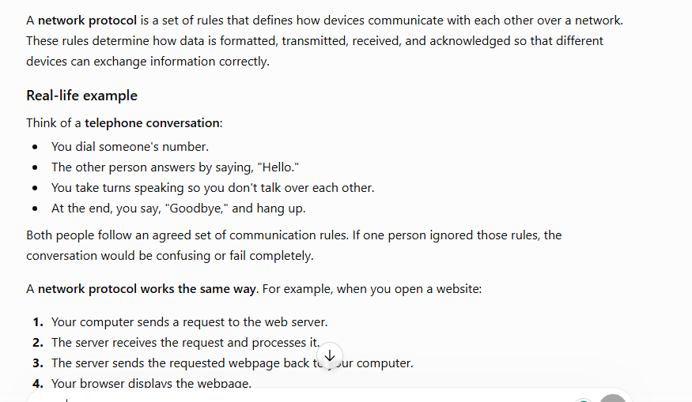
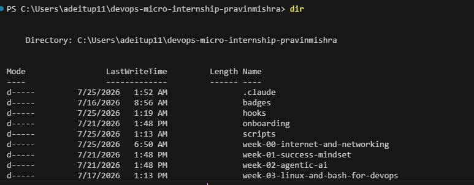

# Week 00 - Internet and Networking

Part of the DevOps Micro Internship (DMI) Cohort 3 with Agentic AI

---

# 🧑‍💻 Task 1: Using ChatGPT as Your Learning Assistant

## Scenario

You're new to DevOps and will frequently encounter technical questions. ChatGPT can be your learning companion.

## Your Task

Write a clear ChatGPT prompt to help you understand:

> "What is a protocol in networking? Explain with a simple real-life example."

Take a screenshot of your interaction showing:

* Your detailed prompt (with clear expectations)
* ChatGPT's simplified response with an example

## Screenshot

Save your screenshot in the `screenshots` folder and update the file name below.




---

## What I Learned (2–3 lines)

A network protocol is like the rules of a conversation—it ensures that devices communicate in an organized, reliable, and understandable way.

---

# 🌐 Task 2: Internet and Networking

## Scenario

Your friend is launching an online bookstore named **EpicReads**.

He asked you to explain how users globally can access his website hosted in Finland.

## Your Task

Write a short explanation (**100–150 words**) that includes:

* Packet Switching
* IP Address
* TCP/IP
* HTTP/HTTPS

💡 **Tip:** You may use ChatGPT (as demonstrated in Task 1) to refine your explanation.

## Answer

A computer network uses packet switching to send data by breaking it into small packets that travel independently and are reassembled at their destination. Every device on the network has a unique IP address, which acts like a home address, ensuring the packets reach the correct destination. The TCP/IP protocol suite manages communication by organizing data into packets, ensuring reliable delivery, and routing them across networks. When you browse the internet, HTTP (Hypertext Transfer Protocol) or HTTPS (Hypertext Transfer Protocol Secure) is used to transfer web pages between your browser and a web server. HTTPS adds encryption to protect sensitive information such as passwords, banking details, and personal data, making online communication secure and trustworthy.

---

# 🏗️ Task 3: Application Architecture & Stack

## Scenario

EpicReads bookstore has two application versions:

### Two-Tier Application

* Frontend
* Database

### Three-Tier Application

* Frontend
* Backend
* Database

## Your Task

* Draw simple diagrams (hand-drawn or tool-based such as draw.io)
* Label each layer clearly
* List at least two common technologies or tools used for each layer
* Submit a screenshot or photo clearly showing your own drawing

## Diagram Screenshot / Photo

Save your diagram image in the `screenshots` folder and update the file name below.


---

## Technologies Used

### Frontend

* HTML, CSS, JavaScript
* React.js, Angular

### Backend

* Node.js with Express.js
* Python with Django or Flask

### Database

* MySQL
* PostgreSQL

---

# 🌍 Task 4: Domain Name & DNS (Basic Concepts)

## Scenario

Your friend's bookstore **EpicReads** is currently accessible through:

```text
52.172.142.222:3000
```

He purchased the domain:

```text
epicreads.com
```

## Your Task

In **50–100 words**, explain in your own words:

1. What is DNS (Domain Name System)?
2. Which DNS record type should be used to connect the domain to the given IP, and why?

## Answer

The Domain Name System (DNS) is like the internet's phonebook. It translates a human-friendly domain name, such as epicreads.com, into an IP address that computers use to locate a website. To connect epicreads.com to 52.172.142.222, you should use an A (Address) record because it maps a domain name directly to an IPv4 address. This allows users to access the website by typing the domain name instead of remembering the numeric IP address.

---

# 💻 Task 5: Visual Studio Code Setup (Hands-on)

## Your Task

Install Visual Studio Code (if not already installed).

Take a screenshot of your VS Code environment showing:

* Terminal open inside VS Code
* Running a basic command:

### Windows

```powershell
dir
```

### Linux / macOS

```bash
pwd
ls
```

* Your selected VS Code theme clearly visible

⚠️ **Important:** The screenshot must show your username or another identifiable detail to confirm it is your environment.

## Screenshot

Save your screenshot in the `screenshots` folder and update the file name below.




---

# 🔗 Task 6: Publish Your Assignment as a LinkedIn Post

## Objective

Publishing on LinkedIn helps you:

* Build your professional online presence
* Reinforce your learning
* Document your DevOps journey publicly

## Your Task

Summarize your answers from Tasks 1–5 into a LinkedIn post.

Clearly structure your post into the following sections:

* ChatGPT
* Internet & Networking
* App Architecture
* DNS
* VS Code Setup

Add the following credit note at the end of your post:

> **P.S. This post is part of the DevOps Micro Internship (DMI) with Agentic AI — Cohort 3 — by Pravin Mishra. My graded progress is public: https://dmi.pravinmishra.com/s/YOUR-GITHUB-USERNAME.html · Start your DevOps journey: https://dmi.pravinmishra.com/?utm_source=student&utm_medium=ps-linkedin&utm_campaign=cohort3**

---

## LinkedIn Post URL

Paste your LinkedIn post URL here:

https://www.linkedin.com/posts/adepoju-adekunle-43217aa4_devops-cloudcomputing-networking-share-7486751974521024512-K14L/?utm_source=share&utm_medium=member_desktop&rcm=ACoAABYYCOYB1CQ-AKDgCJ7ecCiAgMVI9f2fFws


---

## LinkedIn Post Backup Copy

Paste the full text of your LinkedIn post here:

🚀 DevOps Micro Internship (DMI) Cohort 3 – Week 00: Internet & Networking Fundamentals

I completed Week 00 of my DevOps learning journey, focusing on the core concepts that power modern applications and cloud environments.

🤖 ChatGPT
I explored how to use ChatGPT as a learning assistant by creating effective prompts to understand technical concepts. I learned that clear prompts help generate simpler explanations with real-world examples, making complex topics easier to understand.

🌐 Internet & Networking
I learned how the internet enables global communication through key networking concepts:
Packet Switching breaks data into smaller packets that travel across networks and are reassembled at the destination.
IP Addresses identify devices and ensure data reaches the correct location.
TCP/IP provides the foundation for reliable communication between systems.
HTTP/HTTPS enables browsers and servers to exchange web content securely.

🏗️ Application Architecture
I explored different application architectures using the EpicReads bookstore scenario:
Two-Tier Architecture: Frontend + Database
Three-Tier Architecture: Frontend + Backend + Database
I also learned about common technologies used in each layer:
Frontend: HTML, CSS, JavaScript, React.js, Angular
Backend: Node.js, Express.js, Python Django/Flask
Database: MySQL, PostgreSQL
🌍 DNS (Domain Name System)

I learned how DNS works as the internet’s directory by translating human-readable domain names into IP addresses.
For example, connecting epicreads.com to 52.172.142.222 requires an A Record, which maps a domain name directly to an IPv4 address, allowing users to access websites without remembering complex IP addresses.

💻 VS Code Setup
I configured my Visual Studio Code environment, opened the integrated terminal, executed basic commands, and customized my development workspace.

This week strengthened my understanding of networking fundamentals, application structures, and tools that are essential for a DevOps Engineer.
Looking forward to building more hands-on projects and expanding my DevOps skills. 🚀

P.S. This post is part of the DevOps Micro Internship (DMI) with Agentic AI — Cohort 3 — by Pravin Mishra. My graded progress is public: https://lnkd.in/dmfy69G3 · Start your DevOps journey: https://lnkd.in/dbDhcMP6

#DevOps #CloudComputing #Networking #Azure #Linux #Docker #Kubernetes #LearningJourney #DMI #AgenticAI #SoftwareEngineering

---

# Reflection – Week 0

### What did you find easy?

I found the basic networking concepts such as IP addresses, DNS, HTTP/HTTPS, and application architecture easier to understand because they relate to real-world examples like websites and online stores. Using ChatGPT as a learning assistant also helped me break down complex concepts into simpler explanations.

---

### What was difficult?

The most challenging part was understanding how different layers of networking and application architecture work together behind the scenes. Connecting concepts like packet switching, TCP/IP communication, DNS records, and how users access a globally hosted application required more research and practice.

---

### What will you improve next week?

Next week, I will improve my hands-on technical skills by practicing more with command-line tools, Linux basics, cloud concepts, and DevOps workflows. I will also focus on building a stronger understanding of how infrastructure components communicate in real-world production environments.

---

## 📌 About DMI & CloudAdvisory

DevOps Micro Internship (DMI) is a project-based DevOps program run by Pravin Mishra (The CloudAdvisory) focused on real-world execution, systems thinking, and career readiness.

It helps learners build strong DevOps foundations with hands-on experience.


## 📌 Resources

- 🌐 **DMI Official Website:** https://pravinmishra.com/dmi  
- 🎓 **DevOps for Beginners (Udemy):** https://www.udemy.com/course/devops-for-beginners-docker-k8s-cloud-cicd-4-projects/  
- 🎓 **Ultimate Agentic AI DevOps with Clude Code** https://www.udemy.com/course/ultimate-agentic-ai-devops-with-claude-code/?referralCode=448389767BC96284087B
- 🎓 **DevOps with Claude Code: Terraform, EKS, ArgoCD & Helm** https://www.udemy.com/course/devops-with-claude-code-terraform-eks-argocd-helm/?referralCode=1C5B734505D65A010FA3
- ▶️ **YouTube Playlist (DMI Cohort 3):** https://www.youtube.com/playlist?list=PLFeSNDtI4Cho  
- 🔗 **Pravin Mishra (LinkedIn):** https://www.linkedin.com/in/pravin-mishra-aws-trainer/  
- 🏢 **CloudAdvisory (LinkedIn):** https://www.linkedin.com/company/thecloudadvisory/

---

*This submission is part of DevOps Micro Internship (DMI) Cohort 3 — Agentic AI Track*