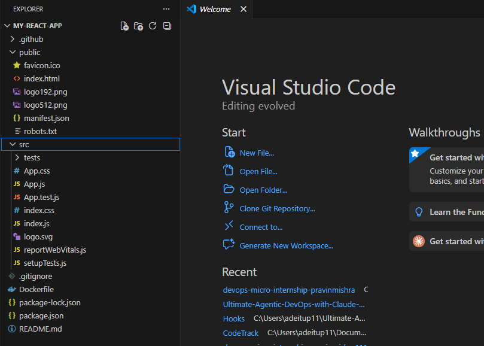
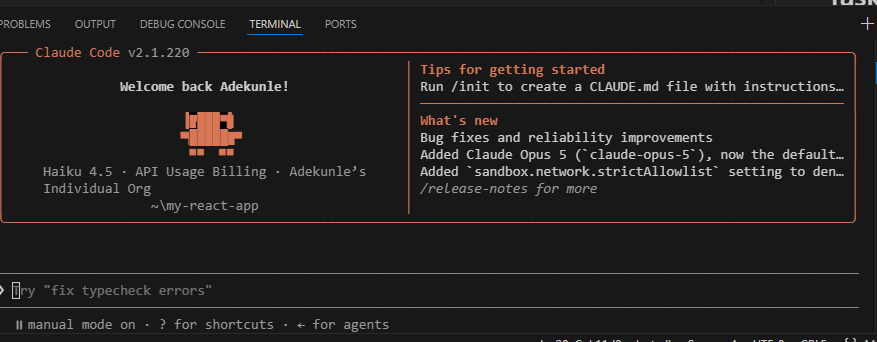

# Assignment 7 — A Claude That Remembers

Part of the DevOps Micro Internship (DMI) Cohort 3 with Agentic AI

---

## Purpose

---

# Task 2 — Give Claude Information to Remember

## Goal

Teach Claude three specific facts about the project and instruct it to save them to the memory file.

### Evidence

#### Screenshot 2 — Claude confirming the memory was saved

---

#### Screenshot 3 — The `MEMORY.md` file open in VS Code showing the saved content

---

# Task 3 — Close the Session Completely

## Goal

Terminate the current Claude Code session and restart it to ensure memory is the only persistent context source.

### Evidence

#### Screenshot 4 — VS Code reopened with a fresh Claude Code session showing no previous conversation

---

# Task 4 — Prove Memory Recall Across Sessions

## Goal

Run three tests that prove Claude remembers what you told it — without you saying it again in the new session.

### Evidence

#### Screenshot 5 — Claude recalling hero section colors

---

#### Screenshot 6 — Claude refusing JavaScript request based on memory rule

---

# Submission Instructions

- Ensure memory was successfully saved into `MEMORY.md`
- Restart Claude Code session completely before testing recall
- Add all required screenshots to your GitHub repository
- Push final changes to your forked repository

---

## Linkedin Post Link

Paste your Linkedin post link here:

https://www.linkedin.com/posts/adepoju-adekunle-43217aa4_dmi-devops-micro-internship-with-agentic-share-7487555591901696001-lELI/?utm_source=share&utm_medium=member_desktop&rcm=ACoAABYYCOYB1CQ-AKDgCJ7ecCiAgMVI9f2fFws

---

## GitHub Repository URL

Paste your forked repository URL here:

https://github.com/adeitup11/my-react-app

---

# Completion Checklist

- [ ] Memory file path identified (Screenshot 1)
- [ ] Memory successfully saved via prompt (Screenshot 2)
- [ ] `MEMORY.md` shows stored content (Screenshot 3)
- [ ] Fresh session opened after full restart (Screenshot 4)
- [ ] Claude recalled hero colors correctly (Screenshot 5)
- [ ] Claude refused JavaScript request based on memory (Screenshot 6)
- [ ] All screenshots added and committed to GitHub repo
- [ ] Linkedin post created.

---

## 📌 About DMI & CloudAdvisory

DevOps Micro Internship (DMI) is a project-based DevOps program run by Pravin Mishra (The CloudAdvisory) focused on real-world execution, systems thinking, and career readiness.

It helps learners build strong DevOps foundations with hands-on experience.

---

## 📌 Resources

- 🌐 DMI Official Website: https://dmi.pravinmishra.com?utm_source=github&utm_medium=readme  
- 🎓 University: https://university.pravinmishra.com?utm_source=github&utm_medium=readme  
- 💬 Discord Community: https://discord.pravinmishra.com?utm_source=github&utm_medium=readme  
- 📝 Blog: https://dmi.pravinmishra.com/blog?utm_source=github&utm_medium=readme  
- ▶️ YouTube Playlist: https://www.youtube.com/playlist?list=PLFeSNDtI4Cho  
- 🔗 Pravin Mishra (LinkedIn): https://www.linkedin.com/in/pravin-mishra-aws-trainer/  
- 🏢 CloudAdvisory (LinkedIn): https://www.linkedin.com/company/thecloudadvisory/

---

*This submission is part of DevOps Micro Internship (DMI) Cohort 3 — Agentic AI Track.*