# Assignment 3 — Production Maintenance Drill (OPS Checklist)

Part of the DevOps Micro Internship (DMI) Cohort 3 with Agentic AI

---

## Purpose

In this assignment, you will treat your already deployed React application (on Ubuntu VM with Nginx) as a live production system. You will perform structured operational checks covering network validation, service health, log analysis, resource monitoring, configuration verification, and incident simulation with recovery — mirroring real on-call DevOps responsibilities.

---

# Task 1 — Server Access & Networking Validation

## Goal

Verify that the deployed React application is reachable from the browser and confirm basic network connectivity of the Ubuntu VM.

### Evidence

#### Screenshot 1 — Browser showing the React app with your Full Name visible on the UI

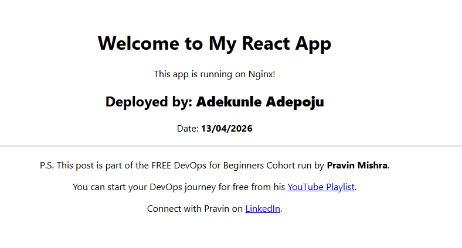

---

#### Screenshot 2 — Output of `ip a`

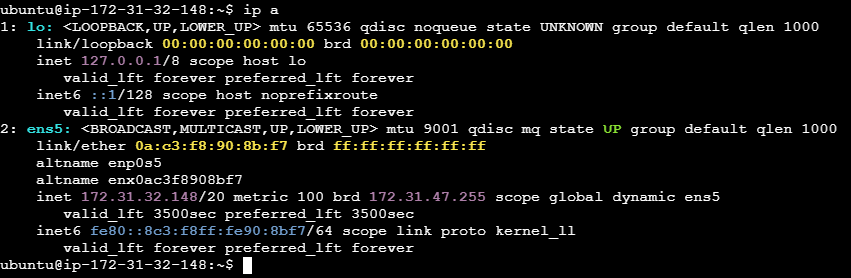

---

#### Screenshot 3 — Output of `sudo ss -tulpen`

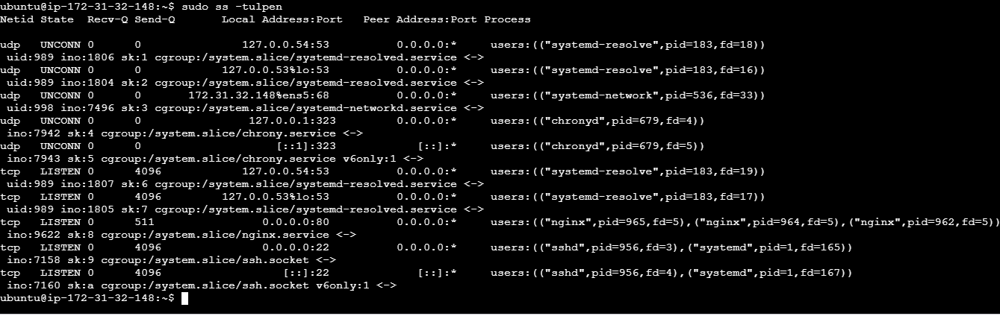

---

#### Screenshot 4 — Output of `sudo ufw status`

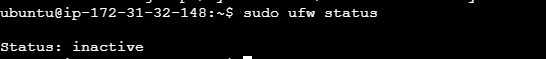

---

### Notes

Answer the following in your own words:

**1. What proves Nginx is listening on 0.0.0.0:80?**

tcp   LISTEN   511   0.0.0.0:80   0.0.0.0:*   users:(("nginx",pid=965,...),("nginx",pid=964,...),("nginx",pid=962,...))

This confirms that the nginx process is actively listening for HTTP connections on port 80.

---

**2. What proves SSH is active on port 22?**

tcp   LISTEN   4096   0.0.0.0:22   0.0.0.0:*   users:(("sshd",pid=956,...))

and

tcp   LISTEN   4096   [::]:22   [::]:*   users:(("sshd",pid=956,...))

These lines show that SSH is accepting both IPv4 and IPv6 connections on port 22.
---

**3. Did you find any unexpected open ports? Explain briefly.**

No. The open ports shown are expected for this server:

80/TCP – Nginx web server
22/TCP – SSH remote administration
53/TCP/UDP – systemd-resolved for local DNS resolution
68/UDP – DHCP client (systemd-networkd)
123/UDP – NTP service (chronyd) for time synchronization

---

# Task 2 — Service Health & Systemd Validation (Nginx)

## Goal

Verify that Nginx is properly installed, running, enabled at boot, and safely configured.

### Evidence

#### Screenshot 1 — Output of `systemctl status nginx --no-pager`

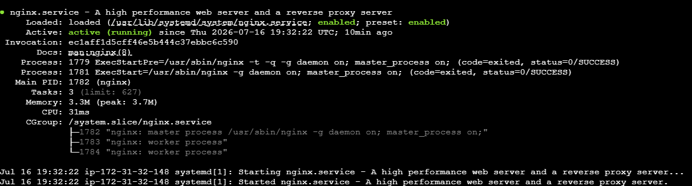

---

#### Screenshot 2 — Output of `sudo nginx -t`

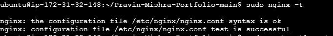

---

#### Screenshot 3 — Output of `sudo ss -lptn '( sport = :80 )'`

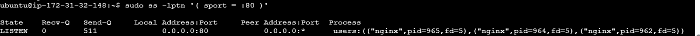

---

### Notes

Answer the following in your own words:

**1. What happens if Nginx fails to restart in production?**

If Nginx fails to restart, the website or application may become unavailable, causing users to receive errors such as 502 Bad Gateway, 503 Service Unavailable, or connection failures. This can disrupt business operations, so the issue should be investigated immediately by checking the Nginx configuration, logs, and service status before attempting another restart.

**2. What's your basic rollback plan?**

If the restart fails after making changes, I would restore the previous working Nginx configuration from a backup or version control, validate it using nginx -t, and restart the service. After confirming that the website is working normally, I would investigate the failed changes, fix the root cause in a test environment, and only redeploy after successful validation.

---

# Task 3 — Logs & Request Trace

## Goal

Verify real traffic flow and analyze logs to understand system behavior and errors.

### Evidence

#### Screenshot 1 — Output of `sudo tail -n 30 /var/log/nginx/access.log`

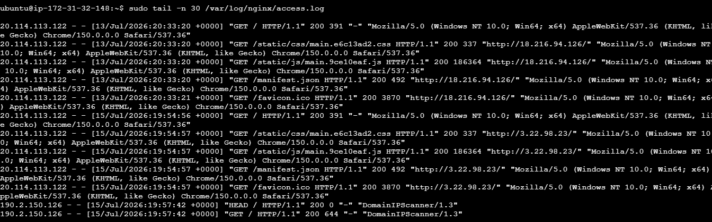

---

#### Screenshot 2 — Output of `sudo tail -n 30 /var/log/nginx/error.log`

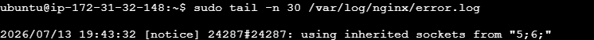

---

#### Screenshot 3 — Output of `sudo journalctl -u nginx --no-pager -n 50`

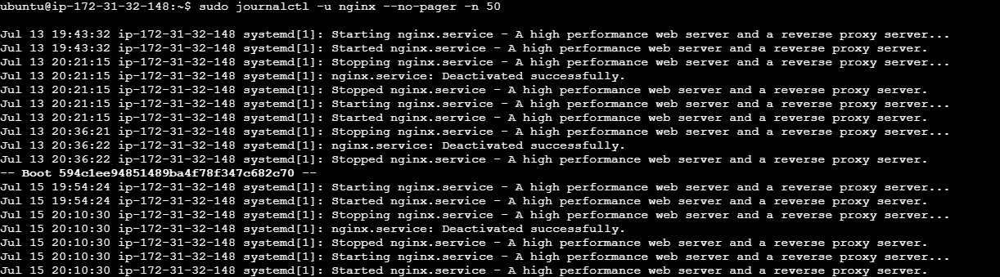

---

### Notes

Answer the following in your own words:

**1. Were there any errors in the logs?**

- If yes, mention 1–2 example error lines from the logs and explain what each one means in simple terms.
- If no, explain what it means if the error log is empty or shows no recent errors during your check.

No, I did not find any errors in the logs.

The error.log only contains a notice:

[notice] ... using inherited sockets from "5;6;"

This is an informational message indicating that Nginx reused existing sockets during a restart or reload. It is not an error and does not indicate a problem.

The journalctl -u nginx output also shows normal service events such as:

Starting nginx.service...
Started nginx.service...
Stopping nginx.service...
Stopped nginx.service...

These messages indicate that Nginx started and stopped successfully without any failures.

---

**2. If there were no errors, what does that indicate about the system?**

An empty error log or one with no recent errors generally means Nginx is operating normally and no issues have been detected during the period you checked. It suggests that the server started successfully and there were no configuration errors or runtime failures recorded.

---

**3. Based on the access logs, were your curl requests visible in the log entries? What does that prove about traffic flow?**

Yes, the curl requests were visible in the access logs. This proves that client requests successfully reached the Nginx server, were processed correctly, and were recorded in the access log. It confirms that network connectivity, Nginx, and HTTP traffic flow are working properly end to end.

# Task 4 — System Resource Health Check (Capacity Red Flags)

## Goal

Assess server capacity and detect potential performance or failure risks.

### Evidence

#### Screenshot 1 — Output of `uptime`

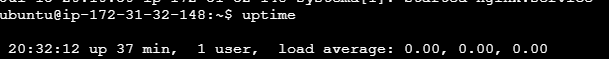

---

#### Screenshot 2 — Output of `free -h`

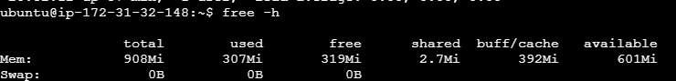

---

#### Screenshot 3 — Output of `df -h`

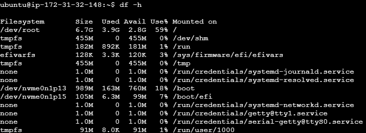

---

#### Screenshot 4 — Output of `sudo du -sh /var/* | sort -h`

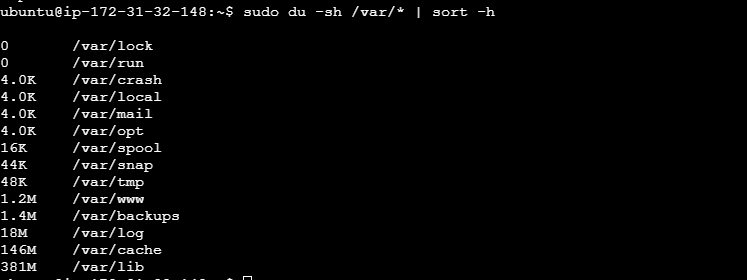

---

### Notes

Answer the following in your own words:

**1. Which resource looks most critical right now? (CPU/load, memory, or disk) Explain why.**

Based on the output shown, disk usage is the resource that stands out because the command displays how much space is being used under /var. The largest directories are:

/var/lib – 381 MB
/var/cache – 146 MB
/var/log – 18 MB

There is no information about CPU or memory usage in this output, so they cannot be evaluated. At this point, disk usage does not appear to be critical because the directories are using a relatively small amount of space and there are no signs that the filesystem is close to being full.

---

**2. What happens if disk becomes 100% full in a production server?**

If the disk reaches 100% capacity, the server may no longer be able to write log files, create temporary files, or save application data. Services such as Nginx, databases, and other applications may fail or become unstable, users may experience errors, and updates or backups may also fail. Monitoring disk usage and cleaning up unnecessary files before the disk becomes full helps prevent service outages.

---

# Task 5 — Configuration & Deployment Verification

## Goal

Ensure the correct React build is deployed and Nginx is serving it properly.

### Evidence

#### Screenshot 1 — Output of `ls -lah /var/www/html | head -n 20`

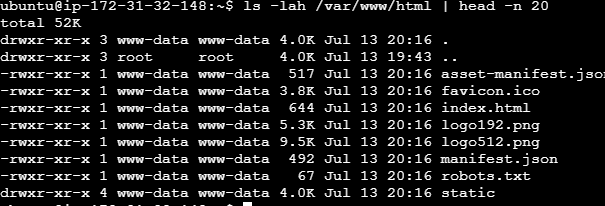

---

#### Screenshot 2 — Output of `grep -R "Deployed by" -n /var/www/html 2>/dev/null | head`

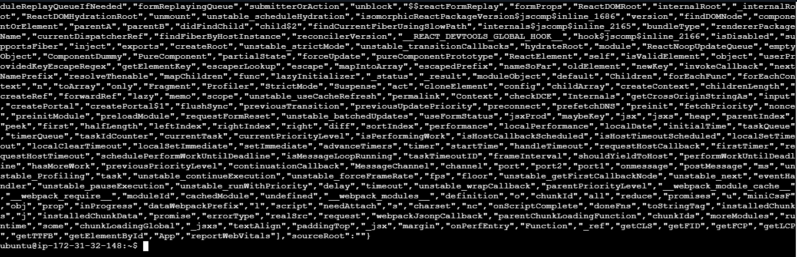

---

#### Screenshot 3 — Output of `grep -n "try_files" /etc/nginx/sites-available/default`

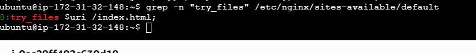

---

### Notes

Answer the following in your own words:

**1. How do you confirm that the correct version of the application is deployed?**

I confirm the correct version is deployed by verifying that Nginx is serving the expected application files. In this case:

The Nginx configuration shows:

try_files $uri /index.html;

which confirms that requests are being served from the application's index.html file.

I then inspect the deployed files (such as index.html and the generated JavaScript bundles) in the web root and verify they match the expected build version or release artifacts.
Finally, I access the application in a browser or with curl to ensure the latest changes are being served. If version information is available (for example, in the page footer, API endpoint, or build metadata), I compare it with the expected release version.

Together, these checks confirm that the intended version of the application has been successfully deployed and is being served by Nginx.

---

# Task 6 — Nginx Configuration Failure Simulation

## Goal

Simulate a real-world Nginx misconfiguration and recover the service safely.

### Evidence

#### Screenshot 1 — Output of `sudo nginx -t` showing the syntax error (broken config)

---

#### Screenshot 2 — Output of `sudo nginx -t` showing syntax ok (fixed config)

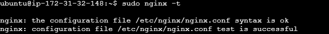

---

#### Screenshot 3 — Output of `curl -I http://<public-ip>` confirming recovery (200 OK)

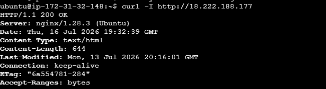

---

### Notes

Answer the following in your own words:

**1. What caused the configuration failure?**

The configuration failure was caused by an incorrect or invalid Nginx configuration. This can happen due to a syntax error, an incorrect directive, a missing file, or an invalid path in the configuration file. When Nginx checks the configuration, it fails validation and refuses to reload or restart to prevent a broken configuration from affecting the web server.
---

**2. How did you fix the issue?**

I identified the problem by running nginx -t, which checks the configuration and reports any errors. After reviewing the error message, I corrected the invalid configuration, saved the changes, and ran nginx -t again to verify the configuration was valid. Once the test passed successfully, I reloaded or restarted the Nginx service and confirmed the application was accessible.

---

**3. How can you avoid this kind of issue in real production systems?**

To avoid configuration issues in production, I would validate every configuration change with nginx -t before deploying it. I would also use version control, peer reviews, and test changes in a staging environment before applying them to production. Automating configuration validation through CI/CD pipelines and maintaining backups of working configurations also helps reduce the risk of downtime and enables quick rollback if needed.
---

# Task 7 — Web Application Failure Simulation

## Goal

Simulate missing deployment content and recover the application safely.

### Evidence

#### Screenshot 1 — Output of `curl -I http://<public-ip>` showing failure (non-200 response)

---

#### Screenshot 2 — Output of `curl -I http://<public-ip>` confirming recovery (200 OK)

---

### Notes

Answer the following in your own words:

**1. What caused the application to break in this scenario?**

The application stopped working because the web server or application configuration became invalid or the application files were not being served correctly. As a result, users could not access the application until the issue was identified and corrected.
---

**2. How did you fix the issue and restore the application?**

The application stopped working because the web server or application configuration became invalid or the application files were not being served correctly. As a result, users could not access the application until the issue was identified and corrected.
---

**3. What steps would you take to prevent this kind of issue in real production systems?**

To prevent similar issues, I would validate all configuration changes with nginx -t before deployment, test changes in a staging environment, and use version control and CI/CD pipelines to automate configuration validation. I would also maintain backups of known-good configurations, implement monitoring and alerts to detect failures quickly, and have a documented rollback procedure to restore service rapidly if a deployment causes problems.

---

# Task 8 — Security & Reliability Review

## Goal

Review and reflect on the security and reliability practices applied during this assignment.

### Security & Reliability Notes

Answer the following in your own words:

**1. Why is SSH key-based authentication more secure than sharing passwords?**

SSH key-based authentication is more secure because it uses a pair of cryptographic keys instead of a password. Private keys are much harder to guess or crack than passwords and are not transmitted over the network during authentication. This greatly reduces the risk of brute-force attacks and unauthorized access.

---

**2. Why should only required ports be open on a production server?**

Only the ports needed for the server's services should be open to minimize the attack surface. Closing unnecessary ports reduces the risk of attackers exploiting unused services and helps improve the overall security of the server.
---

**3. Why is it important for Nginx to be enabled on boot?**

Enabling Nginx on boot ensures the web server starts automatically whenever the server restarts. This helps maintain application availability, reduces downtime, and eliminates the need for manual intervention after a reboot.
---

**4. What are the risks of sharing secrets, keys, or credentials publicly?**

Sharing secrets, API keys, passwords, or private SSH keys publicly can allow unauthorized users to access systems, steal sensitive data, modify resources, or incur unexpected cloud costs. Credentials should always be stored securely using tools such as a secrets manager or key vault and never committed to public repositories.
---

**5. Why should cloud resources be stopped or terminated when they are no longer needed?**

Stopping or terminating unused cloud resources helps reduce unnecessary costs, improves security by removing unused systems that could become attack targets, and keeps the cloud environment organized. Regularly cleaning up unused resources is a cloud best practice for both cost management and operational efficiency.

---

# LinkedIn Post (Required)

## Evidence

#### LinkedIn Post URL

Paste your LinkedIn post URL here:

`https://www.linkedin.com/posts/adepoju-adekunle-43217aa4_cloudcomputing-linux-devops-share-7483619877761626112-VHlw/?utm_source=share&utm_medium=member_desktop&rcm=ACoAABYYCOYB1CQ-AKDgCJ7ecCiAgMVI9f2fFws`

---

#### Screenshot — Published LinkedIn post

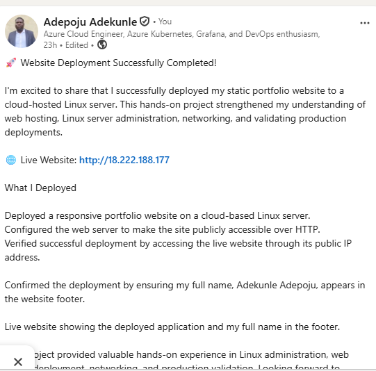

---

# Submission Instructions

- Add all required screenshots in your submission
- Full name must be visible in required screenshots
- Do not expose sensitive information (keys, passwords, account IDs)

---

# Completion Checklist

- [ ] Task 1: Screenshots (browser, ip a, ss -tulpen, ufw status) + Notes answered
- [ ] Task 2: Screenshots (nginx status, nginx -t, ss port 80) + Notes answered
- [ ] Task 3: Screenshots (access log, error log, journalctl) + Notes answered
- [ ] Task 4: Screenshots (uptime, free -h, df -h, du -sh) + Notes answered
- [ ] Task 5: Screenshots (ls html, grep deployed by, grep try_files) + Notes answered
- [ ] Task 6: Screenshots (nginx -t fail, nginx -t pass, curl recovery) + Notes answered
- [ ] Task 7: Screenshots (curl failure, curl recovery) + Notes answered
- [ ] Task 8: Security & Reliability Notes answered
- [ ] LinkedIn post published and URL submitted
- [ ] Full Name visible in all required screenshots
- [ ] No sensitive data exposed

---

## 📌 About DMI & CloudAdvisory

DevOps Micro Internship (DMI) is a project-based DevOps program run by Pravin Mishra (The CloudAdvisory) focused on real-world execution, systems thinking, and career readiness.

It helps learners build strong DevOps foundations with hands-on experience.

---

## 📌 Resources

- 🌐 DMI Official Website: https://pravinmishra.com/dmi  
- 🎓 DevOps for Beginners (Udemy): https://www.udemy.com/course/devops-for-beginners-docker-k8s-cloud-cicd-4-projects/  
- 🎓 Agentic AI DevOps with Claude Code: https://www.udemy.com/course/ultimate-agentic-ai-devops-with-claude-code/  
- 🎓 DevOps with Claude Code: Terraform, EKS, ArgoCD & Helm: https://www.udemy.com/course/devops-with-claude-code-terraform-eks-argocd-helm/  
- ▶️ YouTube Playlist: https://www.youtube.com/playlist?list=PLFeSNDtI4Cho  
- 🔗 Pravin Mishra (LinkedIn): https://www.linkedin.com/in/pravin-mishra-aws-trainer/  
- 🏢 CloudAdvisory (LinkedIn): https://www.linkedin.com/company/thecloudadvisory/

---

*This submission is part of DevOps Micro Internship (DMI) Cohort 3 — Agentic AI Track.*