# Assignment 5 — Bash Script Automation Drill (OPS Checklist)

Part of the DevOps Micro Internship (DMI) Cohort 3 with Agentic AI

---

## Purpose

In this assignment, you will practice Bash scripting by building a series of small automation scripts covering environment setup, variables, arrays, loops, file conditionals, if-else logic, and functions. These scripts form the foundation of real-world Linux automation used in DevOps, cloud, and production support environments.

---

# Task 1 — Bash Environment & Workspace Setup

## Goal

Verify that Bash is available on your system and create a clean workspace for this assignment.

### Evidence

#### Screenshot 1 — Output of `echo $SHELL` and `bash --version`

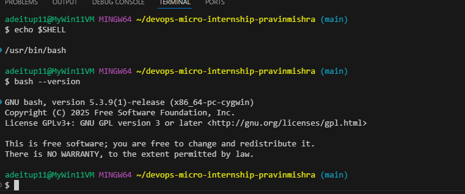

---

#### Screenshot 2 — Output of `pwd` and `ls -lah` showing the scripts directory

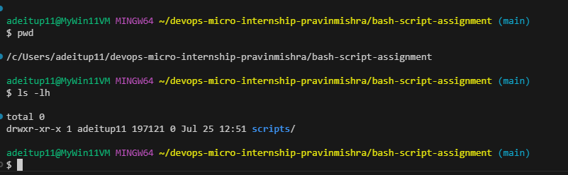

---

### Notes

Answer the following in your own words:

**1. What is Bash?**

Bash (Bourne Again Shell) is a command-line shell and scripting language used to interact with Linux and Unix operating systems. It allows users to execute commands, automate repetitive tasks with scripts, and manage files, processes, and system operations efficiently.

---

**2. What is the difference between shell and Bash?**

A shell is a program that provides an interface between the user and the operating system, allowing users to run commands. Bash is a specific type of shell and is one of the most widely used shells on Linux systems. In other words, all Bash programs are shells, but not all shells are Bash (examples include sh, zsh, and fish).

---

**3. Why is it important to confirm the Bash version before writing scripts?**

It is important to confirm the Bash version because different versions support different features and syntax. A script written for a newer version of Bash may not work correctly on an older version, leading to errors or unexpected behavior. Checking the version helps ensure your script is compatible with the target system.

---

# Task 2 — Your First Bash Script

## Goal

Create your first Bash script, make it executable, and run it from the terminal.

### Evidence

#### Screenshot 1 — Content of `first-script.sh`

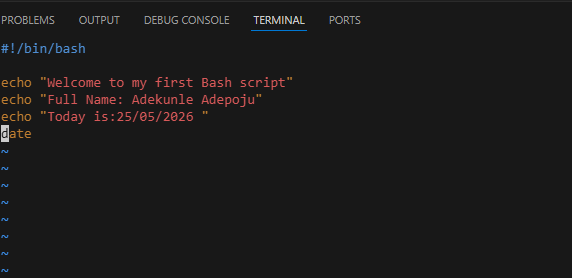
---

#### Screenshot 2 — Output of `./first-script.sh`

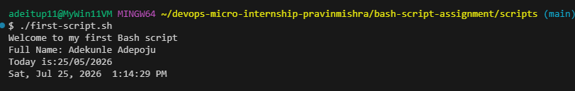

---

#### Screenshot 3 — Output of `ls -l first-script.sh` showing executable permission

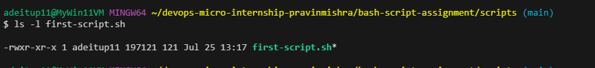
---

### Notes

Answer the following in your own words:

**1. What is the purpose of `#!/bin/bash`?**

The #!/bin/bash line, called a shebang, tells the operating system to use the Bash shell to execute the script. This ensures the script runs with Bash, even if the user's default shell is different.

---

**2. Why do we use `chmod +x` before running a script?**

The chmod +x command gives a script execute permission, allowing it to be run as a program. Without this permission, the operating system will not let you execute the script directly.

---

**3. What is the difference between running a script using `./script.sh` and `bash script.sh`?**

Running ./script.sh executes the script directly and requires the script to have execute permission (chmod +x) and a valid shebang (#!/bin/bash). Running bash script.sh starts the Bash interpreter and passes the script to it, so the script does not need execute permission or a shebang, as long as Bash is installed.

---

# Task 3 — Variables: User Information Script

## Goal

Use variables to store and display user-related information.

### Evidence

#### Screenshot 1 — Content of `user-info.sh`

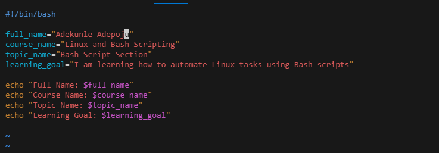

---

#### Screenshot 2 — Output of `./user-info.sh`

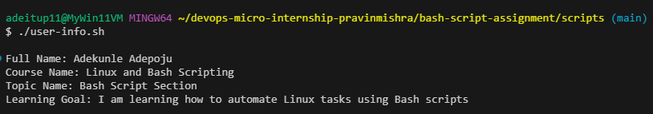

---

### Notes

Answer the following in your own words:

**1. What is a variable in Bash?**

A variable in Bash is a named container used to store information such as text, numbers, or command results. Variables allow scripts to save and reuse values during execution, making scripts more flexible and easier to maintain.

---

**2. Why should we avoid spaces around the `=` sign when creating variables?**

In Bash, spaces around the = sign are not allowed when assigning a value because Bash interprets the command differently. For example, name=John creates a variable, but name = John is treated as a command and will cause an error.

---

**3. How do you access the value stored inside a Bash variable?**

You access the value of a Bash variable by placing a $ symbol before the variable name. For example, if the variable is name=John, you can display its value using echo $name.

---

# Task 4 — Arrays & Loops: Tools Checklist Script

## Goal

Use arrays and loops to print a checklist of tools used in Bash scripting.

### Evidence

#### Screenshot 1 — Content of `tools-checklist.sh`

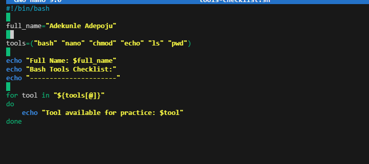

---

#### Screenshot 2 — Output of `./tools-checklist.sh`

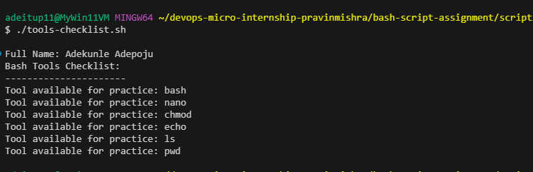
---

### Notes

Answer the following in your own words:

**1. What is an array in Bash?**

An array in Bash is a variable that can store multiple values under a single name. Each value in the array has an index, allowing scripts to store and access a collection of related data easily.

---

**2. Why are arrays useful in scripts?**

Arrays are useful because they allow scripts to manage multiple values efficiently without creating separate variables for each item. They are commonly used for storing lists of files, users, servers, tools, or other data that needs to be processed together.

---

**3. What does `"${tools[@]}"` mean?**

"${tools[@]}" is used to access all elements stored in the Bash array named tools. The @ symbol represents all items in the array, and the quotes preserve each element as a separate value, especially when values contain spaces.

---

**4. What is the purpose of the `for` loop in this script?**

The for loop is used to repeatedly execute a set of commands for each item in the array. In this script, it allows the program to go through each value in the tools array and perform an action on each one individually.

---

# Task 5 — Loops: Number Counter Script

## Goal

Use loops to repeat a task multiple times.

### Evidence

#### Screenshot 1 — Content of `counter.sh`

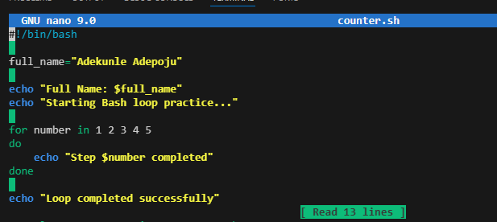
---

#### Screenshot 2 — Output of `./counter.sh`

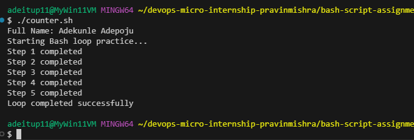

---

### Notes

Answer the following in your own words:

**1. What is a loop?**

A loop is a programming structure that repeatedly executes a set of commands until a specific condition is met or a defined number of repetitions is completed.

---

**2. Why do we use loops in Bash scripting?**

We use loops in Bash scripting to automate repetitive tasks, reduce the amount of code we write, and efficiently process multiple items such as files, users, or commands.

---

**3. How many times did the loop run in your script?**

The loop ran based on the number of items or iterations defined in the script. For example, if the script used a list of 5 items, the loop would run 5 times.

---

**4. What would you change if you wanted the loop to run 10 times?**

I would change the loop condition or the range of values so that it includes 10 iterations.

---

# Task 6 — Files & Conditionals: File Validation Script

## Goal

Use file checks and conditionals to verify whether files and directories exist.

### Evidence

#### Screenshot 1 — Output of `ls -lah ../test-folder`

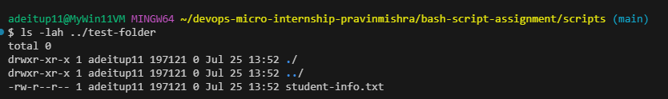

---

#### Screenshot 2 — Content of `file-check.sh`

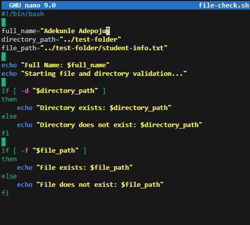

---

#### Screenshot 3 — Output of `./file-check.sh`

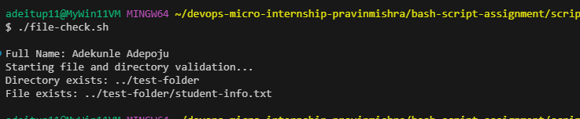

---

### Notes

Answer the following in your own words:

**1. What does `-d` check in Bash?**

The -d option checks whether a specified path exists and is a directory. It is commonly used in if statements to verify that a folder is available before performing operations on it.

---

**2. What does `-f` check in Bash?**

The -f option checks whether a specified path exists and is a regular file. It helps scripts confirm that a file is present before trying to read, modify, or process it.

---

**3. Why should file and directory paths be stored in variables?**

Storing file and directory paths in variables makes scripts easier to read, maintain, and update. If the path changes, you only need to modify the variable instead of changing it in multiple places throughout the script.

---

**4. What happens if the file does not exist?**

If the file does not exist, the -f check returns false, and the script can handle the situation using an else statement or display an appropriate message instead of failing unexpectedly.

---

# Task 7 — Conditionals: Pass or Retry Script

## Goal

Use if-else conditionals to make decisions based on a variable value.

### Evidence

#### Screenshot 1 — Content of `score-check.sh` with `score=85`

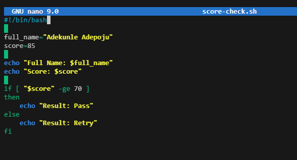

---

#### Screenshot 2 — Output showing `Result: Pass`

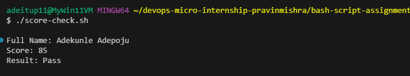

---

#### Screenshot 3 — Content of `score-check.sh` with `score=55`

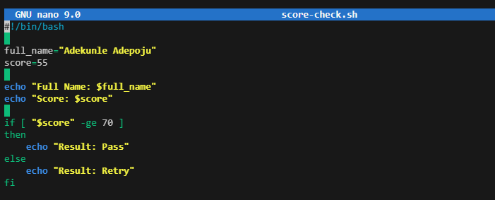

---

#### Screenshot 4 — Output showing `Result: Retry`

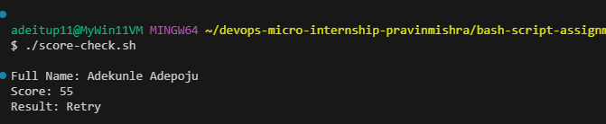

---

### Notes

Answer the following in your own words:

**1. What is the purpose of if-else in Bash?**

The if-else statement in Bash is used to make decisions in a script. It allows the script to execute one set of commands when a condition is true and another set of commands when the condition is false.

---

**2. What does `-ge` mean?**

-ge means "greater than or equal to". It is a Bash comparison operator used to compare two numeric values and check whether the first value is greater than or equal to the second value.

---

**3. Why should conditions be tested with different values?**

Conditions should be tested with different values to make sure the script works correctly in different situations. Testing helps find errors and confirms that the script handles both expected and unexpected inputs properly.

---

**4. How can conditionals help in automation scripts?**

Conditionals help automation scripts make decisions automatically. They allow scripts to check situations before taking action, such as verifying if a file exists, checking system health, restarting services, or continuing with a deployment only when requirements are met.

---

# Task 8 — Functions: Final Bash Automation Script

## Goal

Create a final Bash script using functions to organize reusable code.

### Evidence

#### Screenshot 1 — Content of `final-automation.sh`

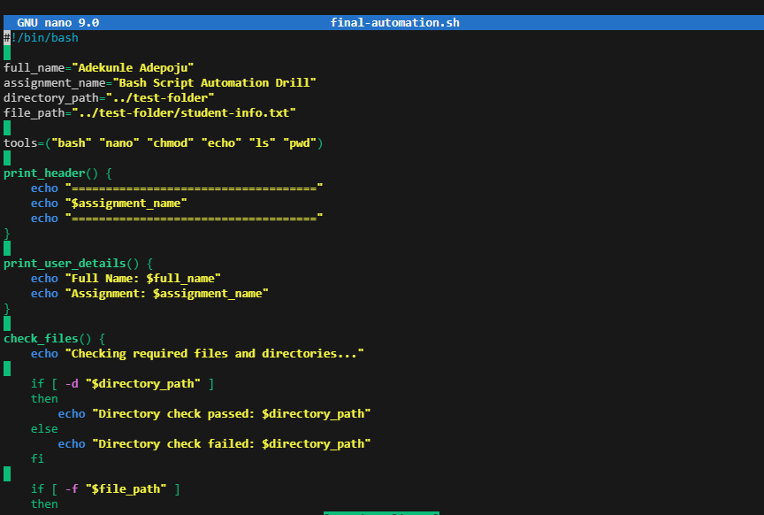

---

#### Screenshot 2 — Output of `./final-automation.sh`

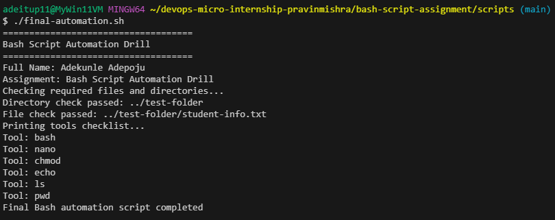

---

#### Screenshot 3 — Output of `ls -lah` showing all created scripts

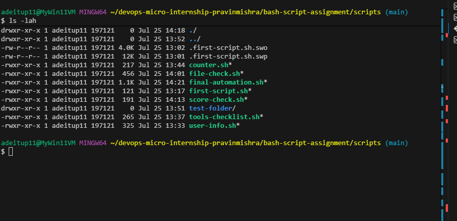

---

### Notes

Answer the following in your own words:

**1. What is a function in Bash?**

A function in Bash is a reusable block of code that performs a specific task. It allows you to group commands together and run them whenever needed by calling the function name.

---

**2. Why are functions useful in scripts?**

Functions make scripts easier to organize, read, and maintain. They help avoid repeating the same code multiple times and allow complex scripts to be divided into smaller, manageable sections.

---

**3. Which functions did you create in this script?**

The functions created in this script were used to perform specific tasks such as checking files or directories, displaying information, and handling different script operations.

---

**4. How does this final script combine variables, arrays, loops, conditionals, files, and functions?**

The final script combines different Bash features to automate tasks efficiently. Variables store values, arrays hold multiple items, loops process repeated tasks, conditionals make decisions, file checks verify the existence of files or directories, and functions organize reusable sections of code. Together, these features create a structured and automated script that is easier to manage and execute.

---

# LinkedIn Post (Required)

## Evidence

#### LinkedIn Post URL

Paste your LinkedIn post URL here:

https://www.linkedin.com/posts/adepoju-adekunle-43217aa4_devops-bash-linux-share-7486866578756546560-PAnD/?utm_source=share&utm_medium=member_desktop&rcm=ACoAABYYCOYB1CQ-AKDgCJ7ecCiAgMVI9f2fFws

---

#### Screenshot — Published LinkedIn post

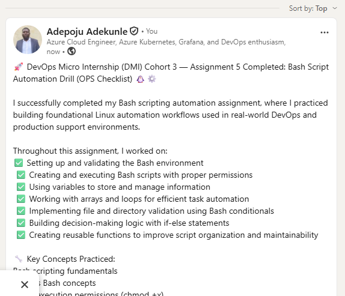

---

# Submission Instructions

- Add all required screenshots in your submission
- Full name must be visible in required screenshots
- All script files must be created and run successfully
- Required notes must be answered clearly for every task
- Do not expose sensitive information (keys, passwords, credentials)

---

# Completion Checklist

- [ ] Task 1: Environment setup verified, workspace created (Screenshots 1–2, Notes answered)
- [ ] Task 2: First script created, executed, permissions verified (Screenshots 1–3, Notes answered)
- [ ] Task 3: Variables script created and run (Screenshots 1–2, Notes answered)
- [ ] Task 4: Arrays and loops script created and run (Screenshots 1–2, Notes answered)
- [ ] Task 5: Counter loop script created and run (Screenshots 1–2, Notes answered)
- [ ] Task 6: File validation script created and run (Screenshots 1–3, Notes answered)
- [ ] Task 7: Pass/Retry conditional script tested with both values (Screenshots 1–4, Notes answered)
- [ ] Task 8: Final automation script created and run (Screenshots 1–3, Notes answered)
- [ ] All scripts run without errors
- [ ] Full Name visible in all required screenshots
- [ ] LinkedIn post published and URL submitted
- [ ] No sensitive data exposed

---

## 📌 About DMI & CloudAdvisory

DevOps Micro Internship (DMI) is a project-based DevOps program run by Pravin Mishra (The CloudAdvisory) focused on real-world execution, systems thinking, and career readiness.

It helps learners build strong DevOps foundations with hands-on experience.

---

## 📌 Resources

- 🌐 DMI Official Website: https://dmi.pravinmishra.com?utm_source=github&utm_medium=readme  
- 🎓 University: https://university.pravinmishra.com?utm_source=github&utm_medium=readme  
- 💬 Discord Community: https://discord.pravinmishra.com?utm_source=github&utm_medium=readme  
- 📝 Blog: https://dmi.pravinmishra.com/blog?utm_source=github&utm_medium=readme  
- ▶️ YouTube Playlist: https://www.youtube.com/playlist?list=PLFeSNDtI4Cho  
- 🔗 Pravin Mishra (LinkedIn): https://www.linkedin.com/in/pravin-mishra-aws-trainer/  
- 🏢 CloudAdvisory (LinkedIn): https://www.linkedin.com/company/thecloudadvisory/

---

*This submission is part of DevOps Micro Internship (DMI) Cohort 3 — Agentic AI Track.*