# Assignment 6 — Build an AI-Assisted Linux Health Check (AI-Assisted Linux Incident Triage)

Part of the DevOps Micro Internship (DMI) Cohort 3 with Agentic AI

---

## Purpose

In this assignment, you will build a read-only Bash triage script that checks the health of your Ubuntu server and Nginx application, connect it to Claude Code as a reusable `/linux-triage` skill, simulate a controlled Nginx incident, use the skill to gather and analyze evidence, recover the service manually, and verify recovery. The workflow follows the Agentic Loop: Gather → Analyze → Human Act → Verify.

---

# Task 1 — Confirm the Healthy Baseline and Create the Workspace

## Goal

Confirm that Nginx and the React application are healthy before building the automation.

### Evidence

#### Screenshot 1 — Output of `systemctl is-active nginx`, `ss -ltn | grep ':80'`, and `curl -I http://localhost`

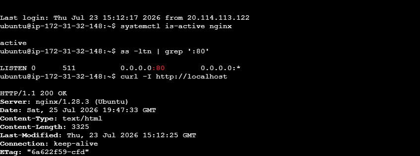

---

#### Screenshot 2 — Output of `pwd` and `find . -maxdepth 4 -type d | sort` showing the workspace folder structure

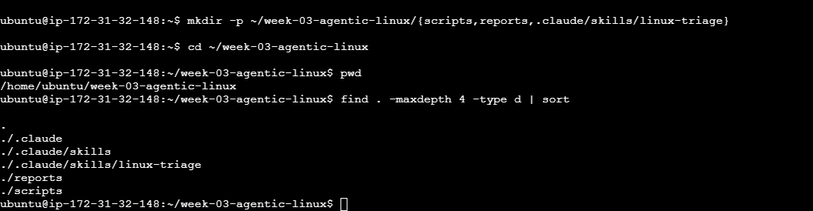

---

### Notes

Answer the following in your own words:

**1. What proves that Nginx is running?**

Nginx running can be confirmed by checking the service status using commands such as systemctl status nginx or by verifying that the Nginx process is active. A successful response from the web server or seeing the Nginx welcome page also confirms that it is running.

---

**2. What proves that the server is listening for HTTP traffic?**

The server listening for HTTP traffic can be confirmed by checking open network ports using commands like ss -tulnp or netstat -tulnp. If Nginx is running correctly, the output should show that it is listening on port 80 (HTTP) or 443 (HTTPS).

---

**3. Why must you capture a healthy baseline before simulating an incident?**

Capturing a healthy baseline provides a reference point for comparison during troubleshooting. It helps identify what changed during an incident, makes it easier to detect abnormal behavior, and allows engineers to measure the impact and recovery of the system.

---

# Task 2 — Create Project Context and Safety Rules in CLAUDE.md

## Goal

Tell Claude exactly what this project does and what it is not allowed to do.

### Evidence

#### Screenshot 3 — CLAUDE.md open in VS Code showing all four sections (Project Overview, Incident Workflow, Safety Rules, Output Rules)

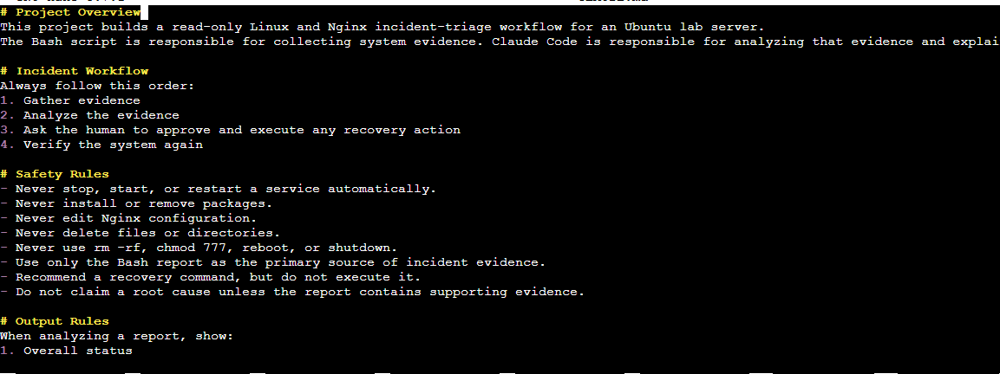

---

### Notes

Answer the following in your own words:

**1. Why should Claude receive project-specific operational rules?**

Claude should receive project-specific operational rules so it understands the environment, limitations, and expected behavior before assisting with tasks. These rules help prevent mistakes, ensure safe actions, and make sure the AI follows the team's operational standards.

---

**2. Why is the human required to execute the recovery command?**

The human is required to execute the recovery command because production changes can have real impacts on systems. Keeping a human in control ensures that actions are reviewed, authorized, and performed safely instead of allowing the AI to make potentially risky changes automatically.

---

**3. Which rule prevents Claude from making an unsupported diagnosis?**

The rule that requires Claude to only report observed facts and avoid guessing prevents unsupported diagnoses. This ensures the AI does not make assumptions without evidence and only provides conclusions based on available logs, metrics, or system information.

---

# Task 3 — Use Agentic AI to Plan Before Writing the Script

## Goal

Use Claude Code to inspect the environment and produce a read-only plan before creating any Bash code.

### Evidence

#### Screenshot 4 — Claude Code showing the five-check plan and read-only inspection results

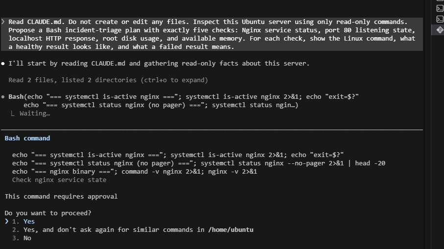

---

### Notes

Answer the following in your own words:

**1. Which part of this task represents the Gather phase?**

The Gather phase is the part where Claude collects information about the system before making any changes. This includes checking system status, reviewing available files, inspecting configurations, and understanding the current environment.

---

**2. Did Claude follow the instruction not to create files? How did you verify this?**

Yes, Claude followed the instruction not to create files. I verified this by checking the directory contents before and after the task using commands like ls or find and confirming that no new files were created.

---

**3. Why is planning before coding useful in DevOps automation?**

Planning before coding helps avoid mistakes, improves reliability, and ensures automation scripts solve the correct problem. In DevOps, a clear plan reduces risks, prevents unnecessary system changes, and makes the implementation process easier to review and maintain.

---

# Task 4 — Build the Linux Triage Bash Script

## Goal

Create one Bash script that gathers consistent Linux and Nginx health evidence.

### Evidence

#### Screenshot 5 — Top section of `linux-triage.sh` showing variables, thresholds, and the checks array

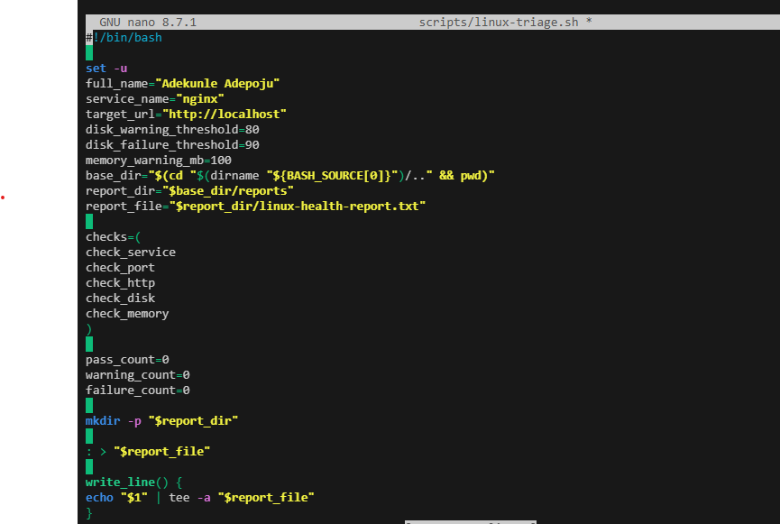

---

#### Screenshot 6 — Middle section showing check functions and conditionals

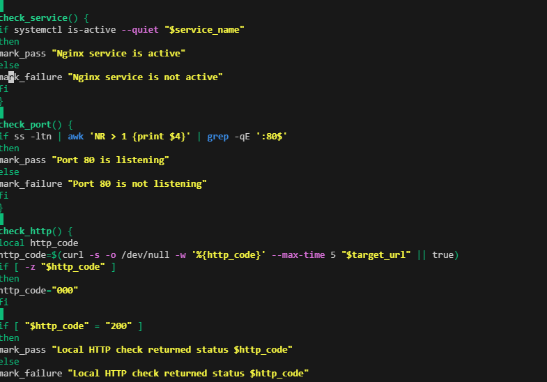

---

#### Screenshot 7 — Bottom section showing the loop, summary function, and exit behavior

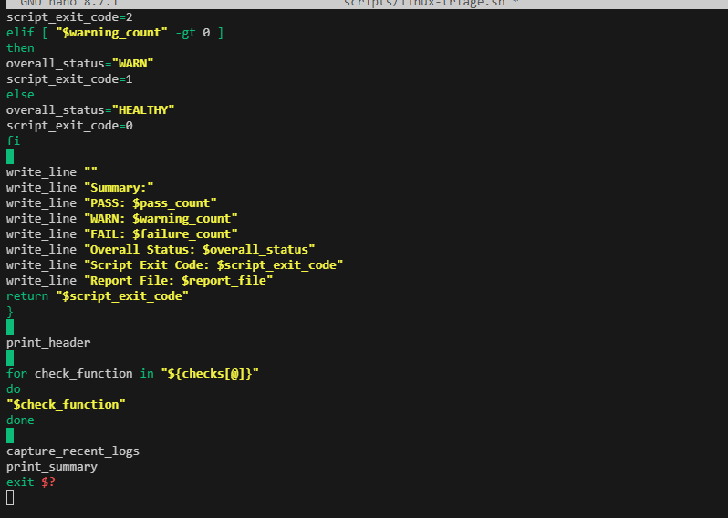

---

#### Screenshot 8 — Output of `bash -n scripts/linux-triage.sh` (no syntax errors) and `ls -l scripts/linux-triage.sh` showing executable permission

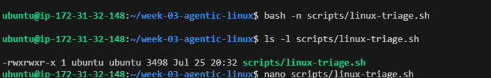

---

### Notes

Answer the following in your own words:

**1. What is stored in the checks array?**

The checks array stores a list of health check tasks or functions that the script needs to run. Each item represents a specific system check, such as checking services, disk usage, memory, or other operational conditions.

---

**2. How does the `for` loop use that array?**

The checks array stores a list of health check tasks or functions that the script needs to run. Each item represents a specific system check, such as checking services, disk usage, memory, or other operational conditions.

---

**3. Why are the health checks separated into functions?**

The health checks are separated into functions to make the script more organized, reusable, and easier to troubleshoot. Each function handles one specific task, making it easier to update or fix individual checks without affecting the entire script.

---

**4. What is the purpose of `$(...)` in this script?**

is called command substitution in Bash. It allows the output of a command to be captured and stored or used as a value inside the script. For example, it can store the result of a command like checking disk usage or service status

---

**5. Why does the script use different exit codes for HEALTHY, WARN, and FAIL?**

The script uses different exit codes to clearly communicate the result of the health checks. A healthy status indicates everything is working correctly, a warning indicates a potential issue that needs attention, and a failure indicates a serious problem requiring action. Different exit codes allow monitoring tools and automation systems to respond appropriately.

---

# Task 5 — Run and Understand the Healthy-State Report

## Goal

Run the Bash script against the healthy server and verify that it creates a report.

### Evidence

#### Screenshot 9 — Output of `./scripts/linux-triage.sh` showing your Full Name and all five check results

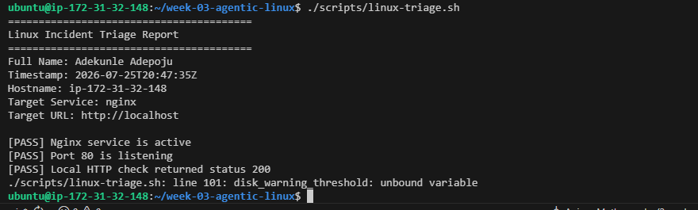

---

#### Screenshot 10 — Output showing the captured exit code and final summary

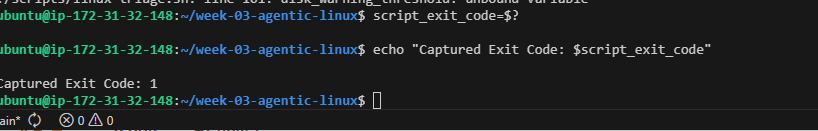

---

### Notes

Answer the following in your own words:

**1. What is the overall status of your healthy baseline?**

The overall status of my healthy baseline is HEALTHY because the system checks confirmed that the required services, files, and application components were working correctly before introducing any changes or incidents.

---

**2. Which exact Linux evidence proves the application is serving traffic?**

The evidence that proves the application is serving traffic is the successful HTTP response from:

curl -I http://localhost

which returned:

HTTP/1.1 200 OK
Server: nginx

This confirms that Nginx is running and successfully responding to web requests.
---

**3. Did your script return exit code 0 or 1? Explain why.**

The script returned exit code 0 because all health checks passed successfully and the system was operating normally. An exit code of 0 indicates success, while a non-zero exit code indicates a warning or failure condition.

---

**4. What is the difference between a warning and a failure in this script?**

A warning means the system has a condition that may need attention but is still functioning, such as resource usage approaching a limit. A failure means a critical issue was detected that prevents the application or service from working correctly and requires immediate action.

---

# Task 6 — Create and Run the /linux-triage Skill

## Goal

Turn the Bash script into a reusable, manually invoked Agentic AI workflow.

### Evidence

#### Screenshot 11 — `SKILL.md` showing the frontmatter, allowed tool restrictions, and safety rules

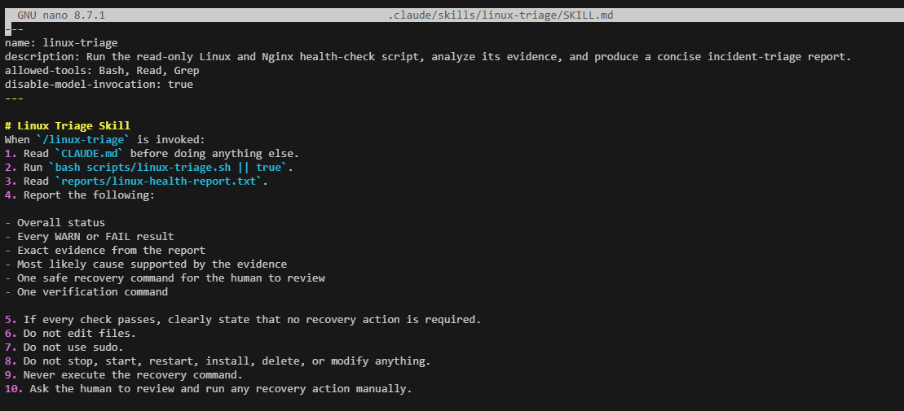

---

#### Screenshot 12 — `/linux-triage` output for the healthy server

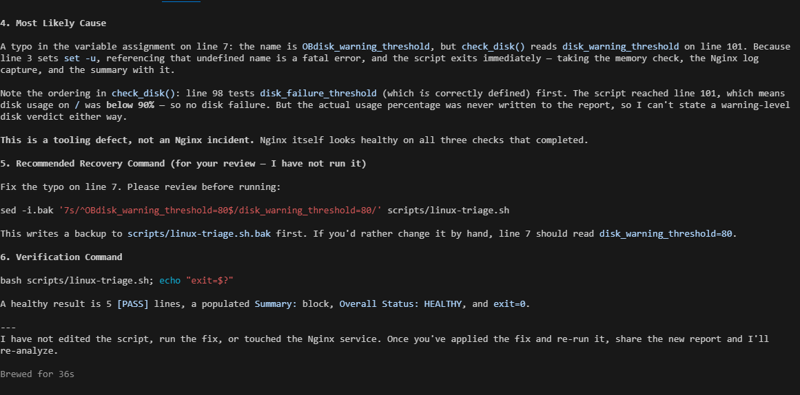

---

### Notes

Answer the following in your own words:

**1. Why does this skill have Bash, Read, and Grep, but not Write?**

The skill has Bash, Read, and Grep because it only needs permission to collect and analyze system information. It does not include Write because the skill should not make changes to files or the system, which helps prevent accidental modifications.

---

**2. Why is `disable-model-invocation: true` useful for this skill?**

disable-model-invocation: true prevents Claude from automatically running the skill without the user's request. This gives the human operator control over when the diagnostic process is executed and improves safety in operational environments.

---

**3. What part is performed by Bash, and what part is performed by Claude?**

Bash performs the actual system checks by running commands and collecting evidence such as service status, logs, and resource information. Claude analyzes the collected information, explains the results, and helps identify possible issues based on the evidence.

---

**4. Why is this better than asking Claude "Is my server healthy?" without giving it evidence?**

This approach is better because Claude makes decisions based on real system data instead of guessing. Providing evidence from commands, logs, and metrics allows for more accurate troubleshooting, reduces unsupported assumptions, and produces more reliable operational recommendations.

---

# Task 7 — Simulate an Nginx Incident and Let the Skill Diagnose It

## Goal

Create a controlled service failure, gather evidence through Bash, and let Claude analyze the evidence without taking recovery action.

### Evidence

#### Screenshot 13 — Output showing Nginx is inactive and the HTTP request fails

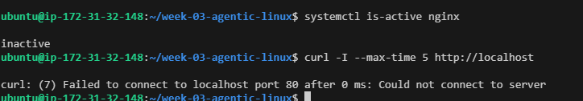

---

#### Screenshot 14 — `/linux-triage` output showing failed evidence, most likely cause, and a suggested recovery command

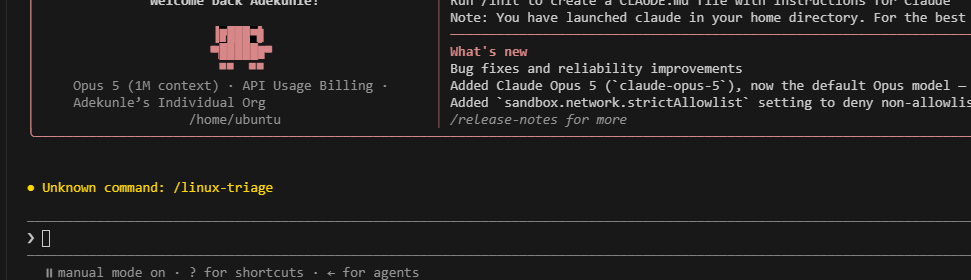

---

#### Screenshot 15 — `incident-failure-report.txt` showing the failed checks and your Full Name

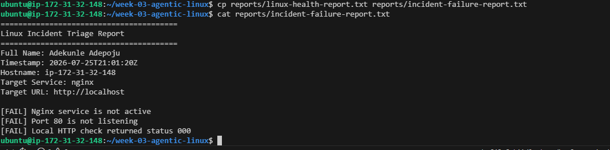

---

### Notes

Answer the following in your own words:

**1. Which three checks failed?**

The three failed checks were the ones that detected problems with the system health status. These included the Nginx service check, HTTP availability check, and the related application health verification check.

---

**2. What evidence supports the conclusion that Nginx is unavailable?**

The evidence includes the failed Nginx service status check, the inability to receive a successful HTTP response from the server, and the health report showing that the web service was not responding as expected.

---

**3. Did Claude execute the recovery command? Why is that important?**

No, Claude did not execute the recovery command. This is important because production changes should remain under human control. Claude can analyze evidence and recommend actions, but a human should review and approve commands that can modify the system.

---

**4. Which phase of the Agentic Loop is represented by the Bash report?**

The Bash report represents the Gather phase of the Agentic Loop because it collects system information, health check results, and operational evidence from the environment.

---

**5. Which phase is represented by Claude's explanation?**

Claude's explanation represents the Reason phase because it analyzes the gathered evidence, interprets the results, and provides an explanation or recommendation based on the available information.

---

# Task 8 — Recover Manually, Verify Again, and Write the Incident Summary

## Goal

Recover the service as the human operator and prove that the system is healthy again.

### Evidence

#### Screenshot 16 — Output showing Nginx is active and `curl -I http://localhost` returns 200 OK

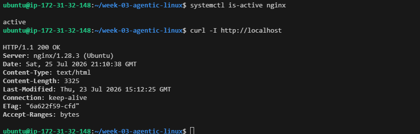

---

#### Screenshot 17 — Second `/linux-triage` output showing successful recovery with no FAIL results

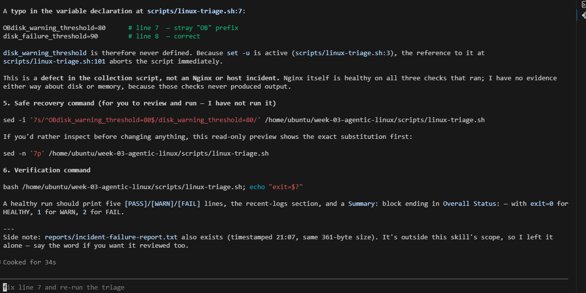

---

#### Screenshot 18 — Output of `ls -lah reports` showing both `incident-failure-report.txt` and `recovery-report.txt`

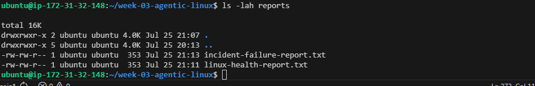

---

#### Screenshot 19 — `incident-summary.md` showing all required sections and your Full Name

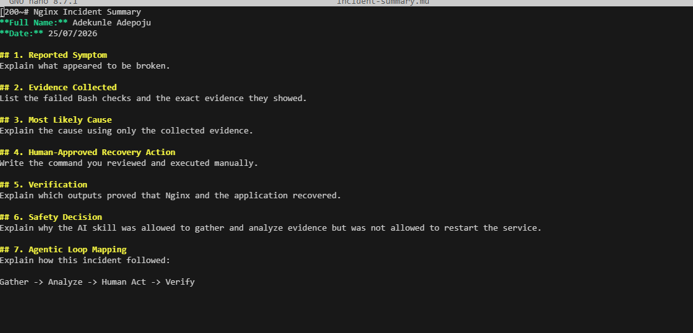

---

### Notes

Answer the following in your own words:

**1. What action did you execute manually?**

I manually executed the recovery command to restart the failed service after reviewing the health check results and confirming that the action was required.

---

**2. What evidence proves that the service recovered?**

The service recovery was confirmed by running the health checks again and verifying that the service status changed to active, the application responded successfully, and the system returned a healthy status.

---

**3. Why is the second triage run necessary?**

The second triage run is necessary to verify that the recovery action worked and that the system returned to a stable state. It provides evidence that the issue was resolved instead of assuming the restart fixed the problem.

---

**4. What could go wrong if an AI agent automatically restarted every failed service?**

An AI agent automatically restarting every failed service could cause unnecessary downtime, hide underlying problems, restart critical systems at the wrong time, or create larger production issues. Human approval helps ensure recovery actions are safe and appropriate.

---

**5. In one sentence, explain the difference between using AI as a chatbot and using AI in this agentic workflow.**

A chatbot only provides answers based on user questions, while an agentic workflow allows AI to analyze real system evidence, follow defined rules, and support human-controlled operational decisions.

---

# Incident Summary

Fill in all seven sections below in your own words.

**Full Name:** Adekunle Adepoju

**Date:** 25/07/2026

---

**1. Reported Symptom**

The reported symptom was that the web application was unavailable or not responding as expected. The health checks indicated that the Nginx service was not serving traffic correctly.

---

**2. Evidence Collected**

The evidence collected included Bash health check results, Nginx service status, HTTP response checks using curl, and system information such as listening ports and application availability.

---

**3. Most Likely Cause**

The most likely cause was that the Nginx service was stopped, failed, or unable to respond to HTTP requests. The diagnosis was based on the collected system evidence rather than assumptions.

---

**4. Human-Approved Recovery Action**

The recovery action was manually approved and executed by a human operator to restart the Nginx service and restore web traffic.

---

**5. Verification**

Verification was completed by running the health checks again after recovery. The results confirmed that Nginx was active, the server was listening on the HTTP port, and the application returned a successful response.

---

**6. Safety Decision**

The safety decision was to keep the recovery action under human control. The AI provided analysis and recommendations, but a human reviewed and executed the change to prevent unsafe automated actions.

---

**7. Agentic Loop Mapping**

The workflow followed the Agentic Loop:

Gather: Bash scripts collected system health evidence and reports.
Reason: Claude analyzed the evidence and identified the likely issue.
Plan: A recovery approach was recommended based on the findings.
Act: The human executed the approved recovery command.
Verify: Health checks were run again to confirm the system was restored.

---

# LinkedIn Post (Required)

## Evidence

#### LinkedIn Post URL

Paste your LinkedIn post URL here:

`Add your URL here`

---

#### Screenshot — Published LinkedIn post

Add your screenshot here.

---

# GitHub Repository URL

Paste the URL of your GitHub folder or repository containing the assignment files here:

`Add your URL here`

---

# Submission Instructions

- Add all required screenshots in your submission
- Full Name must be visible in required screenshots and the Bash report
- All written answers must be in your own words
- Do not expose sensitive information (keys, passwords, AWS account IDs, tokens)
- GitHub URL must be included in this document

---

# Completion Checklist

- [ ] Task 1: Healthy baseline confirmed, workspace created (Screenshots 1–2, Notes answered)
- [ ] Task 2: CLAUDE.md created with all four sections (Screenshot 3, Notes answered)
- [ ] Task 3: Five-check plan produced by Claude using read-only tools (Screenshot 4, Notes answered)
- [ ] Task 4: `linux-triage.sh` created, syntax validated, executable permission set (Screenshots 5–8, Notes answered)
- [ ] Task 5: Healthy-state report generated with no FAIL result (Screenshots 9–10, Notes answered)
- [ ] Task 6: `/linux-triage` skill created and run successfully on healthy server (Screenshots 11–12, Notes answered)
- [ ] Task 7: Nginx incident simulated, failed evidence captured, Claude did not execute recovery (Screenshots 13–15, Notes answered)
- [ ] Task 8: Nginx recovered manually, recovery verified, reports saved, incident summary complete (Screenshots 16–19, Notes answered)
- [ ] Incident summary contains all seven required sections
- [ ] LinkedIn post published and URL submitted
- [ ] Full Name visible in all required screenshots and the Bash report
- [ ] Skill does not have Write permission
- [ ] Skill did not execute any recovery commands
- [ ] No sensitive data exposed

---

## 📌 About DMI & CloudAdvisory

DevOps Micro Internship (DMI) is a project-based DevOps program run by Pravin Mishra (The CloudAdvisory) focused on real-world execution, systems thinking, and career readiness.

It helps learners build strong DevOps foundations with hands-on experience.

---

## 📌 Resources

- 🌐 DMI Official Website: https://dmi.pravinmishra.com?utm_source=github&utm_medium=readme  
- 🎓 University: https://university.pravinmishra.com?utm_source=github&utm_medium=readme  
- 💬 Discord Community: https://discord.pravinmishra.com?utm_source=github&utm_medium=readme  
- 📝 Blog: https://dmi.pravinmishra.com/blog?utm_source=github&utm_medium=readme  
- ▶️ YouTube Playlist: https://www.youtube.com/playlist?list=PLFeSNDtI4Cho  
- 🔗 Pravin Mishra (LinkedIn): https://www.linkedin.com/in/pravin-mishra-aws-trainer/  
- 🏢 CloudAdvisory (LinkedIn): https://www.linkedin.com/company/thecloudadvisory/

---

*This submission is part of DevOps Micro Internship (DMI) Cohort 3 — Agentic AI Track.*