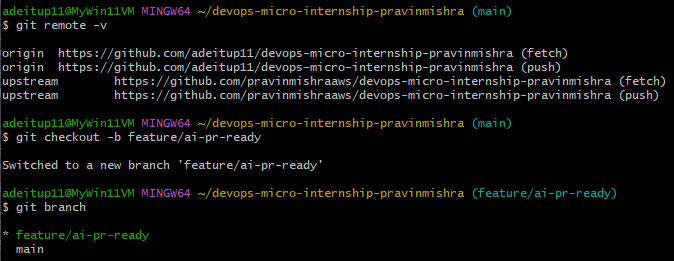
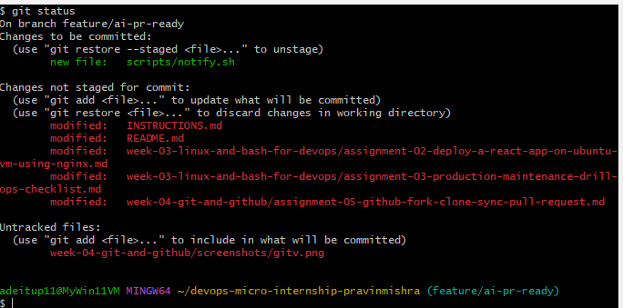
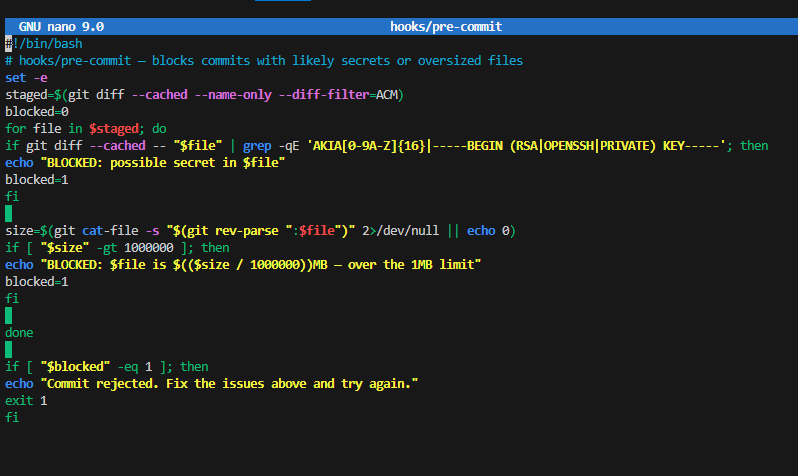
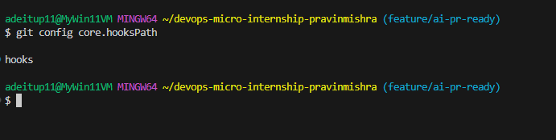
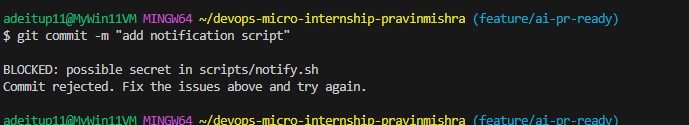
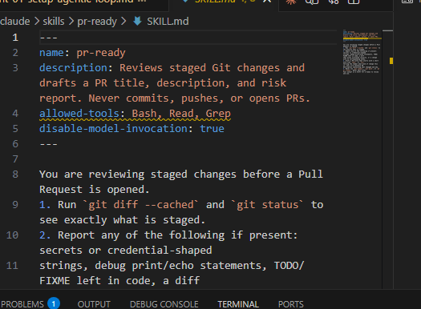
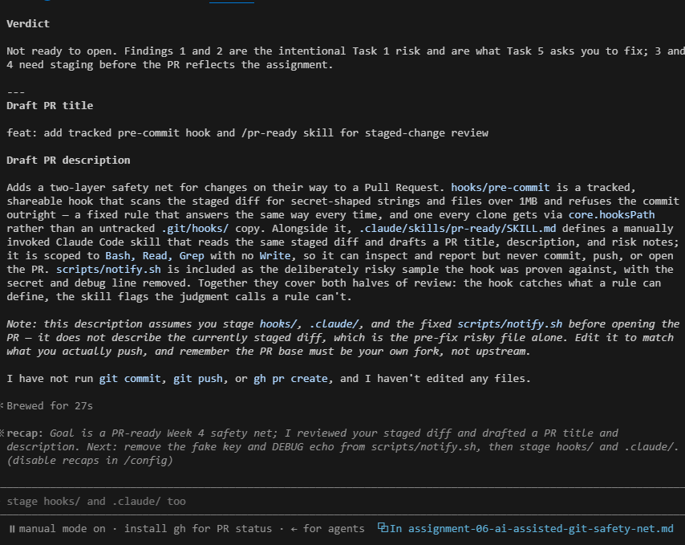
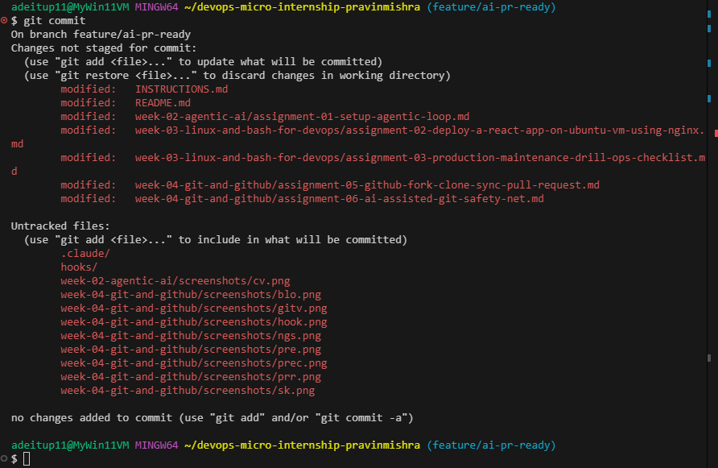
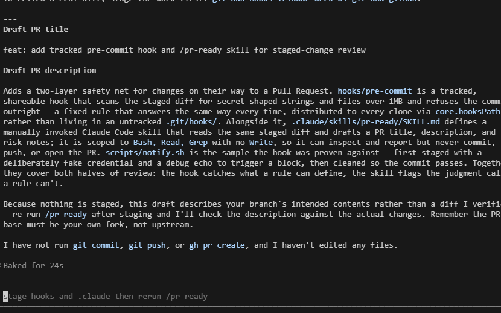
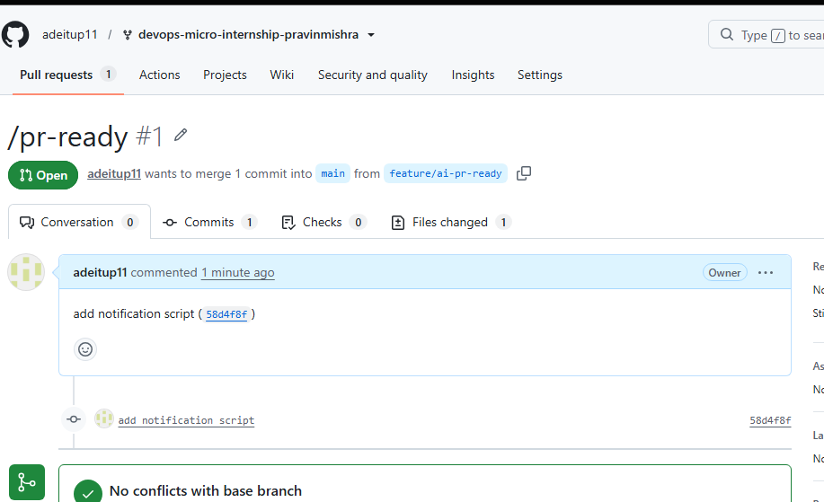

# Assignment 6 — Building an AI-Assisted Git Safety Net (PR Ready Check)

Part of the DevOps Micro Internship (DMI) Cohort 3 with Agentic AI

---

## Purpose

In Week 2 you built Claude Code hooks that block a dangerous action *before* it happens (`PreToolUse`), and a restricted skill that could look but not touch (`allowed-tools` without `Write`). In this assignment you will discover that Git has the exact same idea, decades older: a **pre-commit hook** that blocks a commit before it's created.

You will build both halves of a real "PR Ready" workflow:

1. A **Git hook that follows fixed rules** — scans staged changes for hardcoded secrets and oversized files and refuses the commit. No AI involved, no guessing, just a rule that gives the same answer every time.
2. A **restricted Claude Code skill** (`/pr-ready`) that reads your staged diff and drafts a Pull Request title, description, and a short list of things worth a second look — the kind of judgment a fixed rule can't make (mixed changes, missing context, unclear intent). The skill never commits, pushes, or opens the PR. You do that yourself, using its draft as a starting point.

This mirrors the Agentic Loop from Week 3's Linux triage assignment: **Gather → Analyze → Human Act → Verify**. The hook and the skill both gather and analyze; only you act.

---

# Task 0 — Confirm Your Fork and Create a Feature Branch

## Goal

Confirm you are working in your own fork, then create a dedicated branch for this assignment.

### Evidence

#### Screenshot 1 — Output of git remote -v and git branch showing the new branch

---

### Notes

**1. Why create a dedicated branch instead of doing this work on main?**

A dedicated branch keeps your work isolated from the main branch, allowing you to make, test, and review changes without affecting the stable codebase. It also makes collaboration easier by enabling code reviews through pull requests before merging changes into main.

---

# Task 1 — Stage a Change With Realistic Risk

## Goal

On your own fork of this repository (the one you've been submitting your DMI work in since onboarding), create a new branch and stage a change that a real reviewer should catch: a hardcoded-looking secret and a leftover debug statement.

### Evidence

#### Screenshot 1 — Output of  `git status` showing the staged file on feature/ai-pr-ready

---

### Notes

**1. Why does this assignment use an obviously fake key instead of a real one?**

The assignment uses a fake key to prevent exposing sensitive credentials while allowing learners to practice securely. It reinforces the best practice of never committing real secrets to version control or public repositories.

---

# Task 2 — Write a Real Git Pre-Commit Hook

## Goal

Create a tracked, shareable pre-commit hook that blocks a commit containing secret-like patterns or files over 1MB.

### Evidence

#### Screenshot 2 — `hooks/pre-commit` open in VS Code showing the full script

---

#### Screenshot 3 — Output of `git config core.hooksPath` confirming it points to `hooks`

---

### Notes

**1. Why is `hooks/pre-commit` tracked in the repo instead of living only in `.git/hooks/`?**

hooks/pre-commit is tracked so it can be shared and version-controlled with the project. The .git/hooks/ directory is local to each clone and is not included in Git, so hooks stored there alone cannot be distributed to other contributors.

---

**2. Compare this to `PreToolUse` from Week 2 Assignment 6. What does each one intercept, and what do they have in common?**

PreToolUse intercepts tool executions before they run, while pre-commit intercepts Git commits before they are recorded. Both automatically enforce rules and can block an action if validation checks fail.

---

# Task 3 — Prove the Hook Blocks the Risky Commit

## Goal

Attempt to commit the staged file from Task 1 and show the hook rejecting it.

### Evidence

#### Screenshot 4 — Terminal showing `git commit` rejected with the hook's "BLOCKED" message naming the exact file

---

### Notes

**1. Which line in `hooks/pre-commit` matched your fake key, and why did it match?**

The line that matched was the regular expression (regex) used to detect API keys or secrets. It matched because the fake key was intentionally formatted to resemble a real secret (for example, beginning with a known prefix and having the expected length and character pattern), so the hook flagged it.

---

**2. Could this hook have caught a poorly-named variable that stores a secret without the `AKIA` prefix? What does that tell you about the limits of a fixed rule like this?**

No, the hook would not catch every secret. It only detects patterns it was designed to find, such as the AKIA prefix. This shows that fixed rules are useful for basic protection but cannot replace broader security practices like secret scanning tools, code reviews, and proper credential management.

---

# Task 4 — Build the `/pr-ready` Skill

## Goal

Create a manually invoked Claude Code skill that reads your staged changes and produces a PR-readiness report and a draft PR description — without writing, committing, or pushing anything itself.

### Evidence

#### Screenshot 5 — `SKILL.md` frontmatter showing `allowed-tools: Bash, Read, Grep` (no `Write`) and `disable-model-invocation: true`

---

#### Screenshot 6 — `/pr-ready` output while the risky file is still staged, showing it flagged the secret and/or debug statement

---

### Notes

**1. Why does `/pr-ready` have `Bash` and `Read` but not `Write`?**

/pr-ready can use Bash and Read to check the repository state and gather information, but it does not need Write because it should not modify files. This follows the principle of least privilege by giving only the permissions required for the task.

---

**2. The pre-commit hook and `/pr-ready` both looked at the same staged diff. Did they flag the same things? What did one catch that the other didn't?**

The pre-commit hook and /pr-ready both reviewed the staged diff, but they had different purposes. The pre-commit hook caught the fake secret pattern because it used a fixed rule for credential detection, while /pr-ready provided a broader review and could catch issues outside the hook’s specific checks. This shows why multiple layers of validation are useful in a DevOps workflow.

---

# Task 5 — Fix the Issues and Re-Verify

## Goal

Remove the secret and debug statement, then prove both gates now pass clean.

### Evidence

#### Screenshot 7 — `git commit` succeeding after the fix (no BLOCKED message)

.

---

#### Screenshot 8 — Second `/pr-ready` run showing a clean risk report and a drafted PR title + description

---

### Notes

**1. What exactly did you change to satisfy the pre-commit hook?**

I removed the fake secret value from the staged changes and replaced it with a safe placeholder/example value that does not match the secret detection pattern used by the pre-commit hook. This allowed the hook to pass while keeping the example useful for learning.

---

# Task 6 — Push and Open a Pull Request Using the AI Draft

## Goal

Push your branch and open a real Pull Request, using `/pr-ready`'s drafted title and description as your starting point — read it critically and edit before you use it.

**Important:** Open this Pull Request with base repository set to **your own fork** — not the shared upstream `pravinmishraaws/devops-micro-internship-pravinmishra` repository. This assignment's hook and skill files are your own practice work, not a change meant for the shared class repo.

### Evidence

#### Screenshot 9 — Your Pull Request showing the base repository is your own fork, plus the title and description, with the `/pr-ready` draft visible for comparison (paste it in the PR conversation or your notes below)

---

#### PR Link

https://github.com/adeitup11/devops-micro-internship-pravinmishra/pull/1

---

### Notes

**1. What, if anything, did you edit in the AI's drafted PR description before using it? Why?**

I reviewed the AI-generated PR description and edited it to make sure it accurately represented the changes I made. I updated the details about the files modified, the purpose of the changes, and the testing performed so the description matched the actual work completed.

---

**2. If you had blindly copy-pasted the AI's draft without reading it, what could go wrong?**

The PR description could include incorrect information, describe changes that were not actually made, or miss important details. This could mislead reviewers, create confusion during review, and reduce trust in the development process.

---

**3. Why does this PR need to target your own fork instead of the shared upstream repository?**

This PR contains my own practice work, including the pre-commit hook and AI workflow files created during the assignment. It should target my own fork because these changes are for learning and testing purposes, not intended to modify the shared upstream class repository. This keeps the upstream repository clean and avoids unintended changes.

---

# Task 7 — Map the Workflow to the Agentic Loop

## Goal

Explain this assignment's workflow using the same Gather → Analyze → Human Act → Verify structure from Week 3.

### Notes

**1. Which step(s) represent Gather?**

The Gather steps are collecting the repository information and current state of the project. This includes checking the Git status, reviewing staged changes, reading files, examining the diff, and gathering information from the repository before making decisions.

---

**2. Which step(s) represent Analyze?**

The Analyze steps are when Claude Code reviews the gathered information and evaluates the changes. This includes using /pr-ready to inspect the staged diff, identify possible issues, check for security concerns, and generate a draft Pull Request title and description.

---

**3. Which step is Human Act, and why must a human — not Claude — run `git commit`, `git push`, and open the PR?**

The Human Act step is the developer reviewing the AI suggestions, making final decisions, committing changes, pushing the branch, and opening the Pull Request. A human must perform these actions because they involve ownership, approval, security decisions, and responsibility for what is shared. Claude can assist with analysis, but it should not independently publish changes or modify project history without human approval.

---

**4. Which step is Verify?**

The Verify step is reviewing the Pull Request, confirming the correct base repository and branch, checking the PR description, ensuring the changes are accurate, and confirming that automated checks such as the pre-commit hook passed successfully.

---

**5. In one or two sentences: why do you need *both* the fixed-rule pre-commit hook and the AI skill? Isn't one enough?**

Both are needed because they serve different purposes: the pre-commit hook provides fast, consistent automated checks for known issues like secret patterns, while the AI skill provides broader analysis, context, and recommendations. Using both creates a stronger workflow by combining automated enforcement with intelligent review.

---

# Task 8 — LinkedIn Post

## Goal

Publish a LinkedIn post summarizing what you built and what you learned about combining fixed-rule safety checks with AI-assisted review.

### Evidence

#### LinkedIn Post URL

https://www.linkedin.com/posts/adepoju-adekunle-43217aa4_devops-git-github-share-7486714686382571520-v1JY/?utm_source=share&utm_medium=member_desktop&rcm=ACoAABYYCOYB1CQ-AKDgCJ7ecCiAgMVI9f2fFws

---

## Key Learnings

Add 3-5 bullet points on what you learned this week.

- Learned how to use Git and GitHub collaboration workflows, including branching, committing, pushing changes, and creating Pull Requests.
- Learned the importance of AI-assisted development workflows, including using Claude Code to analyze changes and generate PR-ready documentation.
- Learned how pre-commit hooks can automate security checks and prevent issues such as accidentally committing secrets.
- Learned the difference between AI recommendations and human responsibility, where developers must review, approve, and execute important actions.
- Improved my understanding of the Gather → Analyze → Human Act → Verify workflow for combining automation with human decision-making.

---

# Submission Instructions

- Ensure `hooks/pre-commit` and `.claude/skills/pr-ready/SKILL.md` are committed to your GitHub repository
- Add all required screenshots to your submission
- All written answers must be in your own words
- Do not use a real secret or credential anywhere in your submission — the fake key in Task 1 is intentional and must stay clearly fake
- Open your Pull Request against your own fork, not the shared upstream repository
- Push your final changes to your forked repository
- Include your PR link and LinkedIn post URL

---

## GitHub Repository URL

Paste your forked repository URL here:

https://github.com/pravinmishraaws/devops-micro-internship-pravinmishra

---

# Completion Checklist

- [ ] Branch `feature/ai-pr-ready` created with a staged file containing a fake secret and a debug statement
- [ ] `hooks/pre-commit` created and tracked in the repo (not only in `.git/hooks/`)
- [ ] `core.hooksPath` configured to point at `hooks/`
- [ ] Pre-commit hook shown blocking the risky commit
- [ ] `.claude/skills/pr-ready/SKILL.md` created with correct `allowed-tools` (no `Write`) and `disable-model-invocation: true`
- [ ] `/pr-ready` run against the risky diff and shown flagging issues
- [ ] Risky file fixed; `git commit` succeeds cleanly
- [ ] `/pr-ready` re-run showing a clean report and drafted PR title/description
- [ ] Pull Request opened using the AI draft as a starting point, with your own fork as the base repository (not upstream), PR link included
- [ ] Agentic Loop mapping (Task 7) completed in your own words
- [ ] LinkedIn post published and URL submitted
- [ ] All required screenshots added
- [ ] GitHub repository URL provided

---

## 📌 About DMI & CloudAdvisory

DevOps Micro Internship (DMI) is a project-based DevOps program run by Pravin Mishra (The CloudAdvisory) focused on real-world execution, systems thinking, and career readiness.

It helps learners build strong DevOps foundations with hands-on experience.

---

## 📌 Resources

- 🌐 DMI Official Website: https://pravinmishra.com/dmi  
- 🎓 DevOps for Beginners (Udemy): https://www.udemy.com/course/devops-for-beginners-docker-k8s-cloud-cicd-4-projects/  
- 🎓 Agentic AI DevOps with Claude Code: https://www.udemy.com/course/ultimate-agentic-ai-devops-with-claude-code/  
- 🎓 DevOps with Claude Code: Terraform, EKS, ArgoCD & Helm: https://www.udemy.com/course/devops-with-claude-code-terraform-eks-argocd-helm/  
- ▶️ YouTube Playlist: https://www.youtube.com/playlist?list=PLFeSNDtI4Cho  
- 🔗 Pravin Mishra (LinkedIn): https://www.linkedin.com/in/pravin-mishra-aws-trainer/  
- 🏢 CloudAdvisory (LinkedIn): https://www.linkedin.com/company/thecloudadvisory/

---

*This submission is part of DevOps Micro Internship (DMI) Cohort 3 — Agentic AI Track.*
