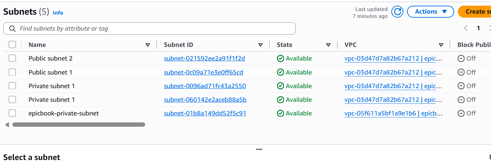
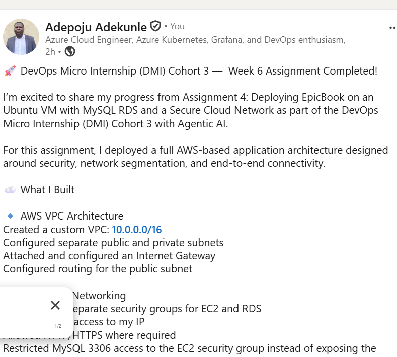

# Assignment 6 — Capstone: Deploy Book Review App (Three-Tier Architecture) on AWS

Part of the DevOps Micro Internship (DMI) Cohort 3 with Agentic AI

---

## Purpose

This is the most important assignment of the course. You will deploy the Book Review App in a fully production-style three-tier architecture on AWS: a Next.js Web Tier behind Nginx and a public ALB, a private Node.js/Express App Tier behind an internal ALB, and a private Multi-AZ MySQL RDS database with a read replica. You are expected to design, deploy, isolate, debug, and document the result independently.

---

# Task 1 — Architecture Diagram

## Goal

Create an architecture diagram showing the custom VPC (10.0.0.0/16), the six subnets across two Availability Zones (two public Web Tier, two private App Tier, two private Database Tier), the public ALB, Web Tier EC2/Nginx, internal ALB, private App Tier EC2, private Multi-AZ RDS with its read replica, and the permitted traffic flow.

### Evidence

#### Diagram image or link

 

---

# Task 2 — AWS Region & Services Used

## Goal

Record the AWS Region used and list every AWS service used across networking, compute, load balancing, security, and the database.

### Notes

**Region:**

ap-south-1 — Asia Pacific (Mumbai)

Item	Value
Cloud Provider	AWS
Region Name	Asia Pacific (Mumbai)
Region Code	ap-south-1
Availability Zones	2 AZs
VPC CIDR	10.0.0.0/16
Architecture	3-tier architecture
Subnets	6 — 2 Web, 2 App, 2 Database

---

**Services used:**

Amazon VPC – Networking
Amazon EC2 – Compute
Application Load Balancer (ALB) – Load balancing
Amazon RDS – Database
AWS IAM – Identity and access management
Security Groups – Network security
Internet Gateway (IGW) – Internet connectivity
Route Tables – Traffic routing
Amazon EC2 Auto Scaling – High availability and scaling
AWS Systems Manager (SSM) – EC2 management
Availability Zones (AZs) – Multi-AZ infrastructure deployment

---

# Task 3 — Public Entry Point

## Goal

Confirm the Book Review App loads through the public ALB DNS name.

### Evidence

#### Public ALB DNS

Paste your public ALB DNS name here:

http://us-east-2.console.aws.amazon.com/vpcconsole/home?region=us-east-2#VpcDetails:VpcId=vpc-05f611a5bf1a9e1b6

---

# Task 4 — Evidence Screenshots

## Goal

Capture visual proof of every tier and load balancer.

### Evidence

#### Screenshot 1 — Web Tier EC2 instance in a public subnet

---

#### Screenshot 2 — App Tier EC2 instance in a private subnet

---

#### Screenshot 3 — Public Application Load Balancer configuration or healthy targets

---

#### Screenshot 4 — Internal Application Load Balancer configuration or healthy targets

---

#### Screenshot 5 — Amazon RDS for MySQL showing Multi-AZ and the read replica

---

#### Screenshot 6 — Book Review App UI working through the public ALB

---

# Task 5 — Summary

## Goal

Summarize what worked in the final deployment, the issues encountered and how each was fixed, and the tools or sources used to research and debug.

### Notes

**What worked:**

The final deployment successfully established the AWS 3-tier architecture with a custom VPC, public and private subnets, Internet Gateway, route tables, security groups, EC2 instances, load balancing, and an RDS database. The Web Tier EC2 instance successfully ran Nginx and returned HTTP 200 OK, confirming that the web server was operational and reachable. Network access was controlled using security groups, with the database restricted to application-tier access.

---

**Issues encountered and fixes:**

RDS DB subnet group failed: Initially, the subnet group covered only one Availability Zone. It was fixed by adding a subnet from a second AZ to satisfy the RDS Multi-AZ subnet requirement.
Backend connected to the wrong database: The Node.js/Sequelize application attempted to connect to 127.0.0.1:3306 instead of the RDS endpoint. This was fixed by updating the application's environment configuration to use the RDS hostname and database credentials.

---

**Tools/sources used:**

AWS Management Console – VPC, EC2, RDS, ALB, security groups, subnets, route tables, and Availability Zones.
AWS CLI – Resource configuration and verification.
Node.js / npm / Sequelize – Application deployment and database connection troubleshooting.
Git/GitHub – Source control and deployment workflow.
AWS documentation and error messages – Used to investigate RDS subnet/AZ requirements and AWS networking issues.

---

# LinkedIn Post (Required)

## Goal

Publish a LinkedIn post sharing the capstone deployment, including the public ALB DNS (or a redacted screenshot), three to five lines on what you built and why it is production-style, and one proof screenshot.

## Evidence

#### LinkedIn Post URL

https://www.linkedin.com/posts/adepoju-adekunle-43217aa4_dmi-devops-micro-internship-with-agentic-share-7493734272034533376-GUkH/?utm_source=share&utm_medium=member_desktop&rcm=ACoAABYYCOYB1CQ-AKDgCJ7ecCiAgMVI9f2fFws

---

#### Screenshot — Published LinkedIn post

---

# Submission Instructions

- Add all required screenshots and links in your submission
- Do not expose passwords, RDS credentials, connection strings, private keys, or account IDs

---

# Completion Checklist

- [ ] Task 1: Architecture diagram completed
- [ ] Task 2: AWS Region and services documented
- [ ] Task 3: Public ALB DNS confirmed working
- [ ] Task 4: All six evidence screenshots captured (Web Tier, App Tier, both ALBs, RDS + replica, app UI)
- [ ] Task 5: Deployment summary completed (what worked, issues/fixes, tools/sources)
- [ ] LinkedIn post published and URL submitted
- [ ] App Tier and Database Tier confirmed not publicly accessible
- [ ] No sensitive data exposed

---

## 📌 About DMI & CloudAdvisory

DevOps Micro Internship (DMI) is a project-based DevOps program run by Pravin Mishra (The CloudAdvisory) focused on real-world execution, systems thinking, and career readiness.

It helps learners build strong DevOps foundations with hands-on experience.

---

## 📌 Resources

- 🌐 DMI Official Website: https://dmi.pravinmishra.com?utm_source=github&utm_medium=readme  
- 🎓 University: https://university.pravinmishra.com?utm_source=github&utm_medium=readme  
- 💬 Discord Community: https://discord.pravinmishra.com?utm_source=github&utm_medium=readme  
- 📝 Blog: https://dmi.pravinmishra.com/blog?utm_source=github&utm_medium=readme  
- ▶️ YouTube Playlist: https://www.youtube.com/playlist?list=PLFeSNDtI4Cho  
- 🔗 Pravin Mishra (LinkedIn): https://www.linkedin.com/in/pravin-mishra-aws-trainer/  
- 🏢 CloudAdvisory (LinkedIn): https://www.linkedin.com/company/thecloudadvisory/

---

*This submission is part of DevOps Micro Internship (DMI) Cohort 3 — Agentic AI Track.*
