# Assignment 6 — Capstone: Deploy Book Review App (Three-Tier Architecture) on Azure

Part of the DevOps Micro Internship (DMI) Cohort 3 with Agentic AI

---

## Purpose

This is the most important assignment of the course. You will deploy the Book Review App in a production-ready, best-practice-compliant three-tier architecture on Azure: separated presentation, application, and database tiers, least-privilege network access, a controlled public entry point, protected secrets, and availability/monitoring evidence.

---

# Task 1 — Design the Azure Three-Tier Architecture

## Goal

Create an architecture diagram and implementation plan identifying the presentation, application, and database components, the chosen Azure services, the public entry point, and the internal traffic paths.

### Evidence

#### Screenshot 1 — Architecture diagram showing the public entry point, three tiers, network boundaries, and traffic flow

#### Screenshot 2 — Written architecture assumptions and selected Azure services

Architecture Component	Azure Service	Purpose
Public/Web Tier	Azure Application Gateway	Public HTTPS entry point and traffic routing
Web Security	Application Gateway WAF	Web attack protection
Application Tier	Azure App Service	Hosts Node.js/Express application
Database Tier	Azure Database for MySQL Flexible Server	Persistent application data
Secrets	Azure Key Vault	Secure storage of credentials and secrets
Identity	Managed Identity	Secure application-to-Azure authentication
Monitoring	Azure Monitor	Metrics, alerts and infrastructure monitoring
Application Monitoring	Application Insights	Application performance and error monitoring
Logging	Log Analytics Workspace	Centralized log collection and analysis
Backup	MySQL automated backup	Database backup and point-in-time recovery

---

# Task 2 — Create the Azure Network Foundation

## Goal

Create a dedicated Resource Group and VNet with separate subnets for the web, application, and database tiers, keeping the application and database tiers without direct public access.

### Evidence

#### Screenshot 3 — Resource Group overview showing the assignment resources

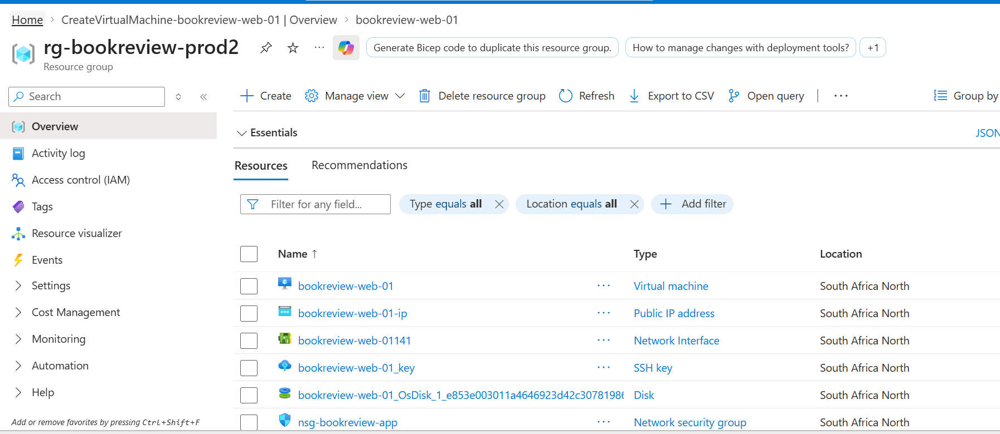

---

#### Screenshot 4 — VNet overview showing the address space and all required subnets

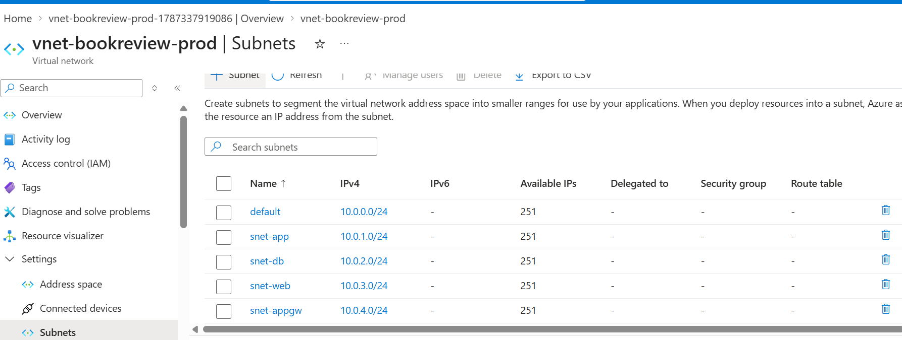

---

#### Screenshot 5 — Route-table or Private DNS evidence where applicable

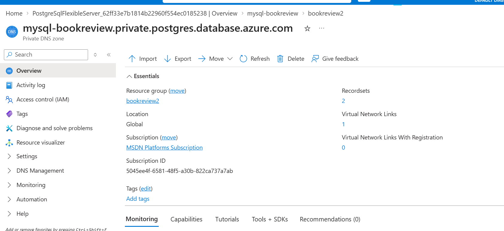

---

# Task 3 — Configure Security and Secret Management

## Goal

Apply least-privilege NSG rules so traffic flows Internet → public entry point → web tier → application tier → database tier, and store credentials in Azure Key Vault or another approved secure mechanism.

### Evidence

#### Screenshot 6 — NSG rules proving least-privilege access between the tiers

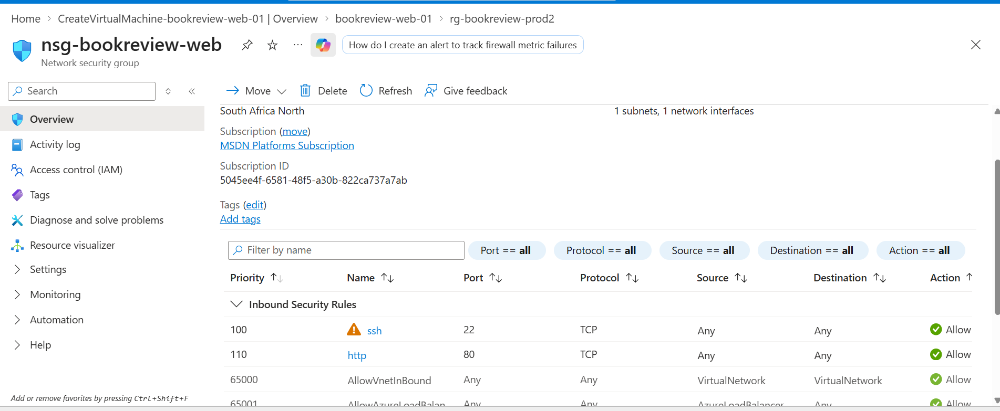

---

#### Screenshot 7 — Key Vault or approved secret-management configuration (without displaying secret values)

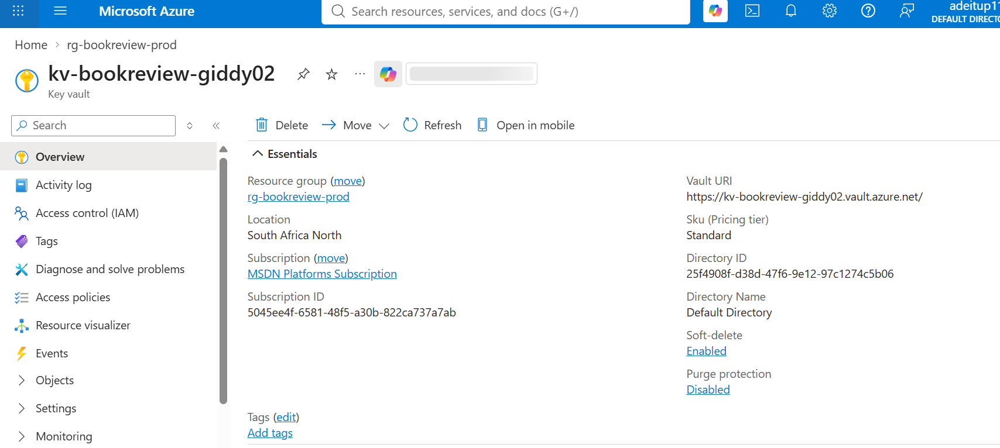

---

# Task 4 — Deploy the Presentation (Web) Tier

## Goal

Deploy the Book Review App presentation layer on the approved web-tier compute service, configured to route requests to the internal application-tier endpoint, and not directly exposed except through the public entry service.

### Evidence

#### Screenshot 8 — Web-tier compute overview showing subnet and availability configuration

---

#### Screenshot 9 — Terminal or service output proving the presentation layer is running

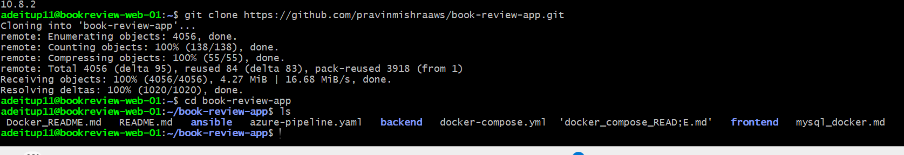

---

# Task 5 — Deploy the Business (Application) Tier

## Goal

Deploy the Book Review App backend privately in the application subnet, configured to use the private database endpoint and secured environment values, reachable only through its internal endpoint.

### Evidence

#### Screenshot 10 — Application-tier compute overview showing private subnet placement

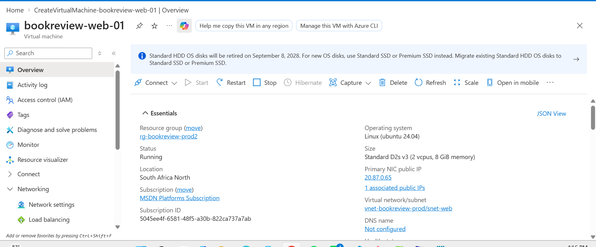

---

#### Screenshot 11 — Backend process, service, or listening-port evidence

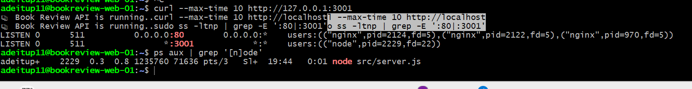

---

#### Screenshot 12 — Internal health-check or API response (without exposing secrets)

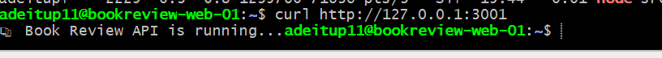

---

# Task 6 — Deploy the Managed Database Tier

## Goal

Create a private Azure managed database (public access disabled), with availability/backup/retention settings, the Book Review App schema imported, and access restricted to the application tier only.

### Evidence

#### Screenshot 13 — Database overview showing private connectivity and public access disabled

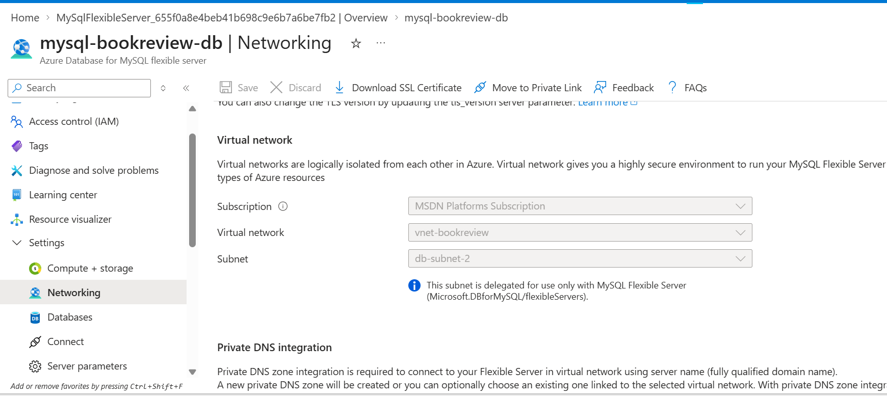

---

#### Screenshot 14 — Availability, backup, and retention configuration

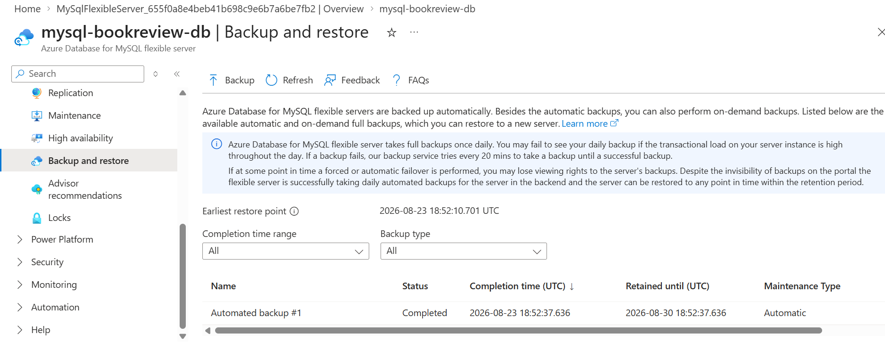

---

#### Screenshot 15 — Successful schema or connectivity verification (without exposing credentials)

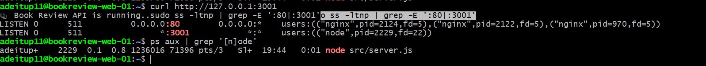
---

# Task 7 — Configure Traffic Management, Availability, and Monitoring

## Goal

Configure the approved public entry service with health probes and backend pools, internal routing for the application tier where required, and enable Azure Monitor/diagnostics/logs/alerts for the key resources.

### Evidence

#### Screenshot 16 — Public entry service showing listener, frontend endpoint, and healthy web targets

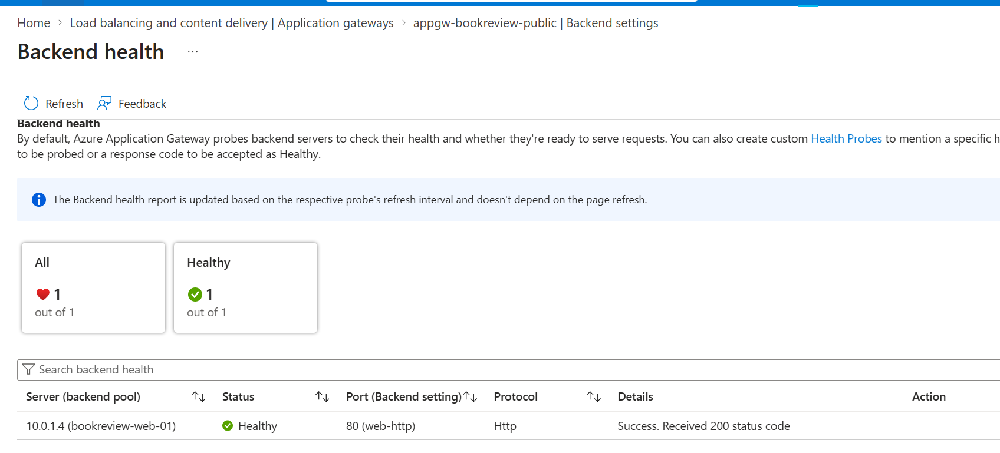

---

#### Screenshot 17 — Internal application-tier load-balancing or routing configuration where applicable

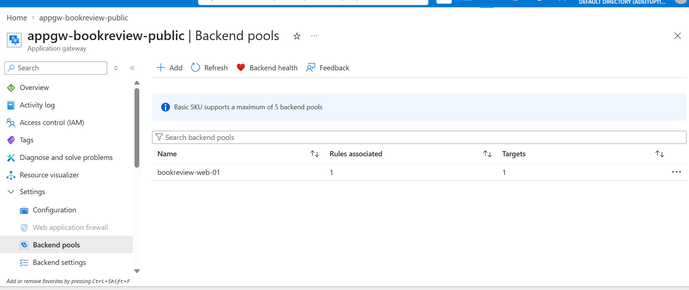

---

#### Screenshot 18 — Azure Monitor, diagnostic settings, logs, metrics, or alert evidence

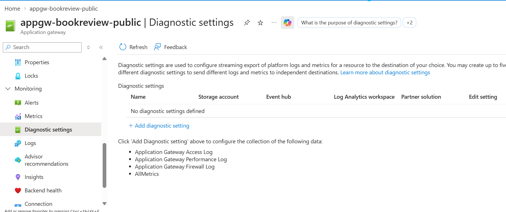

---

# Task 8 — Validate the Production-Style Deployment

## Goal

Confirm the Book Review App works end to end through the public endpoint, with at least one database read and one write, confirm private tiers are not internet-reachable, and complete a safe availability test.

### Evidence

#### Screenshot 19 — Browser showing the Book Review App through the public endpoint

http://20.164.211.176/

---

#### Screenshot 20 — Proof of successful database-backed read and write operations

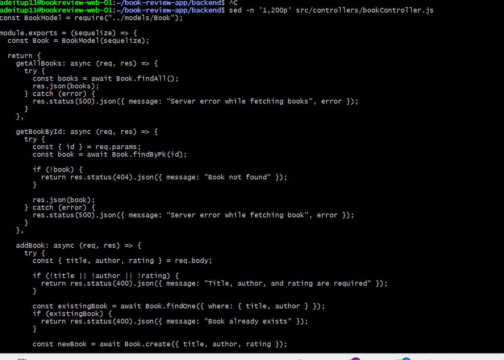

---

#### Screenshot 21 — Evidence that private tiers are not publicly accessible

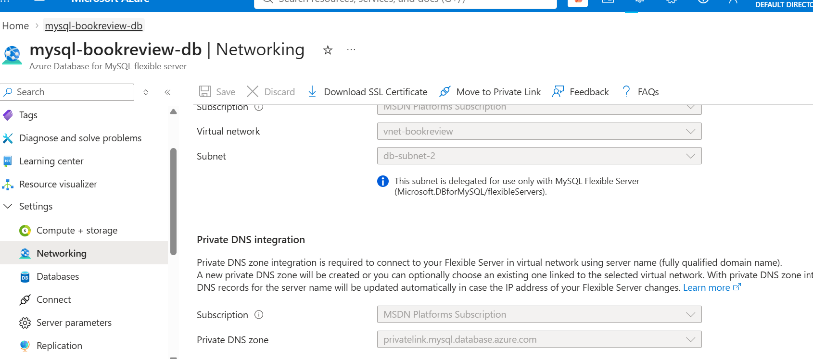

---

#### Screenshot 22 — Availability-test and healthy-target evidence

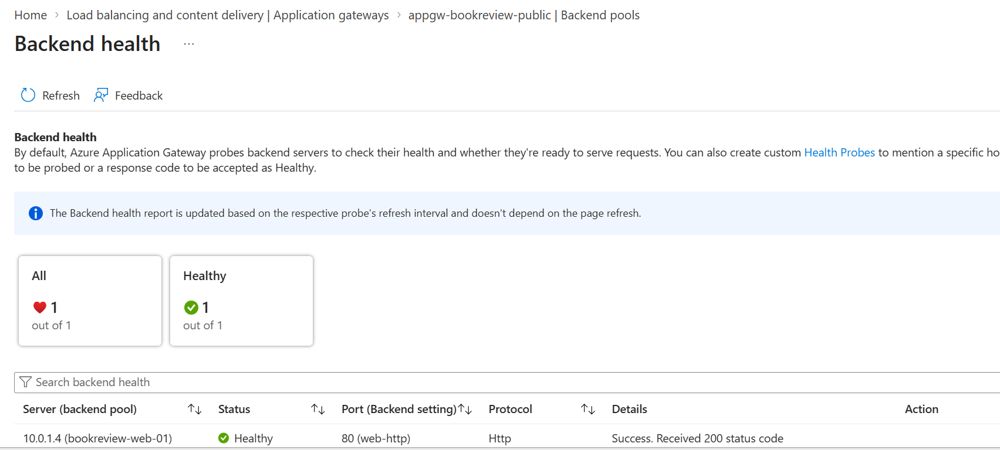

---

#### Public Endpoint

http://20.164.211.176/

---

### Notes

Summarize what worked, issues encountered and how they were fixed, and the availability/security/secrets/monitoring/backup choices made.

What Worked
Azure web VM bookreview-web-01 was successfully provisioned and accessed through SSH.
Nginx was installed and confirmed listening on port 80.
The Book Review Node.js backend was successfully started from:
/home/adeitup11/book-review-app/backend/src/server.js.
The backend successfully listened on port 3001.
The API returned:
📚 Book Review API is running...
Nginx was successfully configured as a reverse proxy from port 80 → port 3001.
The public endpoint was successfully accessed from a browser and displayed the Book Review API response.
The application successfully connected to the managed MySQL database using SSL:
Database 'bookreview' connected successfully with SSL!
The database schema was successfully updated by the application.
Issues Encountered and Fixes
Database DNS resolution issue
The MySQL hostname initially returned NXDOMAIN.
This indicated a private DNS/connectivity configuration issue rather than an application-code problem.
The database connectivity was subsequently established successfully over SSL.
Nginx initially showed the default welcome page
Nginx was working, but the default site was still enabled.
The custom Book Review configuration was pointing to port 3000 while Node was using 3001.
Fixed proxy_pass to:
http://127.0.0.1:3001
Removed /etc/nginx/sites-enabled/default.
Reloaded Nginx after validating the configuration.
Nginx returned 504 Gateway Timeout
Node.js had been suspended using Ctrl+Z.
The Node process eventually exited.
Restarting node src/server.js restored the backend.
Nginx then successfully forwarded requests to the API.
npm start failed
The backend package.json did not contain a start script.
The application was therefore started directly with:
node src/server.js.
Availability Choices
Nginx provides the web-tier entry point and reverse proxy.
Azure Application Gateway provides the public traffic-management layer.
Application Gateway backend health/probes are used to verify the web VM is healthy.
The Node.js service should be converted to a systemd service so it automatically starts after VM reboot and restarts after failures.
Managed MySQL provides Azure-managed database availability and backup capabilities.
Security Choices
The database tier is intended to remain private, with public database access disabled.
Database access is restricted to the application tier rather than allowing unrestricted Internet access to MySQL port 3306.
Nginx exposes port 80, while Node.js remains behind Nginx on port 3001.
Application Gateway provides the controlled public entry point.
Database connections use SSL/TLS.
SSH access should remain restricted to an administrative source IP rather than 0.0.0.0/0.
Network Security Groups are used to restrict traffic between tiers.
Secrets Management
Database credentials and connection strings were not exposed in screenshots or evidence.
.env/credential files should not be committed to Git or exposed through the public endpoint.
The application uses environment/configuration values for database connectivity rather than hard-coding credentials into the application.
For a production-style Azure deployment, sensitive database credentials should preferably be stored in Azure Key Vault and accessed using managed identity.
Monitoring
Azure Monitor should be used for VM/Application Gateway metrics and health information.
Application Gateway backend health provides evidence that the web target is available.
Nginx logs were used during troubleshooting to identify the 504 Gateway Timeout.
The Nginx error log confirmed that requests were reaching the proxy but the Node upstream was not responding.
Application logs from server.js confirmed database connectivity, schema updates, and application startup.
Backup and Retention
The managed Azure MySQL service is used instead of running MySQL directly on the VM.
Azure-managed backup and retention settings should be enabled according to the assignment's required retention period.
Backup/availability configuration should be captured as Screenshot 14.
Keeping the database managed and private reduces the operational risk associated with maintaining a self-hosted database.

---

# Submission Instructions

- Add all required screenshots and links in your submission
- Do not expose passwords, keys, connection strings, or subscription IDs

---

# Completion Checklist

- [ ] Task 1: Architecture diagram and assumptions documented (Screenshots 1–2)
- [ ] Task 2: Network foundation created with isolated tiers (Screenshots 3–5)
- [ ] Task 3: Least-privilege security and secret management configured (Screenshots 6–7)
- [ ] Task 4: Presentation tier deployed (Screenshots 8–9)
- [ ] Task 5: Application tier deployed privately (Screenshots 10–12)
- [ ] Task 6: Managed database tier deployed privately (Screenshots 13–15)
- [ ] Task 7: Public entry, internal routing, and monitoring configured (Screenshots 16–18)
- [ ] Task 8: End-to-end validation and availability test completed (Screenshots 19–22, Public Endpoint, Notes)
- [ ] No sensitive data exposed

---

## 📌 About DMI & CloudAdvisory

DevOps Micro Internship (DMI) is a project-based DevOps program run by Pravin Mishra (The CloudAdvisory) focused on real-world execution, systems thinking, and career readiness.

It helps learners build strong DevOps foundations with hands-on experience.

---

## 📌 Resources

- 🌐 DMI Official Website: https://dmi.pravinmishra.com?utm_source=github&utm_medium=readme  
- 🎓 University: https://university.pravinmishra.com?utm_source=github&utm_medium=readme  
- 💬 Discord Community: https://discord.pravinmishra.com?utm_source=github&utm_medium=readme  
- 📝 Blog: https://dmi.pravinmishra.com/blog?utm_source=github&utm_medium=readme  
- ▶️ YouTube Playlist: https://www.youtube.com/playlist?list=PLFeSNDtI4Cho  
- 🔗 Pravin Mishra (LinkedIn): https://www.linkedin.com/in/pravin-mishra-aws-trainer/  
- 🏢 CloudAdvisory (LinkedIn): https://www.linkedin.com/company/thecloudadvisory/

---

*This submission is part of DevOps Micro Internship (DMI) Cohort 3 — Agentic AI Track.*
