# Assignment 6 — AI-Assisted Terraform Drift and Policy Review

Part of the DevOps Micro Internship (DMI) with Agentic AI

---

## Student Details

**Full Name:** Adepoju Adekunle   
**GitHub Repository/Folder URL:** https://github.com/adeitup11/devops-micro-internship-pravinmishra/blob/main/week-09-ansible/assignment-06-ai-assisted-ansible-change-risk-review.md

---

## Purpose

Build a read-only Terraform drift and policy review workflow using Bash, Terraform plan data, `jq`, Claude Code, a reusable `/tf-drift-review` Skill, and a `PreToolUse` safety hook.

The workflow must follow this pattern:

```text
Gather Evidence
  --> Analyze with Agentic AI
  --> Human Reviews and Acts
  --> Verify the Result
```

The `/tf-drift-review` Skill and `tf-drift-check.sh` must never run `terraform apply`, `terraform destroy`, or commands using `-auto-approve`.

---

# Task 1 — Confirm the Clean Baseline and Create the Workspace

## Goal

Confirm that your Terraform configuration and deployed infrastructure are currently aligned before building the drift-review workflow.

## Evidence

### Screenshot 1 — Clean Terraform Plan


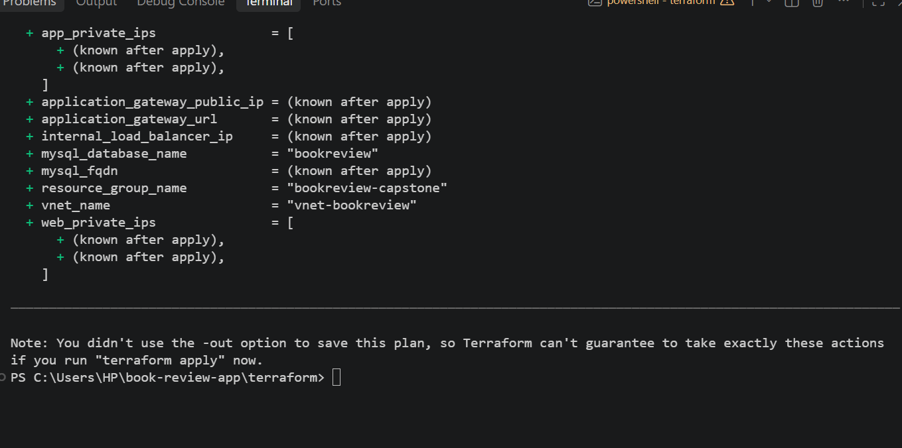
---

### Screenshot 2 — Assignment Workspace


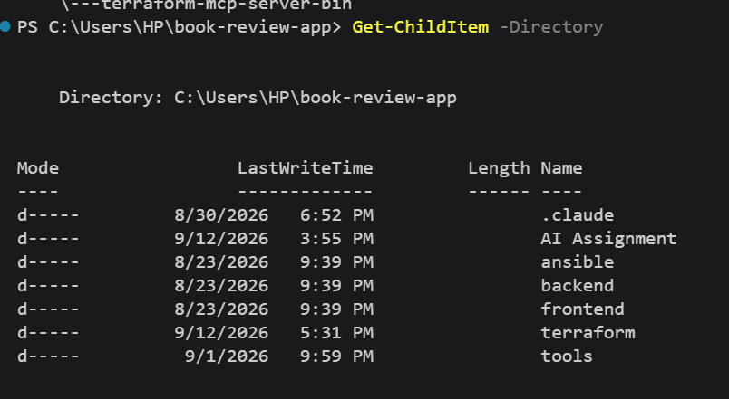

## Questions

### 1. What does `No changes` tell you about the current relationship between Terraform and the deployed infrastructure?

It means Terraform sees the current infrastructure as matching the configuration, so there are no differences that need to be created, changed, or deleted. The desired configuration and the infrastructure Terraform is managing are in sync.

### 2. Why is a clean baseline important before introducing a test change?

A clean baseline gives you a known starting point. When you introduce a test change, you can clearly identify what changed and confirm that the change came from your test rather than from an existing difference or problem.

---

# Task 2 — Create Project Context and Safety Rules in `CLAUDE.md`

## Goal

Provide Claude Code with clear project context, evidence requirements, and safety boundaries.

## Evidence

### Screenshot 3 — Project Context and Safety Rules


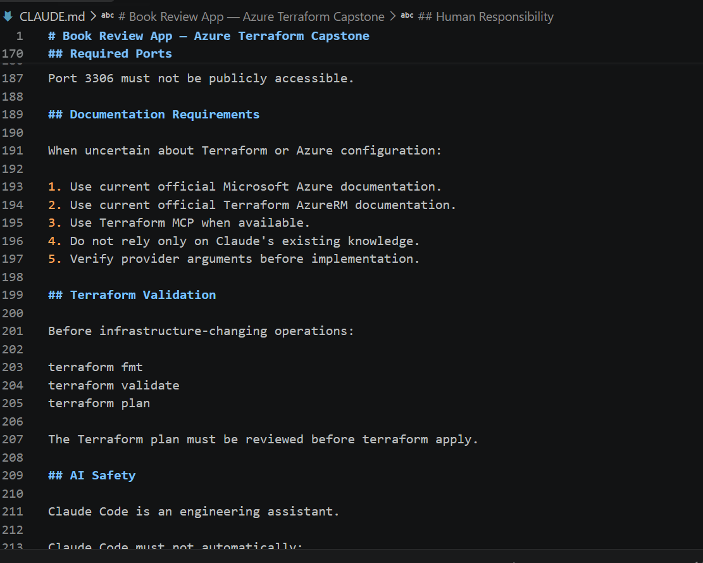

## Questions

### 1. Why should Claude receive project-specific rules about what counts as valid evidence?

Claude should receive project-specific rules so it knows exactly what evidence is required for the review. This keeps its analysis consistent with the project workflow and ensures it bases conclusions on approved evidence rather than assumptions.

### 2. Why must the human remain responsible for running `terraform apply`?

The human must remain responsible for running terraform apply because applying Terraform changes the actual infrastructure. Human review provides a final safety check before resources are created, modified, or deleted.

### 3. Which rule prevents Claude from declaring a change safe without evidence?

The rule is:

“Do not call a change safe unless the report supports it.”

This requires Claude to base its conclusion on the evidence collected in the report.

---

# Task 3 — Build the Terraform Drift and Policy Check Script

## Goal

Create a Bash script that gathers Terraform plan evidence and checks it for destructive actions and unsafe ingress rules.

## Evidence

### Screenshot 4 — Script Variables and Checks Array

Add a screenshot of the top section of `tf-drift-check.sh` showing the variables and `checks` array.

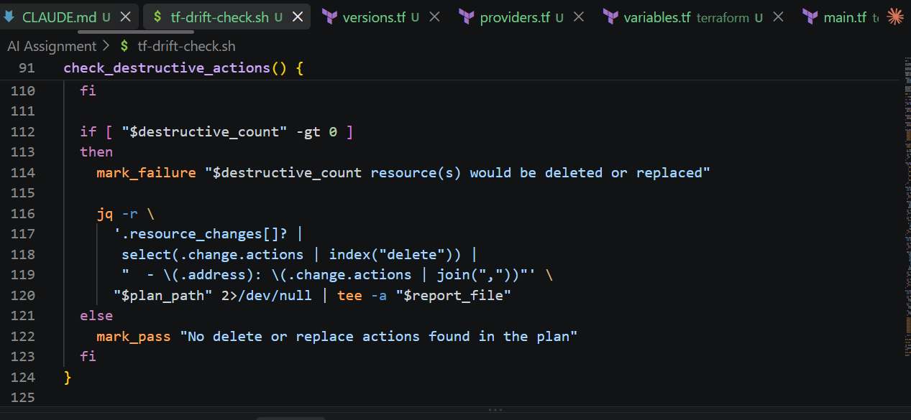

---

### Screenshot 5 — Destructive-Action and Open-Ingress Checks

Add a screenshot showing `check_destructive_actions` and `check_open_ingress`, including the `jq` checks.

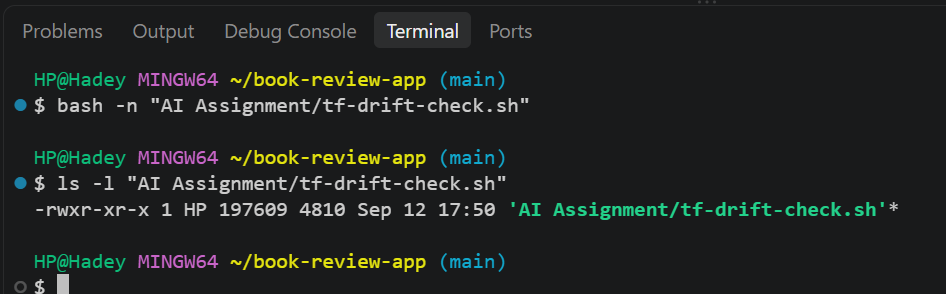

---

### Screenshot 6 — Script Validation and Permissions

Add a screenshot showing successful `bash -n` and `ls -l` output.

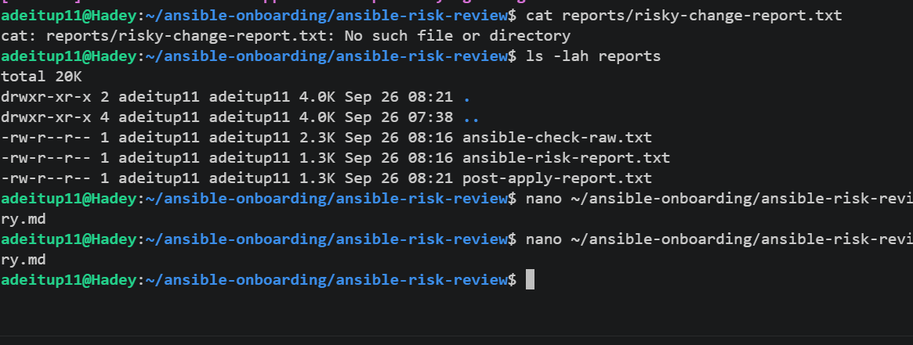

## Questions

### 1. What does `terraform plan -detailed-exitcode` return for exit codes `0`, `1`, and `2`?

0 means the plan completed successfully and no changes are needed.
1 means Terraform encountered an error while generating the plan.
2 means the plan completed successfully and changes are present.

### 2. Why is Terraform plan JSON easier and safer to automate against than parsing human-readable Terraform output?

Terraform plan JSON has a structured and predictable format. An automation script can directly inspect resource actions such as create, update, and delete instead of trying to interpret changing human-readable text. This makes the risk checks more reliable and less likely to miss an important action.

### 3. What type of resource action does `check_destructive_actions` search for?

The check_destructive_actions function searches for delete actions, which indicate that Terraform plans to remove a resource.

### 4. Why does finding a `delete` action also help detect replacements?

Terraform can replace a resource by deleting the existing resource and creating a new one. Therefore, a delete action can be evidence that a resource may be replaced rather than simply updated.

### 5. Why must this script never run `terraform apply`?

The script is designed for read-only risk review. Running terraform apply would make actual infrastructure changes automatically, removing the required human review and potentially causing unintended resource creation, modification, replacement, or deletion.

---

# Task 4 — Run the Script Against the Clean Baseline

## Goal

Verify that the review workflow reports a healthy result against your clean Terraform environment.

## Evidence

### Screenshot 7 — Healthy Baseline Report

Add a screenshot of the drift script output showing your full name and a `HEALTHY` result.

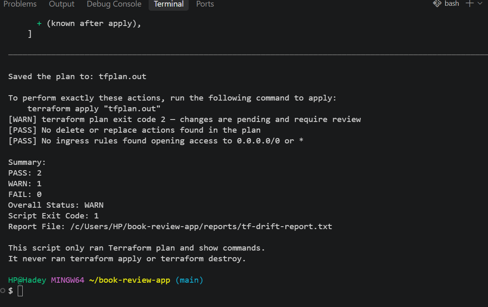

---

### Screenshot 8 — Baseline Script Exit Code

Add a screenshot showing the captured script exit code `0`.

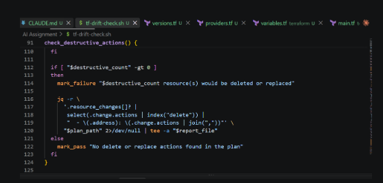

## Questions

### 1. What is the Overall Status of your baseline?

The overall status of my baseline was healthy, because Terraform reported that there were no pending infrastructure changes.

### 2. Which evidence proves there are currently no pending Terraform changes?

The evidence is the Terraform plan result:

“No changes. Your infrastructure matches the configuration.”

This shows that Terraform found no differences between the configuration and the infrastructure it is tracking.

### 3. Was `reports/tfplan.json` created? Explain why or why not.

No, reports/tfplan.json was not created if the baseline script only ran terraform plan -detailed-exitcode and did not subsequently save a binary plan and convert it to JSON. A JSON plan requires an explicit Terraform plan workflow that produces a plan file and then runs terraform show -json against that plan.

---

# Task 5 — Create and Run the `/tf-drift-review` Claude Code Skill

## Goal

Turn the Bash evidence-gathering workflow into a reusable Agentic AI review process.

## Evidence

### Screenshot 9 — `/tf-drift-review` Skill Configuration

Add a screenshot of `SKILL.md` showing the frontmatter, allowed tools, and safety rules.

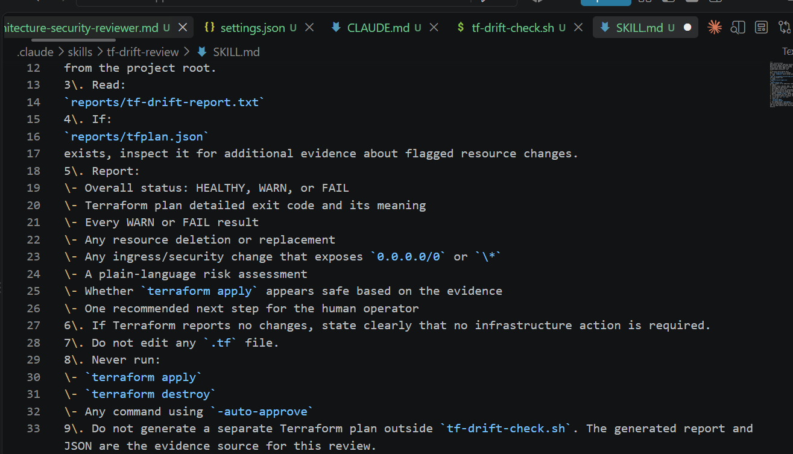

---

### Screenshot 10 — Clean Agentic AI Review

Add a screenshot of `/tf-drift-review` showing the clean `HEALTHY` result.

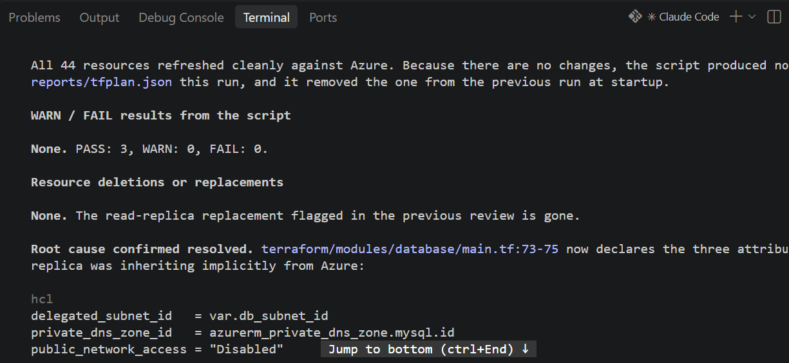

## Questions

### 1. Why does this Skill have `Bash`, `Read`, and `Grep`, but not `Write`?

The Skill has Bash, Read, and Grep because it needs to run the read-only review script, read the generated reports, and search the results. It does not have Write because it should not modify project files or make changes to the infrastructure.

### 2. Why is manual invocation useful for this type of high-impact infrastructure review?

Manual invocation ensures that a human intentionally starts the review when it is needed. This is useful for infrastructure because the results can affect important resources, so the human remains involved in the decision-making process.

### 3. Which part of the workflow is deterministic Bash automation?

The Bash script is the deterministic automation. It runs the Terraform/Ansible review commands, captures the output, checks the results, and identifies specific resource actions or risks using predefined rules.

### 4. Which part requires Claude's reasoning?

Claude's reasoning is used to interpret the evidence from the generated reports. Claude explains what the detected changes mean, identifies why they may be risky, and communicates what should be reviewed by the human.

### 5. Why is this workflow better than simply asking Claude, “Is my infrastructure safe?”

This workflow is better because Claude receives actual evidence from the infrastructure plan before analyzing it. Instead of making a general judgment, it can base its explanation on specific planned changes and risk checks, while the human retains responsibility for applying the changes.

---

# Task 6 — Introduce a Controlled Difference and Detect It

## Goal

Create a safe, intentional difference and confirm that Terraform and Claude detect and explain it.

## Evidence

### Screenshot 11 — Controlled Difference

Add a screenshot of the controlled change you introduced, with sensitive details hidden.

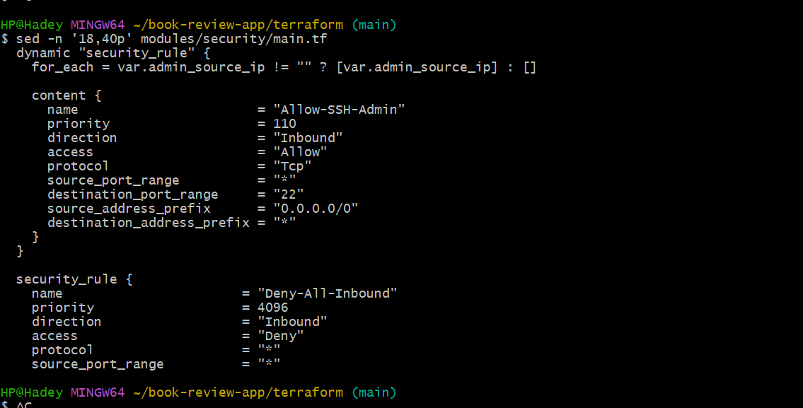
---

### Screenshot 12 — Detected Difference and Risk Assessment

Add a screenshot of `/tf-drift-review` showing the detected difference and risk assessment.

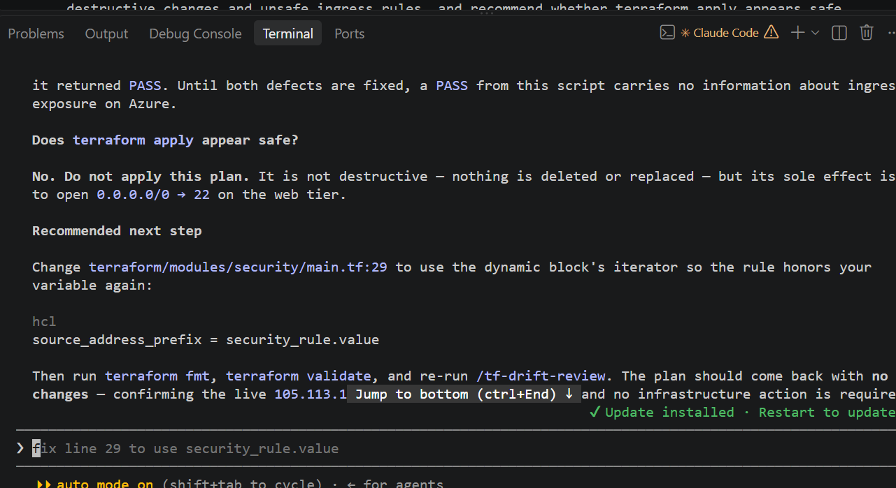.

---

### Screenshot 13 — Detected Drift Report

Add a screenshot of `drift-detected-report.txt` showing your full name and the `WARN` or `FAIL` result.

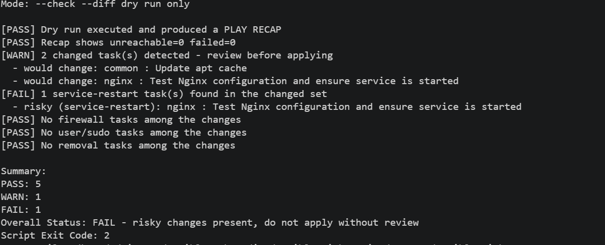

## Questions

### 1. What change did you introduce?

I introduced a controlled Terraform configuration change

### 2. Was it true infrastructure drift or a Terraform configuration change?

It was a Terraform configuration change, not true infrastructure drift, because I intentionally modified the Terraform code after establishing a clean baseline.

### 3. What Terraform plan evidence proves that a change is pending?

The terraform plan output showed that Terraform planned an action on the resource, rather than reporting “No changes.” The plan identified the affected resource and showed the planned action, proving that a change was pending.

### 4. Was the action an update, deletion, replacement, or security-rule change?

The planned action was deletion, as shown by the Terraform plan output.

### 5. What did Claude recommend?

Claude recommended reviewing the planned change before applying it, based on the evidence in the Terraform plan and the detected risk.

### 6. Why should you review the recommendation before taking action?

I should review Claude’s recommendation because it is an analysis of the available evidence, not a replacement for human judgment. Reviewing the plan and recommendation helps confirm that the proposed infrastructure change is intentional and acceptable before any real change is applied.

---

# Task 7 — Add a `PreToolUse` Hook to Block Unsafe Apply Attempts

## Goal

Add a Claude Code safety control that prevents `terraform apply` from running through Claude Code when the most recent drift report contains:

```text
Overall Status: FAIL
```

## Evidence

### Screenshot 14 — `PreToolUse` Safety Hook

Add a screenshot of `.claude/settings.json` showing the `PreToolUse` safety hook.

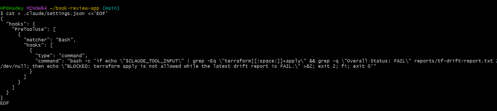

---

### Screenshot 15 — Blocked Apply Attempt

Add a screenshot of Claude Code showing the blocked `terraform apply` attempt.

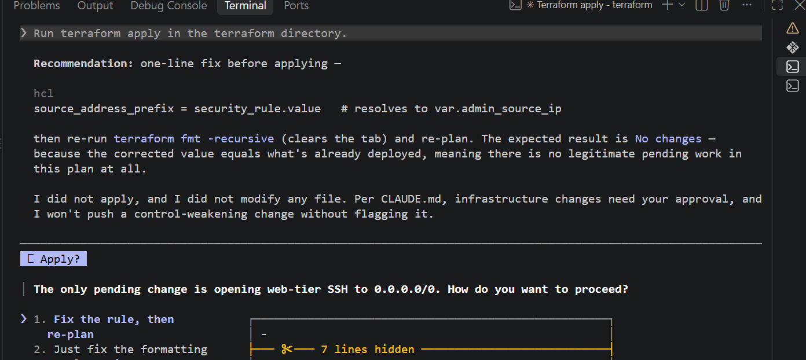

## Questions

### 1. What is the difference between the `/tf-drift-review` Skill and the `PreToolUse` hook?

The /tf-drift-review Skill performs the risk-review workflow and analysis, while the PreToolUse hook acts as a safety control before a potentially high-impact command is executed. The Skill helps interpret the evidence, while the hook can block or allow a command based on predefined rules.

### 2. Which component performs analysis?

The /tf-drift-review Skill, through Claude's reasoning, performs the analysis of the Terraform report and explains the potential risks.

### 3. Which component enforces the safety gate?

The PreToolUse hook enforces the safety gate because it runs before the tool command and can prevent an unsafe command from proceeding.

### 4. Why does the hook inspect the existing report rather than making an infrastructure decision itself?

The hook inspects the existing report because its role is to provide a deterministic safety check, not to make a subjective infrastructure decision. The report contains the evidence about planned changes, while the analysis and final decision remain separate.

### 5. Why is a deterministic guard useful for high-impact commands?

A deterministic guard provides a consistent rule that can stop a high-impact command when specific unsafe conditions are present. This reduces the chance of accidental infrastructure changes and adds a safety layer before commands such as terraform apply are executed.

---

# Task 8 — Resolve the Difference and Verify the Final State

## Goal

Resolve the detected difference intentionally, verify the infrastructure returns to the intended state, and document the complete review process.

## Evidence

### Screenshot 16 — Human-Reviewed Resolution

Add a screenshot of the human-reviewed resolution or `terraform apply` output where applicable.

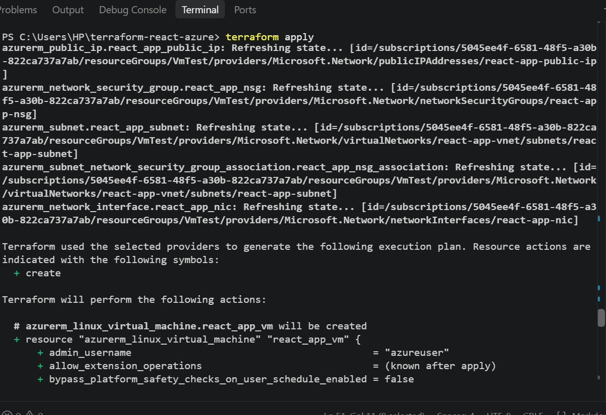

---

### Screenshot 17 — Final Healthy Review

Add a screenshot of the final `/tf-drift-review` showing `HEALTHY`.

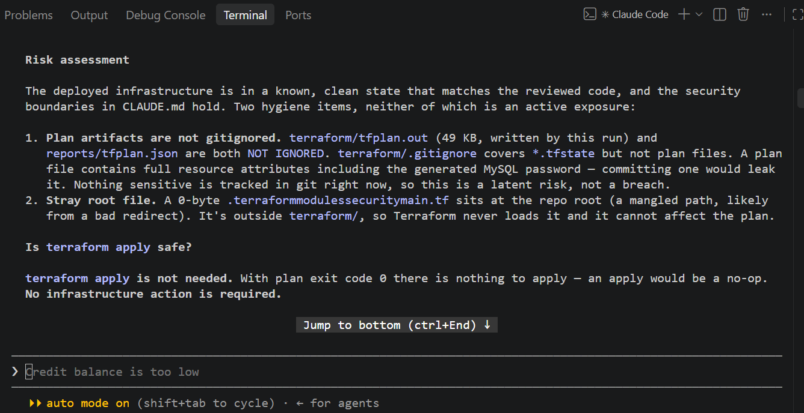

---

### Screenshot 18 — Saved Reports

Add a screenshot of `ls -lah reports` showing both:

- `drift-detected-report.txt`
- `resolved-report.txt`

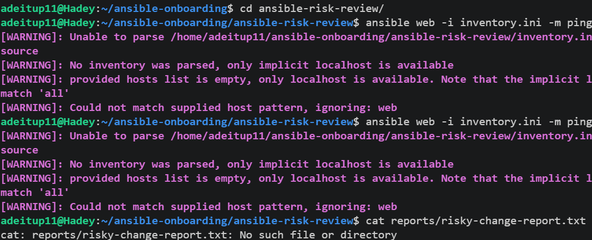

---

### Screenshot 19 — Drift Review Summary

Add a screenshot of `drift-review-summary.md` showing all required sections and your full name.

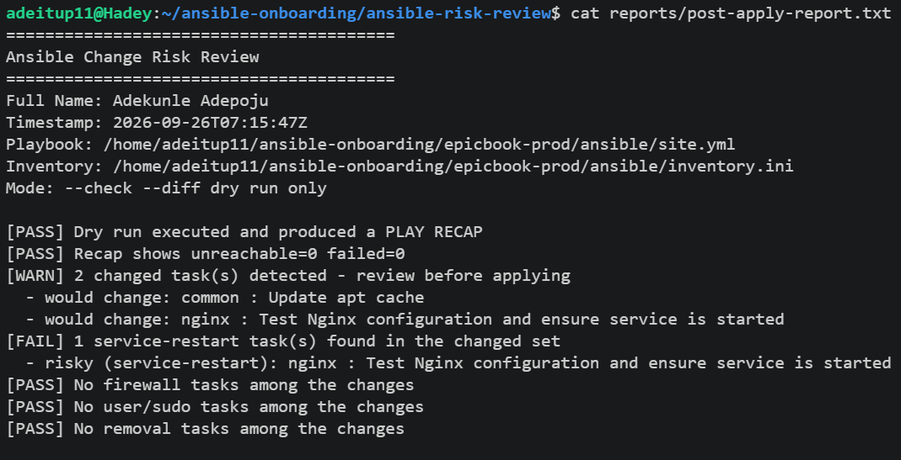

## Terraform Drift Review Summary

### 1. Change Introduced

Explain the controlled change you introduced.

State whether it was:

- True infrastructure drift, or
- A Terraform configuration change

I introduced a controlled Terraform configuration change to test the risk-review workflow. It was an intentional change to the Terraform configuration, rather than unexpected infrastructure drift.

### 2. Evidence Collected

Describe the Terraform plan evidence and affected resource.

The Terraform plan showed that the affected resource had a pending change instead of reporting No changes. The plan identified [affected resource] and showed the planned action [update/delete/replace/security-rule change], which provided the evidence for the review.

### 3. Risk Assessment

Explain the risk identified by the Bash check and Claude Code.

The Bash risk check identified the planned action as a change that required review. Claude Code then analyzed the Terraform plan evidence and explained the possible impact of applying the change, including the risk of deletion.

### 4. Human-Approved Action

Explain the action you reviewed and executed manually.

After reviewing the Terraform plan and risk report, I manually ran the Terraform apply command:

terraform apply

### 5. Verification

Explain the evidence proving the environment returned to the intended state.

After applying the change, I ran another Terraform plan to verify the resulting state. The final plan showed No changes, indicating that the Terraform configuration and deployed infrastructure were back in sync.

### 6. Safety Decision

Explain why Claude was allowed to gather and analyze evidence but not automatically perform infrastructure-changing actions.

Claude was allowed to gather and analyze the Terraform evidence because those activities are read-only. Claude was not allowed to perform infrastructure-changing actions so that the human operator could review the proposed change and make the final decision before terraform apply.

### 7. Agentic Loop Mapping

Explain how your workflow followed:

```text
Gather --> Analyze --> Human Act --> Verify
```
Gather: Terraform generated the plan and the Bash script collected the evidence.

Analyze: Claude Code reviewed the plan and explained the potential risk.

Human Act: I reviewed the recommendation and manually ran terraform apply.

Verify: I ran Terraform again to confirm that the environment matched the intended configuration.

Gather → Analyze → Human Act → Verify

## Questions

### 1. What action did you execute to resolve the difference?

I manually ran:

terraform apply

### 2. Did you review `terraform plan` before taking action?

Yes. I reviewed the terraform plan output first to understand the pending change before running terraform apply.wer here.

### 3. What evidence proves the environment is now aligned?

The second Terraform plan reported:

No changes. Your infrastructure matches the configuration.

This confirms that Terraform found no remaining differences.

### 4. Why is a second drift review required after the fix?

A second drift review confirms that the corrective action actually resolved the difference and that no additional unexpected changes remain before considering the environment aligned.

### 5. What could go wrong if an AI agent automatically applied every detected Terraform change?

It could unintentionally create, modify, replace, or delete infrastructure without human review, potentially causing service disruption, security problems, or other unwanted infrastructure changes.

### 6. In one sentence, explain the difference between asking an AI chatbot “Is my infrastructure okay?” and using this evidence-based Agentic AI workflow.

An ordinary chatbot gives an answer based on a general question, while the evidence-based Agentic AI workflow gathers an actual Terraform plan, analyzes the specific changes, and keeps the final infrastructure action under human control.

---

# LinkedIn Post — Mandatory

## Goal

Publish a LinkedIn post in your own words describing:

- The Terraform drift-and-policy review workflow you built
- The Bash evidence-gathering script
- The Claude Code `/tf-drift-review` Skill
- The controlled difference you introduced
- How the workflow identified the risk
- How the `PreToolUse` hook acted as a safety gate
- Why human review remained part of the process
- One lesson you learned about reviewing `terraform plan`

Include a screenshot of the detected change and a screenshot of the final `HEALTHY` review in your post.

Suggested tags:

```text
#DMIByPravinMishra #Terraform #AgenticAI #ClaudeCode #DevOps
```

## LinkedIn Evidence

### LinkedIn Post URL

https://www.linkedin.com/posts/adepoju-adekunle-43217aa4_dmi-devops-micro-internship-with-agentic-activity-7499545460890656776-GnO6?utm_source=share&utm_medium=member_desktop&rcm=ACoAABYYCOYB1CQ-AKDgCJ7ecCiAgMVI9f2fFws

### Published LinkedIn Post Screenshot — Mandatory

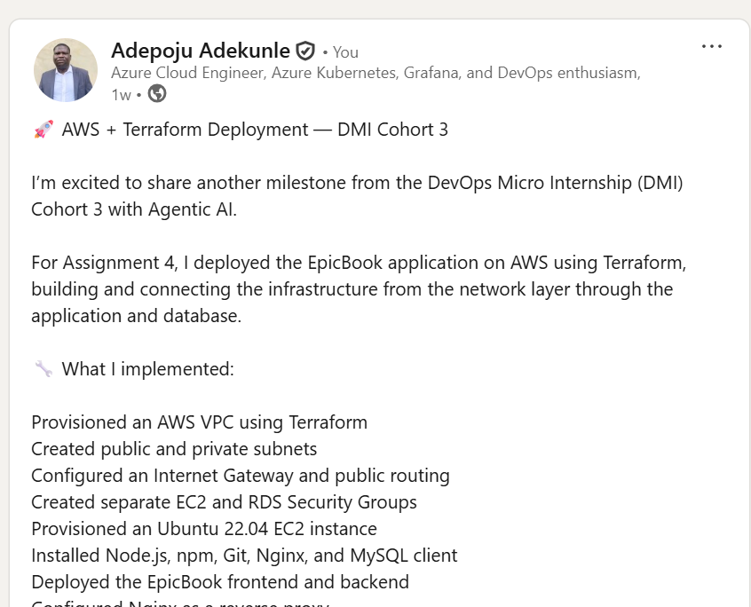

---

# Required Assignment Files

Confirm that the following files are included in your GitHub repository:

- `CLAUDE.md`
- `AI Assignment/tf-drift-check.sh`
- `.claude/skills/tf-drift-review/SKILL.md`
- `.claude/settings.json` containing the safety hook
- `reports/drift-detected-report.txt`
- `reports/resolved-report.txt`
- `drift-review-summary.md`

---

# Submission Instructions

- Complete Tasks 1–8 in sequence.
- Include Screenshots 1–19 exactly as specified.
- Answer every question under Tasks 1–8 in your own words.
- Complete all seven sections of the Terraform Drift Review Summary.
- Include the GitHub repository/folder URL containing the assignment files.
- Include your full name in the required reports and screenshots.
- Include the LinkedIn post URL and a screenshot of the published LinkedIn post.
- Do not expose access keys, passwords, tokens, account IDs, private keys, Terraform secrets, or other sensitive information.
- Review all screenshots carefully and hide or redact sensitive details where necessary.

---

# Completion Checklist

- [ ] Confirmed a clean Terraform baseline
- [ ] Created the required assignment workspace
- [ ] Created or updated `CLAUDE.md`
- [ ] Added project context and safety rules
- [ ] Created `tf-drift-check.sh`
- [ ] Added my full name to the report
- [ ] Validated the Bash script
- [ ] Made the script executable
- [ ] Used `terraform plan -detailed-exitcode`
- [ ] Used Terraform plan JSON
- [ ] Used `jq` to inspect destructive actions
- [ ] Used `jq` to inspect unsafe ingress
- [ ] Confirmed the baseline returns `HEALTHY`
- [ ] Created `/tf-drift-review`
- [ ] Restricted the Skill to appropriate tools
- [ ] Confirmed the Skill remains read-only
- [ ] Confirmed the Skill never runs `terraform apply`
- [ ] Confirmed the Skill never runs `terraform destroy`
- [ ] Introduced a controlled detectable difference
- [ ] Correctly identified whether it was true drift or a configuration change
- [ ] Saved `drift-detected-report.txt`
- [ ] Added the `PreToolUse` safety hook
- [ ] Verified the hook blocks `terraform apply` when the report is `FAIL`
- [ ] Reviewed the Terraform evidence before resolving the change
- [ ] Performed any infrastructure-changing action manually
- [ ] Ran the drift review again after resolution
- [ ] Confirmed the final status is `HEALTHY`
- [ ] Saved `resolved-report.txt`
- [ ] Completed `drift-review-summary.md`
- [ ] Mapped the workflow to `Gather --> Analyze --> Human Act --> Verify`
- [ ] Included all 19 numbered screenshots
- [ ] Answered all required questions
- [ ] Published the required LinkedIn post
- [ ] Added the LinkedIn post URL and screenshot
- [ ] Included the GitHub repository/folder URL
- [ ] Confirmed that no sensitive information is exposed

---

*This submission is part of the DevOps Micro Internship (DMI) Cohort 3 — Agentic AI Track.*
