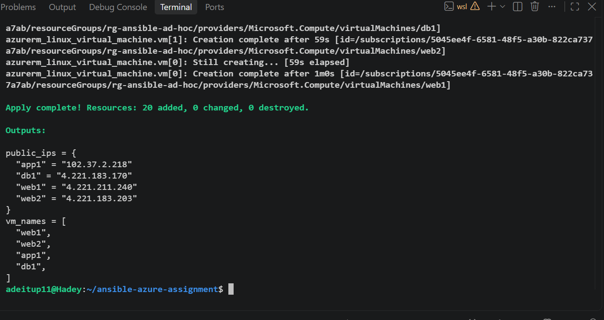
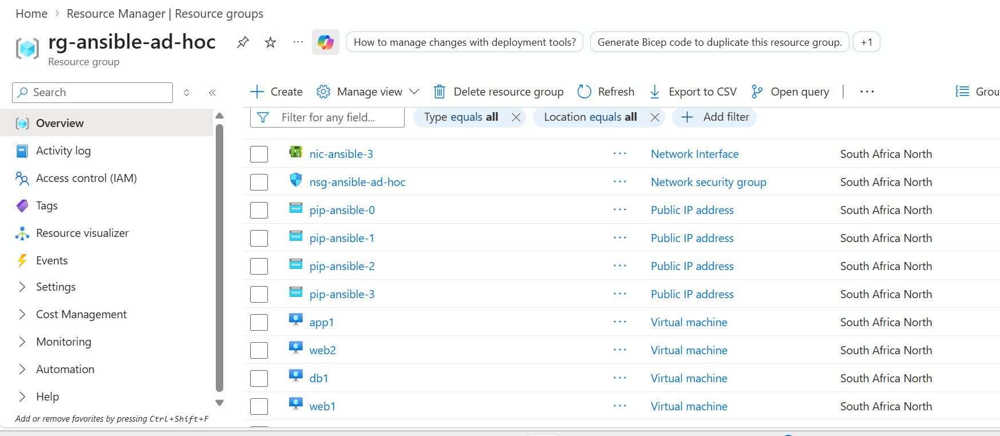
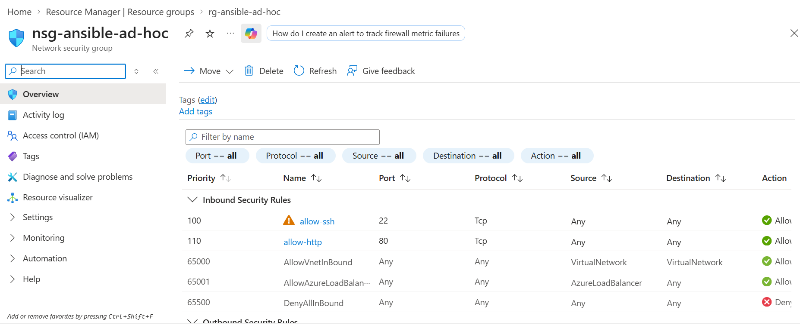
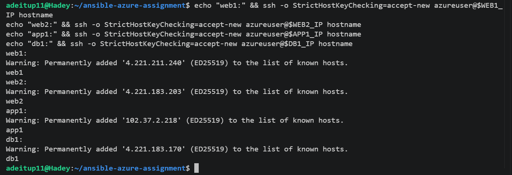
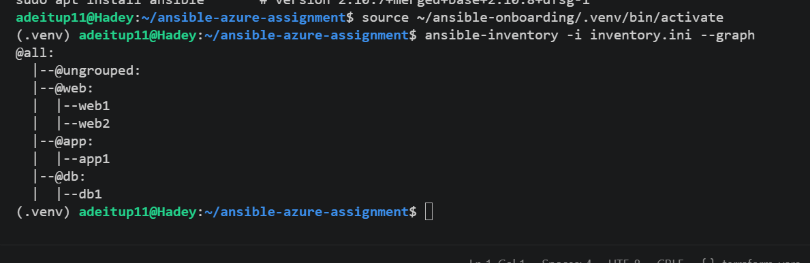
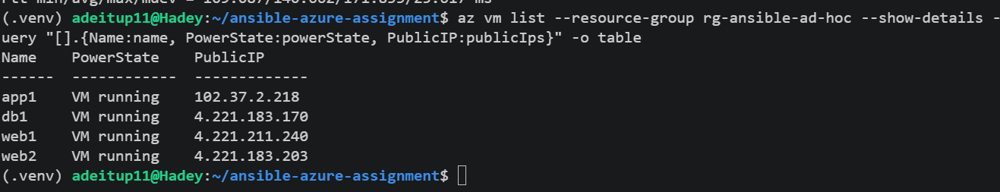
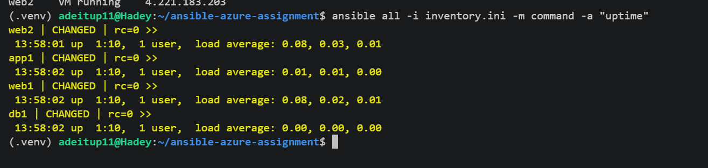
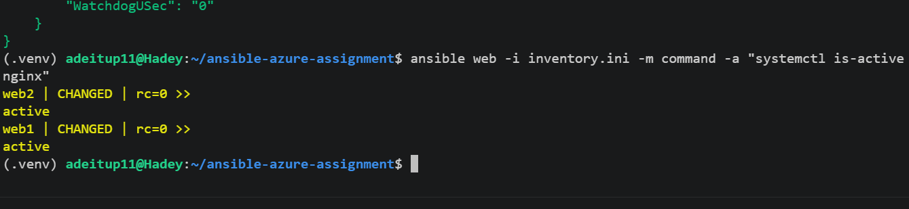
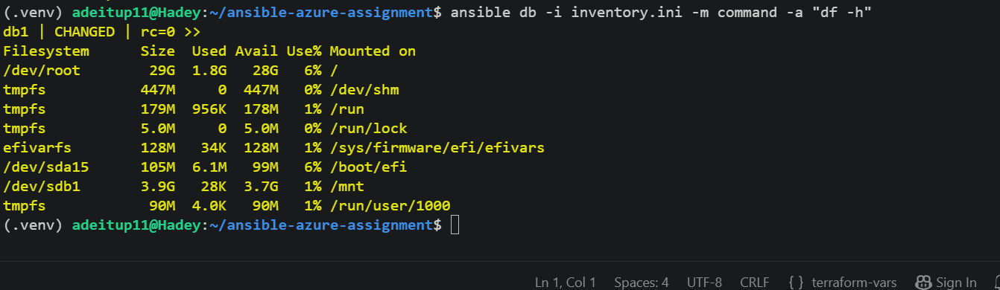

# Assignment 2 — Ad-Hoc Automation on Azure: 4 VMs, Inventory & Passwordless SSH

Part of the DevOps Micro Internship (DMI) Cohort 3 with Agentic AI

---

## Purpose

In this assignment, you will provision four Azure Linux VMs with Terraform, configure passwordless SSH, build a custom Ansible inventory with web/app/db groups, and run ad-hoc commands across individual hosts and groups.

---

# Task 1 — Provision 4 Azure VMs (Terraform)

## Goal

Provision four Ubuntu 22.04 VMs (`web1`, `web2`, `app1`, `db1`, Standard_B1s) with SSH key authentication and public IPs, in a VNet with an NSG allowing SSH (22) and HTTP (80), and output all four public IPs.

### Evidence

#### Screenshot 1 — Terminal showing successful `terraform apply` output and `terraform output public_ips`

---

#### Screenshot 2 — Azure Portal showing all four running Ubuntu VMs

---

#### Screenshot 3 — Network Security Group inbound rules showing SSH 22 and HTTP 80

---

# Task 2 — Configure Passwordless SSH

## Goal

Connect to each of the four VMs as `azureuser` and run `hostname` remotely without a password prompt.

### Evidence

#### Screenshot 4 — Terminal showing successful `hostname` output from all four passwordless SSH tests

---

# Task 3 — Create a Custom Ansible Inventory

## Goal

Create `inventory.ini` mapping VM indices 0–1 to `[web]`, index 2 to `[app]`, and index 3 to `[db]`, with `ansible_user` and `ansible_ssh_private_key_file` set under `[all:vars]`.

### Evidence

#### Screenshot 5 — Editor or terminal showing `inventory.ini` with the web, app, db, and all:vars sections

---

# Task 4 — Run Your First Ansible Ad-Hoc Commands

## Goal

Run `ping`, `whoami`, and `uptime` against all hosts; install and start Nginx on the `web` group with `--become`; install `htop` on all hosts; and run `df -h` on `db` and `free -m` on all hosts.

### Evidence

#### Screenshot 6 — Terminal showing `ansible ping` SUCCESS for all four hosts

---

#### Screenshot 7 — Terminal showing `uptime` output for all four hosts

---

#### Screenshot 8 — Terminal showing Nginx installation and service start on the web group

---

#### Screenshot 9 — Terminal showing `htop` installation on all hosts and group-targeted command output

---

### Notes

Describe an issue you faced and how you fixed it, what you learned, when you'd use an ad-hoc command instead of a playbook, and one challenge you faced during SSH or inventory setup.

Here is a structured overview addressing each part of your DevOps journey with Terraform and Ansible:

---

### **1. An Issue Faced and How It Was Fixed**

* **Issue:** During the setup on Ubuntu WSL, the HashiCorp APT repository repeatedly failed with a GPG key verification error (`NO_PUBKEY FC9CA96ACA026560` / `Temporary failure in name resolution`), preventing `apt` from installing Terraform. Furthermore, attempting to extract the manual binary failed because the system lacked the `unzip` package.
* **Fix:**
1. Removed the broken repository entry (`/etc/apt/sources.list.d/hashicorp.list`).
2. Fixed the WSL DNS issue by setting a public nameserver (`8.8.8.8` in `/etc/resolv.conf`).
3. Installed `unzip` via `apt install -y unzip`.
4. Downloaded the compiled Terraform binary directly from HashiCorp's release site, unzipped it, and moved it into the system path (`/usr/local/bin/`).

---

### **2. Key Takeaways and What Was Learned**

* **Package Manager vs. Direct Binary Fallbacks:** Package repositories can fail due to transient network, GPG key, or DNS issues. Knowing how to manually download, extract, and place standalone binaries into `/usr/local/bin` keeps work moving without being blocked by `apt` errors.
* **WSL Network and Resolution Behavior:** WSL occasionally loses DNS setup after host network changes, leading to host resolution errors for external endpoints like Azure or HashiCorp. Understanding how `/etc/resolv.conf` interacts with WSL helps troubleshoot network connectivity quickly.

---

### **3. When to Use Ad-Hoc Commands vs. Playbooks**

* **Use Ad-Hoc Commands When:**
* Performing quick, one-off operational tasks or diagnostic checks (e.g., running `ansible all -m ping`, checking `uptime`, checking memory with `free -m`, or inspecting disk space with `df -h`).
* Quickly rebooting a group of servers or checking if a service (like Nginx) is active across multiple nodes.
* Testing connection or inventory configuration before running full playbooks.

* **Use Playbooks When:**
* Complex, multi-step provisioning or configuration state management is required (e.g., setting up a Web, Application, and Database multi-tier stack).
* Configurations need to be version-controlled, reusable, idempotent, and shared across teams.
* Tasks require conditional logic, roles, loops, dynamic variables, or secret management (Vault).

---

### **4. A Challenge Faced During SSH or Inventory Setup**

* **Challenge:** Encountered `UNREACHABLE!` errors (`Connection timed out` and `No route to host`) across all four managed nodes (`web1`, `web2`, `app1`, `db1`) when attempting to run `ansible all -i inventory.ini -m ping`.
* **Resolution:** Diagnosed that the issue stemmed from either deallocated VMs/changed public IPs or WSL losing DNS connectivity to Azure endpoints. Resolving the network resolution issue in WSL and verifying that inbound port 22 (SSH) was explicitly allowed in the Network Security Group (NSG) restored connectivity, allowing `ansible ping` to return `SUCCESS` for all target hosts.

---

# Submission Instructions

- Add all required screenshots in your submission
- Public IP addresses may be redacted
- Do not expose, upload, or commit the SSH private key

---

# Completion Checklist

- [ ] Task 1: Four Azure VMs provisioned with Terraform (Screenshots 1–3)
- [ ] Task 2: Passwordless SSH verified on all four VMs (Screenshot 4)
- [ ] Task 3: `inventory.ini` created with web/app/db groups (Screenshot 5)
- [ ] Task 4: Ad-hoc ping, uptime, Nginx, and htop commands run successfully (Screenshots 6–9)
- [ ] Reflection notes written (Notes)
- [ ] No private key material exposed

---

## 📌 About DMI & CloudAdvisory

DevOps Micro Internship (DMI) is a project-based DevOps program run by Pravin Mishra (The CloudAdvisory) focused on real-world execution, systems thinking, and career readiness.

It helps learners build strong DevOps foundations with hands-on experience.

---

## 📌 Resources

- 🌐 DMI Official Website: https://dmi.pravinmishra.com?utm_source=github&utm_medium=readme  
- 🎓 University: https://university.pravinmishra.com?utm_source=github&utm_medium=readme  
- 💬 Discord Community: https://discord.pravinmishra.com?utm_source=github&utm_medium=readme  
- 📝 Blog: https://dmi.pravinmishra.com/blog?utm_source=github&utm_medium=readme  
- ▶️ YouTube Playlist: https://www.youtube.com/playlist?list=PLFeSNDtI4Cho  
- 🔗 Pravin Mishra (LinkedIn): https://www.linkedin.com/in/pravin-mishra-aws-trainer/  
- 🏢 CloudAdvisory (LinkedIn): https://www.linkedin.com/company/thecloudadvisory/

---

*This submission is part of DevOps Micro Internship (DMI) Cohort 3 — Agentic AI Track.*
