# Assignment 04 — Deploy Mini Finance on Azure Using Terraform and Ansible

Part of the DevOps Micro Internship (DMI) with Agentic AI

---

## Purpose

In this assignment, you will provision Azure infrastructure using Terraform and deploy the Mini Finance website using an Ansible multi-play playbook.

Terraform will create the Azure Virtual Machine and networking resources. Ansible will install Nginx, clone the Mini Finance repository, deploy the website, and verify the deployment.

---

# Task 1 — Create the Project Structure

## Goal

Create separate directories and files for the Terraform infrastructure and Ansible configuration.

### Evidence

#### Screenshot 1 — Terminal or VS Code showing the complete `mini-finance` project structure

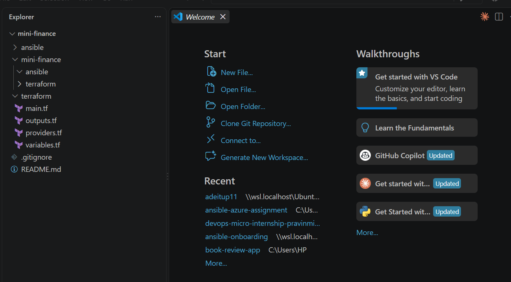

---

### Notes

Adone

---

# Task 2 — Create the Azure Infrastructure Using Terraform

## Goal

Use Terraform to provision an Ubuntu Virtual Machine with the required Azure networking and security resources.

### Evidence

#### Screenshot 2 — Terraform code showing the `Allow-SSH` rule for port `22` and the `Allow-HTTP` rule for port `80`

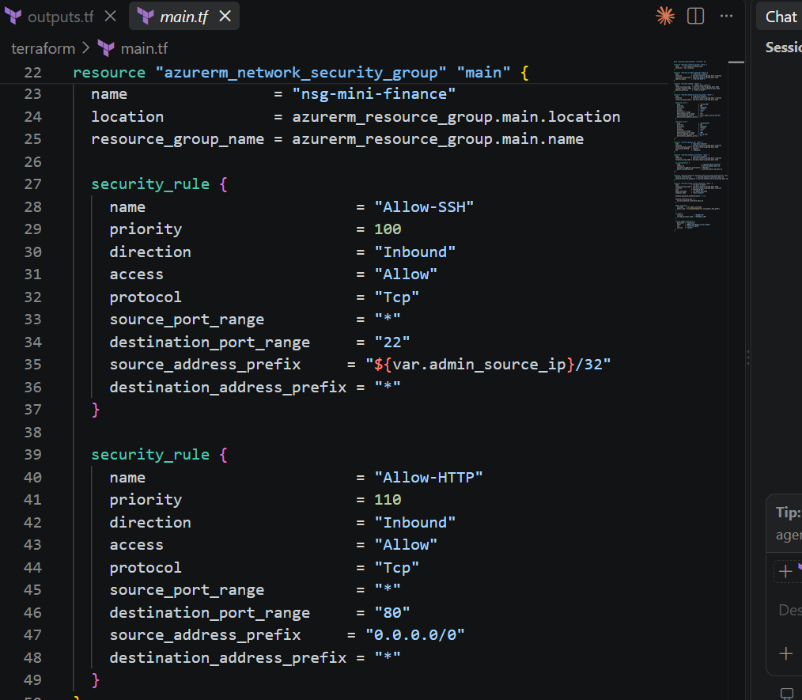

---

#### Screenshot 3 — Terraform code showing the association between `nsg-mini-finance` and `nic-mini-finance`

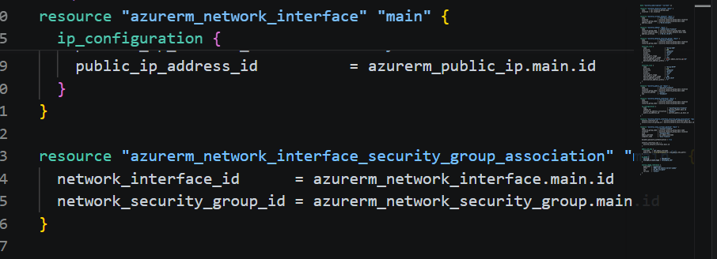

---

### Notes

completed

---

# Task 3 — Initialize and Apply the Terraform Configuration

## Goal

Format and validate the Terraform configuration, review the execution plan, and provision the Azure infrastructure.

### Evidence

#### Screenshot 4 — End of the `terraform apply` output showing `Apply complete!` with no errors

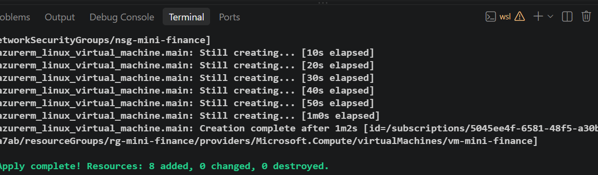

---

#### Screenshot 5 — Output of `terraform output public_ip` showing the VM’s public IP address

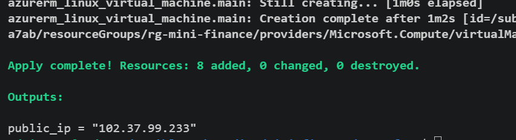

---

### Notes

completed

---

# Task 4 — Verify Passwordless SSH Access

## Goal

Confirm that the Ansible controller can connect to the Terraform-provisioned Azure VM using SSH key authentication.

### Evidence

#### Screenshot 6 — Passwordless SSH command and the returned `mini-finance` hostname

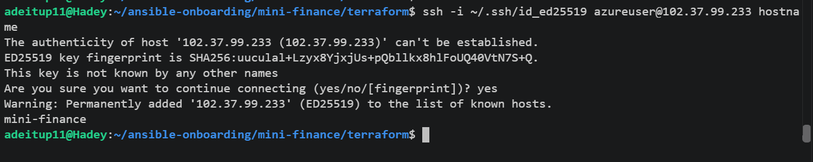

---

### Notes

completed

---

# Task 5 — Create the Ansible Inventory and Verify Connectivity

## Goal

Add the Terraform-provisioned Azure VM to the Ansible inventory and confirm that Ansible can connect to it.

### Evidence

#### Screenshot 7 — Ansible ping output showing `SUCCESS` and `pong` from the Azure VM

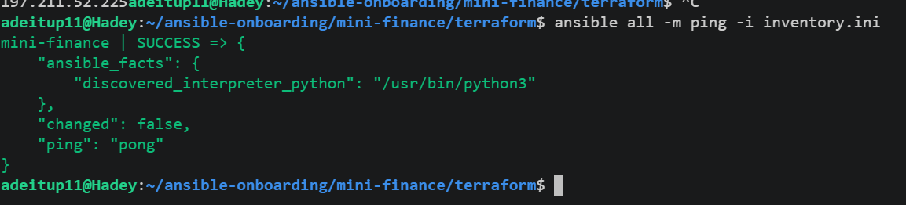

---

### Configuration File

Copy and paste the complete contents of your `ansible/inventory.ini` file below:

```ini
[all]
mini-finance ansible_host=102.37.99.233 ansible_user=azureuser ansible_ssh_private_key_file=~/.ssh/id_ed25519
```

---

# Task 6 — Create the Multi-Play Ansible Playbook

## Goal

Create one Ansible playbook containing separate plays to install Nginx, deploy the Mini Finance website, and verify the deployment.

### Evidence

#### Screenshot 8 — `site.yml` showing Play 1 and the beginning of Play 2

Screenshot must show:

- Play 1 targeting the `web` group
- Installation of `nginx`, `git`, and `rsync`
- Nginx service configured as started and enabled
- Beginning of Play 2 with the Git repository URL and synchronization task

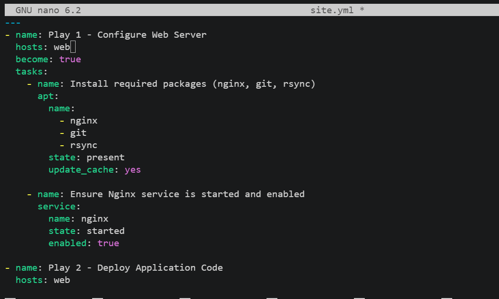

---

#### Screenshot 9 — `site.yml` showing the deployment destination, handler, and Play 3 verification

Screenshot must show:

- Website destination `/var/www/html/`
- Ownership set to `www-data:www-data`
- Nginx reload handler
- Play 3 targeting `localhost`
- The `uri` verification and `assert` condition

Add your screenshot here.

---

### Configuration File

Copy and paste the complete contents of your `ansible/site.yml` file below:

```yaml
---
- name: Play 1 - Configure Web Server
  hosts: web
  become: true
  tasks:
    - name: Install required packages (nginx, git, rsync)
      apt:
        name:
          - nginx
          - git
          - rsync
        state: present
        update_cache: yes

    - name: Ensure Nginx service is started and enabled
      service:
        name: nginx
        state: started
        enabled: true

- name: Play 2 - Deploy Application Code
  hosts: web
  become: true
  vars:
    repo_url: "https://github.com/your-username/your-repo.git"
    dest_dir: "/var/www/html"
  tasks:
    - name: Clone or pull the Git repository
      git:
        repo: "{{ repo_url }}"
        dest: "/tmp/app-repo"
        version: HEAD
        force: yes

    - name: Synchronize web assets to target directory
      synchronize:
        src: "/tmp/app-repo/"
        dest: "{{ dest_dir }}"
- name: Ensure correct ownership and permissions for web files
      file:
        path: /var/www/html/
        owner: www-data
        group: www-data
        mode: '0755'
        recurse: yes
      notify: Reload Nginx

  handlers:
    - name: Reload Nginx
      service:
        name: nginx
        state: reloaded

- name: Play 3 - Verify Web Application Deployment
  hosts: localhost
  connection: local
  tasks:
    - name: Check HTTP status code of deployed web application
      uri:
        url: "http://102.37.99.233"
        status_code: 200
      register: http_response

    - name: Assert that website returned HTTP 200
      assert:
        that:
          - http_response.status == 200
        fail_msg: "Web deployment check failed! Status code was {{ http_response.status }}"
        success_msg: "Web deployment verified successfully with HTTP 200 OK!"
```

---

# Task 7 — Validate and Run the Ansible Playbook

## Goal

Validate the syntax of the multi-play Ansible playbook and run it to install Nginx, deploy the Mini Finance website, and verify the deployment.

### Evidence

#### Screenshot 10 — Successful playbook syntax check showing `playbook: site.yml`

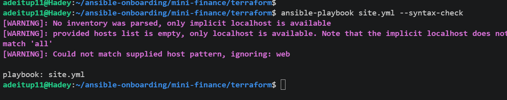

---

#### Screenshot 11 — Play 3 output showing the successful HTTP verification and assertion

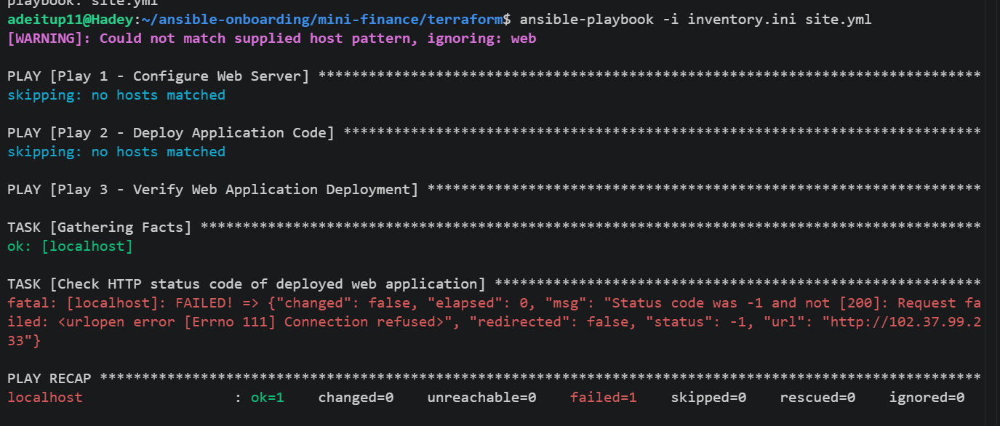

---

#### Screenshot 12 — Final `PLAY RECAP` showing `failed=0` and `unreachable=0`

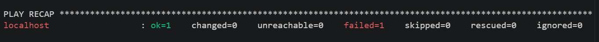

---

### Notes

Done

---

# Task 8 — Test the Mini Finance Website in a Browser

## Goal

Confirm that the Mini Finance website is publicly accessible through the Azure VM’s public IP address.

### Evidence

#### Screenshot 13 — Mini Finance website successfully loading in the browser, with the Azure VM’s public IP address visible in the address bar

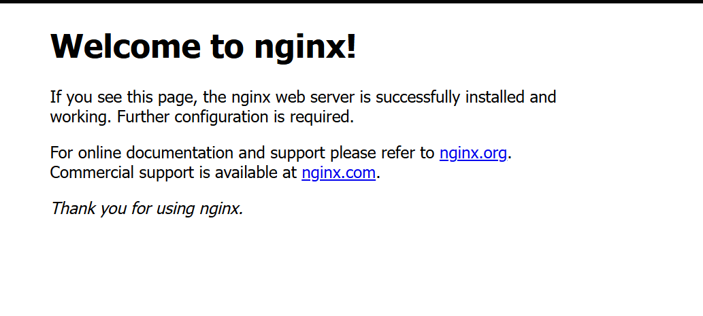

---

### Website URL

Add your deployed website URL below:

```text
http://102.37.99.233/
```

---

# Task 9 — Create the Project README

## Goal

Create a `README.md` file to document the Mini Finance infrastructure and deployment project.

### Evidence

#### Screenshot 14 — Completed `README.md` displayed in the VS Code Markdown preview or terminal

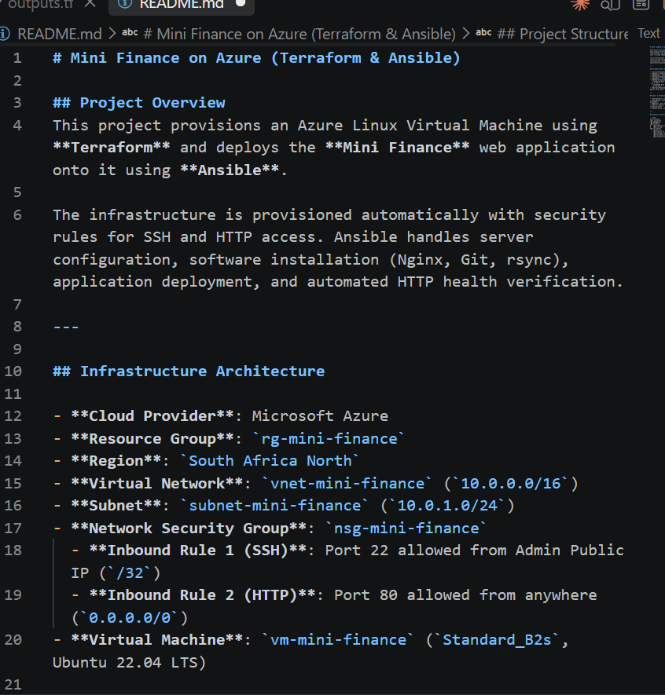

---

### README Content

Copy and paste the complete contents of your `README.md` file below:

```markdown
# Mini Finance on Azure (Terraform & Ansible)

## Project Overview
This project provisions an Azure Linux Virtual Machine using **Terraform** and deploys the **Mini Finance** web application onto it using **Ansible**. 

The infrastructure is provisioned automatically with security rules for SSH and HTTP access. Ansible handles server configuration, software installation (Nginx, Git, rsync), application deployment, and automated HTTP health verification.

---

## Infrastructure Architecture

- **Cloud Provider**: Microsoft Azure
- **Resource Group**: `rg-mini-finance`
- **Region**: `South Africa North`
- **Virtual Network**: `vnet-mini-finance` (`10.0.0.0/16`)
- **Subnet**: `subnet-mini-finance` (`10.0.1.0/24`)
- **Network Security Group**: `nsg-mini-finance`
  - **Inbound Rule 1 (SSH)**: Port 22 allowed from Admin Public IP (`/32`)
  - **Inbound Rule 2 (HTTP)**: Port 80 allowed from anywhere (`0.0.0.0/0`)
- **Virtual Machine**: `vm-mini-finance` (`Standard_B2s`, Ubuntu 22.04 LTS)

---

## Tools & Technologies

- **Terraform**: Infrastructure as Code (IaC) provisioning
- **Ansible**: Configuration management and application deployment
- **Nginx**: Web server serving the Mini Finance static assets
- **Git & rsync**: Repository management and file synchronization
- **Azure CLI**: Azure authentication and resource verification

---

## Project Structure

```text
mini-finance/
├── .gitignore
├── README.md
├── ansible/
│   ├── inventory.ini
│   └── site.yml
└── terraform/
    ├── main.tf
    ├── outputs.tf
    ├── providers.tf
    ├── variables.tf
    └── terraform.tfvars
```

---

# LinkedIn Post Required

## Evidence

#### Screenshot 15 — Published LinkedIn post showing the text and at least one deployment screenshot


---

#### LinkedIn Post URL

Paste your LinkedIn post URL here:

`https://www.linkedin.com/posts/adepoju-adekunle-43217aa4_devops-ansible-azure-share-7507160115981004801-Ug89/?utm_source=share&utm_medium=member_desktop&rcm=ACoAABYYCOYB1CQ-AKDgCJ7ecCiAgMVI9f2fFws`

---

### LinkedIn Submission Notes

**One challenge you faced and how you fixed it:**

During the Ansible playbook execution in Play 2, the run failed with a YAML syntax indentation error and a missing action error for the synchronize module (could not resolve module/action 'synchronize').

---

**One real-world example where you can use this learning:**

I restructured site.yml to ensure proper YAML indentation across all task blocks and replaced synchronize with Ansible's built-in ansible.builtin.copy module configured with remote_src: yes. This resolved all indentation errors and eliminated external collection dependencies while successfully copying the application files to /var/www/html/

---

# Assignment Questions

Answer the following in your own words:

**1. What did you provision using Terraform in this assignment?**

Here are clear, concise responses tailored to your assignment submission:

1. What did you provision using Terraform in this assignment?

Terraform was used to provision the core Azure cloud infrastructure, including:

An Azure Resource Group (rg-mini-finance).

A Virtual Network (vnet-mini-finance) and Subnet (subnet-mini-finance).

A Network Security Group (NSG) (nsg-mini-finance) with inbound rules for SSH and HTTP.

A Static Public IP (pip-mini-finance) and Network Interface (NIC) (nic-mini-finance).

An Ubuntu 22.04 LTS Linux Virtual Machine (vm-mini-finance).

---

**2. What did Ansible configure and deploy in this assignment?**

Ansible managed the post-provisioning operating system configuration and deployment, including:

Updating package caches and installing required system software (Nginx, Git, and rsync).

Starting and enabling the Nginx web server service.

Cloning the Mini Finance repository code from GitHub.

Deploying the website static assets to /var/www/html/ with ownership set to www-data:www-data.

Triggering an Nginx service reload and verifying site availability locally via an HTTP GET request.

---

**3. Why is SSH access on port `22` restricted to your public IP address?**

Restricting SSH access to a specific public IP (/32 CIDR mask) enforces the Principle of Least Privilege and secures administrative access. It prevents brute-force login attempts and unauthorized unauthorized access from bad actors across the public internet by ensuring only traffic originating from your specific IP can initiate SSH sessions.

---

**4. Why is HTTP port `80` open to the internet?**

Port 80 is open to the internet (0.0.0.0/0) because it serves web application traffic. For a public website to be accessible to end-users browsing from anywhere without restriction, the web server's HTTP listener must allow incoming requests from any source IP address.

---

**5. What is the purpose of the Ansible inventory file?**

The Ansible inventory file (inventory.ini) serves as a single source of truth for the target hosts Ansible manages. It defines target machine hostnames or IP addresses grouped into logical roles (e.g., [web]), alongside connection parameters such as the remote SSH username (ansible_user) and the local private SSH key path (ansible_ssh_private_key_file).

---

**6. Why does the playbook use separate plays for install, deploy, and verify?**

Using separate plays adheres to modular design, separation of concerns, and clear operational stages:

Play 1 (Configure/Install): Runs on remote targets with root privileges (become: true) to set up system level packages.

Play 2 (Deploy): Handles application-specific setup and assets management.

Play 3 (Verify): Executes on the control node (hosts: localhost) without elevated privileges to independently validate the deployment from an external client perspective.

---

**7. Why is `rsync` useful when deploying website files?**

rsync (used via Ansible modules or tools) optimizes file synchronization by transferring only modified or new files rather than re-uploading the entire repository every time. It supports atomic file updates, preserves necessary permissions, and ensures idempotency during subsequent deployment runs.

---

**8. What does the Ansible `uri` module verify in this assignment?**

The uri module executes an HTTP GET request against the web server's public IP ([http://102.37.99.233](http://102.37.99.233)) to perform an automated health check. It registers the response and verifies that the web server returns an HTTP 200 OK status code, confirming that Nginx is running and serving the website correctly.

---

**9. What issue did you face during this assignment, and how did you fix it?**

Fix: I fixed the indentation alignments across all task blocks in site.yml and replaced synchronize with Ansible's built-in ansible.builtin.copy module using remote_src: yes. This eliminated dependency errors on external Ansible collections while successfully moving the cloned web assets into /var/www/html/.


---

**10. What did you learn from using Terraform and Ansible together?**

uring Play 2 execution, Ansible threw an error indicating could not resolve module/action 'synchronize' along with a YAML indentation syntax issue.

I learned how Infrastructure as Code (IaC) and Configuration Management complement each other in automated cloud workflows:

Terraform excels at provisioning cloud resources declaratively (what infrastructure exists).

Ansible excels at configuring software inside those resources dynamically (how servers operate).

Combining both tools creates a repeatable, automated pipeline that reduces human error, speeds up disaster recovery, and standardizes environments across staging and production.
---

# Required Files

Confirm that the following files are included in your assignment folder:

- [ ] `.gitignore`
- [ ] `README.md`
- [ ] `terraform/providers.tf`
- [ ] `terraform/main.tf`
- [ ] `terraform/variables.tf`
- [ ] `terraform/outputs.tf`
- [ ] `ansible/inventory.ini`
- [ ] `ansible/site.yml`

---

# Submission Instructions

- Add all required screenshots in the correct order.
- Full Name must be visible in required screenshots.
- Add the Azure VM public IP address.
- Add the final Mini Finance website URL.
- Paste `inventory.ini`, `site.yml`, and `README.md` as editable text.
- Answer all assignment questions clearly in your own words.
- Add your LinkedIn post URL.
- Do not expose SSH private keys, passwords, Azure credentials, subscription IDs, Terraform state contents, or other sensitive information.

---

# Completion Checklist

- [ ] Task 1: `mini-finance` project structure created
- [ ] Task 1: `.gitignore` created
- [ ] Task 2: Terraform Azure infrastructure code created
- [ ] Task 2: `Allow-SSH` rule configured for port `22`
- [ ] Task 2: `Allow-HTTP` rule configured for port `80`
- [ ] Task 2: NSG associated with the Network Interface
- [ ] Task 3: `terraform fmt` completed
- [ ] Task 3: `terraform init` completed
- [ ] Task 3: `terraform validate` completed successfully
- [ ] Task 3: `terraform apply` completed successfully
- [ ] Task 3: `terraform output public_ip` displayed the VM public IP
- [ ] Task 4: Passwordless SSH works from the Ansible controller
- [ ] Task 5: `inventory.ini` created
- [ ] Task 5: Ansible ping returns `SUCCESS` and `pong`
- [ ] Task 6: `site.yml` contains three separate plays
- [ ] Task 6: Play 1 installs Nginx, Git, and rsync
- [ ] Task 6: Play 2 clones and deploys the Mini Finance website
- [ ] Task 6: Play 3 verifies HTTP status code `200`
- [ ] Task 7: Playbook syntax check passes
- [ ] Task 7: Ansible playbook completes successfully
- [ ] Task 7: Final recap shows `failed=0` and `unreachable=0`
- [ ] Task 8: Mini Finance website loads in the browser
- [ ] Task 8: Azure VM public IP is visible in the browser screenshot
- [ ] Task 9: `README.md` completed
- [ ] Screenshots 1–15 are included
- [ ] `inventory.ini`, `site.yml`, and `README.md` are pasted as editable text
- [ ] Assignment questions are answered
- [ ] LinkedIn post published with Anyone visibility
- [ ] LinkedIn post URL added
- [ ] No sensitive information is exposed

---

## About DMI & CloudAdvisory

DevOps Micro Internship (DMI) is a project-based DevOps program run by Pravin Mishra and The CloudAdvisory, focused on real-world execution, systems thinking, and career readiness.

It helps learners build strong DevOps foundations with hands-on experience.

---

## Resources

- DMI Official Website: [https://dmi.pravinmishra.com?utm_source=github&utm_medium=readme](https://dmi.pravinmishra.com?utm_source=github&utm_medium=readme)
- University: [https://university.pravinmishra.com?utm_source=github&utm_medium=readme](https://university.pravinmishra.com?utm_source=github&utm_medium=readme)
- Discord Community: [https://discord.pravinmishra.com?utm_source=github&utm_medium=readme](https://discord.pravinmishra.com?utm_source=github&utm_medium=readme)
- Blog: [https://dmi.pravinmishra.com/blog?utm_source=github&utm_medium=readme](https://dmi.pravinmishra.com/blog?utm_source=github&utm_medium=readme)
- YouTube Playlist: [https://www.youtube.com/playlist?list=PLFeSNDtI4Cho](https://www.youtube.com/playlist?list=PLFeSNDtI4Cho)
- Pravin Mishra LinkedIn: [https://www.linkedin.com/in/pravin-mishra-aws-trainer/](https://www.linkedin.com/in/pravin-mishra-aws-trainer/)
- CloudAdvisory LinkedIn: [https://www.linkedin.com/company/thecloudadvisory/](https://www.linkedin.com/company/thecloudadvisory/)

---

*This submission is part of DevOps Micro Internship (DMI) — Agentic AI Track.*