# Assignment — Deploy EpicBook with Terraform and Ansible Roles

Part of the DevOps Micro Internship (DMI) with Agentic AI

---

## Purpose

In this assignment, you will deploy the EpicBook web application using Terraform and Ansible roles.

Terraform provisions the cloud infrastructure, including one Ubuntu VM and one managed MySQL database. Ansible roles configure the VM, install required software, deploy the EpicBook application, configure Nginx, connect the app to the managed MySQL database, and verify the deployment.

---

# Task 1 — Set Up the Project Folder Layout

## Goal

Create the project folder structure for Terraform and Ansible roles.

Terraform will be used to provision the cloud infrastructure. Ansible roles will be used to configure the VM and deploy the EpicBook application.

### Evidence

#### Screenshot 1 — Terminal showing the completed `epicbook-prod` project structure

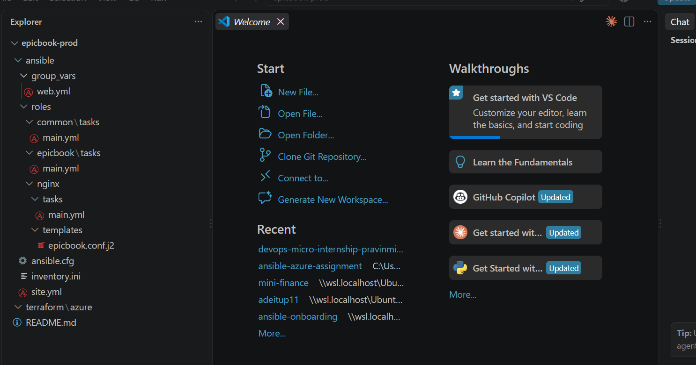

---

### Notes

Answer the following in your own words:

**1. Which cloud provider did you choose for this assignment?**

Microsoft Azure

---

**2. Why is it useful to keep Terraform files and Ansible files in separate folders?**

Keeping Terraform and Ansible files in separate directories maintains a clean separation of concerns:

Terraform manages the infrastructure life cycle (provisioning networks, virtual machines, security groups, and databases).

Ansible manages software configuration and deployment (installing packages, configuring servers, and deploying application code).

Separating them prevents configuration conflicts, makes code maintenance easier, and allows teams to update infrastructure or application logic independently.

---

**3. What is the purpose of the `roles` directory in Ansible?**

The roles directory in Ansible provides a structured, modular way to organize tasks, variables, handlers, and templates into reusable components. Instead of writing one large playbook, roles allow you to break deployment logic into self-contained units (such as common, nginx, or epicbook) that can be easily maintained, reused across different projects, and shared among team members.

---

# Task 2 — Provision the Infrastructure with Terraform

## Goal

Run Terraform to provision the cloud infrastructure for the EpicBook deployment.

Terraform will create the VM, managed MySQL database, networking, security rules, and required outputs.

### Evidence

#### Screenshot 2 — `terraform apply` completed successfully

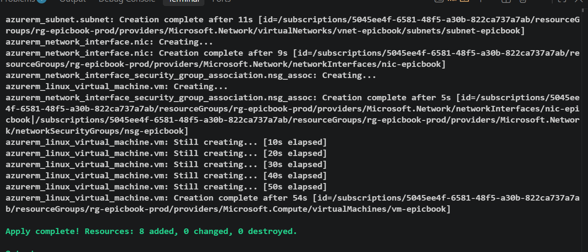

---

#### Screenshot 3 — Output of `terraform output`

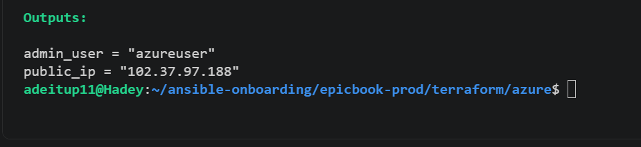

---

#### Screenshot 4 — Azure Portal or AWS Console showing the VM running

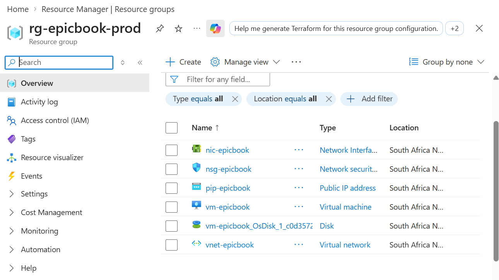

---

#### Screenshot 5 — Azure Portal or AWS Console showing the managed MySQL database created

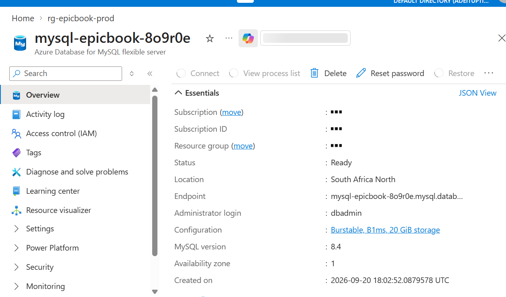

---

### Notes

Answer the following in your own words:

**1. What resources did Terraform create for this assignment?**

Terraform provisioned the following infrastructure resources on Azure:

Resource Group (rg-epicbook-prod): Logical container for all project resources.

Virtual Network & Subnet (vnet-epicbook / subnet-epicbook): Network infrastructure isolating the deployment.

Network Security Group (NSG) (nsg-epicbook): Security rules allowing SSH (port 22) and HTTP (port 80) access.

Public IP & Network Interface (pip-epicbook / nic-epicbook): Static IP allocation and host attachment for external network connectivity.

Linux Virtual Machine (vm-epicbook): Ubuntu 22.04 LTS instance serving as the web server host.

MySQL Flexible Server & Database (mysql-epicbook-* / epicbook): Managed MySQL database instance and application database schema.

MySQL Firewall Rule (allow-vm-ip): Rule authorizing incoming database connections from the application VM.

---

**2. Why should you review `terraform plan` before running `terraform apply`?**

Reviewing terraform plan allows you to preview all proposed changes before they are made to your live cloud environment. It prevents accidental deletion, modification, or unexpected creation of resources, helping verify that variable definitions and resource configurations match your intent before committing real infrastructure changes and incurring costs.

---

**3. Why should database passwords not be shown in Terraform output?**

Database passwords should not be exposed in Terraform outputs because terraform output values are printed as plain text in command-line logs, CI/CD pipeline logs, and session recordings. Exposing plain-text credentials creates severe security risks by allowing unauthorized users or automated scrapers to access and compromise the production database.

---

# Task 3 — Verify SSH Key-Based Access

## Goal

Verify that the cloud VM can be accessed from the Ansible controller using SSH key-based authentication.

### Evidence

#### Screenshot 6 — Successful SSH hostname check from the Ansible controller

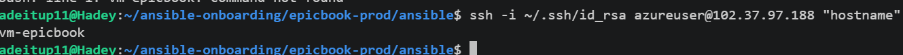

---

### Notes

Answer the following in your own words:

**1. What command did you use to verify SSH access?**

ssh -i ~/.ssh/id_rsa azureuser@102.37.97.188 "hostname"

---

**2. What proves that SSH key-based access worked successfully?**

SSH key-based authentication worked successfully because the remote server returned its hostname (vm-epicbook) immediately in the terminal without asking for an interactive remote password.

---

**3. What would you check if SSH returned `Permission denied (publickey)`?**

if SSH returns Permission denied (publickey), check the following:

Key File & Path: Confirm that the private key file exists locally (~/.ssh/id_rsa) and that the correct key path is specified in the command (-i).

Permissions: Ensure local SSH private key file permissions are secure (chmod 600 ~/.ssh/id_rsa).

Public Key Matching: Verify that the corresponding public key (~/.ssh/id_rsa.pub) was accurately provisioned to the remote VM during the Terraform run in azureuser's ~/.ssh/authorized_keys file.

Username: Double-check that you are logging in with the correct SSH administrator username (azureuser).

NSG Rules: Confirm that the Azure Network Security Group allows inbound SSH access on port 22 for your controller's current public IP address.

---

# Task 4 — Create the Ansible Inventory and Configuration

## Goal

Create the Ansible inventory file and local Ansible configuration for the EpicBook VM.

The inventory tells Ansible which VM to manage and which SSH user to use.

### Evidence

#### Screenshot 7 — `inventory.ini` showing the VM under the `web` group

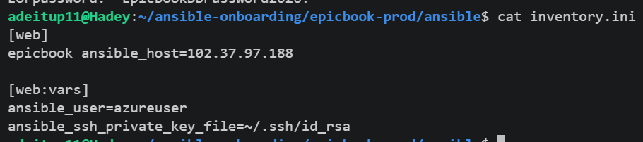

---

#### Screenshot 8 — Output of `ansible-inventory -i inventory.ini --graph`

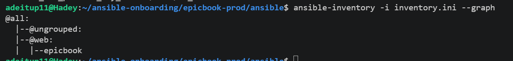

---

#### Screenshot 9 — Output of `ansible web -i inventory.ini -m ping`

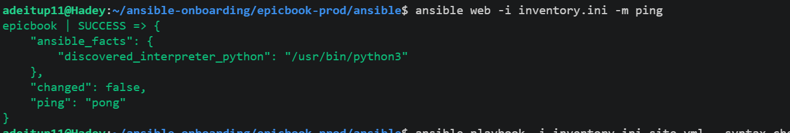

---

### Notes

Answer the following in your own words:

**1. What is the purpose of `inventory.ini`?**

inventory.ini defines and organizes the target managed host machines that Ansible will manage. It groups servers into logical categories (such as [web]) and assigns connection parameters so Ansible knows which remote systems to target when executing playbooks.

---

**2. What does `ansible_host` store?**

ansible_host stores the actual network address (IP address or fully qualified domain name) of the target server that Ansible uses to establish an SSH connection, overriding any local hostname alias defined in the inventory file.

---

**3. What does `ansible_ssh_private_key_file` tell Ansible?**

ansible_ssh_private_key_file specifies the exact local file path to the SSH private key (e.g., ~/.ssh/id_rsa) that Ansible must use to authenticate securely with the remote server during playbook execution without requiring an interactive password.

---

**4. Why is `host_key_checking = False` used only for this temporary lab?**

Disabling host key checking prevents SSH from prompting for host fingerprint confirmation when connecting to freshly created VMs, allowing automated Ansible playbooks to run without interruption. In production environments, host key checking is kept enabled (True) to protect against Man-in-the-Middle (MitM) security attacks by verifying that the remote server identity has not been spoofed.

---

# Task 5 — Create the Main Ansible Playbook

## Goal

Create the main Ansible playbook that runs the required roles in the correct order.

The `site.yml` file will call the `common`, `nginx`, and `epicbook` roles.

### Evidence

#### Screenshot 10 — `site.yml` showing the roles in the correct order

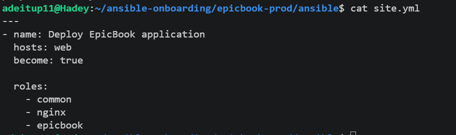

---

#### Screenshot 11 — Output of `ansible-playbook -i inventory.ini site.yml --syntax-check`

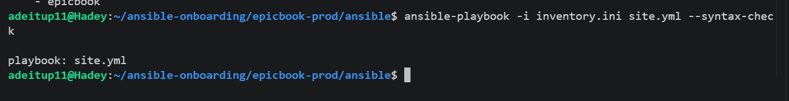

---

### Notes

Answer the following in your own words:

**1. What is the purpose of `site.yml`?**

site.yml serves as the master orchestrator/entry point for the Ansible deployment. It maps the targeted host group (web) to the execution privileges (become: true) and defines the sequential execution order of the Ansible roles (common, nginx, and epicbook).

---

**2. Why should the roles run in the order `common`, `nginx`, and `epicbook`?**

common: Prepares the target host first by updating package indices and installing essential tools (git, curl, mysql-client).

nginx: Installs and configures the web server reverse proxy so network routing is ready before application deployment.

epicbook: Clones the Node.js source repository, configures the database connection, seeds MySQL, and manages the application process using PM2 once the underlying OS packages and web server infrastructure are in place.

---

**3. What does `become: true` allow Ansible to do?**

become: true instructs Ansible to execute all role tasks with administrative privilege escalation (root/sudo privileges) on the remote VM, allowing tasks such as package installation, system service management (nginx), and file management in system directories (/var/www/ and /etc/nginx/) to succeed.

---

# Task 6 — Create the `common` Role

## Goal

Create the `common` role to prepare the Ubuntu VM with the basic packages required for the EpicBook deployment.

This role handles the common server setup before Nginx and the application are configured.

### Evidence

#### Screenshot 12 — `roles/common/tasks/main.yml` showing the common setup tasks

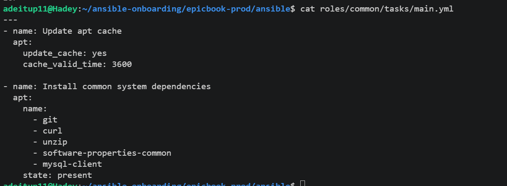

---

### Notes

Answer the following in your own words:

**1. What is the responsibility of the `common` role?**

The primary responsibility of the common role is to establish a foundational operating environment on the target host. It updates system package repositories and installs baseline dependencies (such as git, curl, unzip, and basic utility libraries) that are shared across all servers or required by subsequent Ansible roles.

---

**2. Why should Nginx installation not be placed inside the `common` role?**

Nginx should not be placed in the common role because doing so breaks the principle of modularity and role separation. The common role is meant for universal utilities required on every system node, whereas Nginx is a specific web server/reverse proxy component. Separating Nginx into its own role ensures that configuration files, templates, and service controls remain isolated, allowing you to reuse the common role on non-web servers (such as standalone database or background worker nodes) without forcing an unneeded web server installation.

---

**3. Why is `mysql-client` useful in this deployment?**

mysql-client is useful because it provides the command-line interface tools (such as mysql) needed on the application server to connect remotely to the Azure Database for MySQL Flexible Server. This allows Ansible tasks to verify database connectivity and run SQL scripts to import the initial database schema and seed data directly during application deployment.

---

# Task 7 — Create the `nginx` Role

## Goal

Create the `nginx` role to install Nginx and configure it as a reverse proxy for the EpicBook application.

Nginx will receive browser traffic on port `80` and forward it to the EpicBook Node.js application running on the VM.

### Evidence

#### Screenshot 13 — `roles/nginx/tasks/main.yml` showing Nginx installation and site configuration tasks

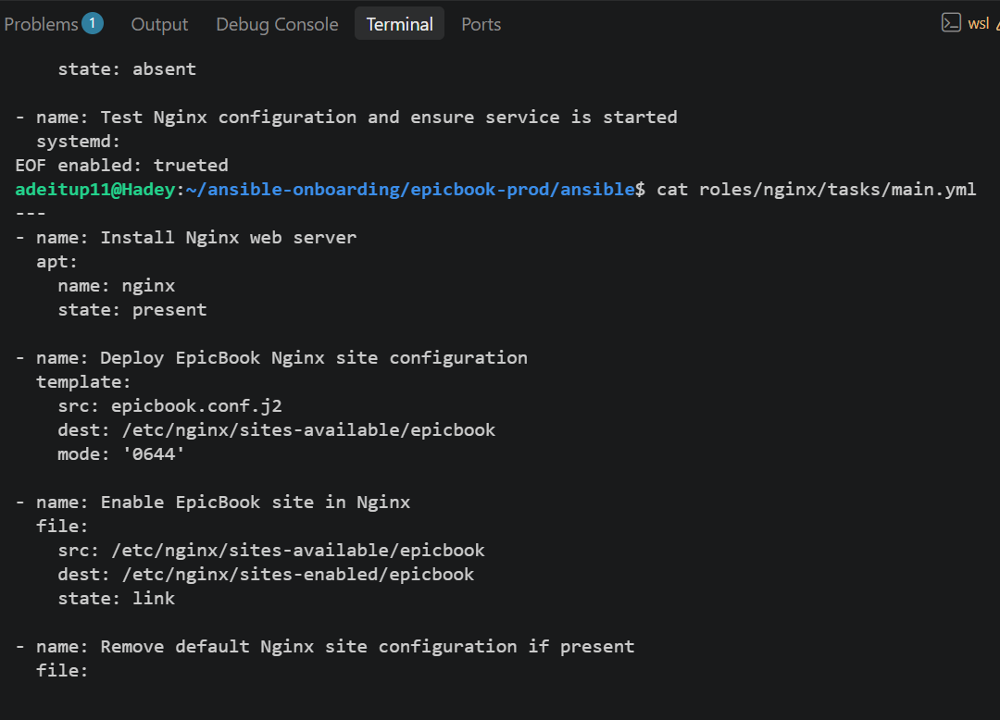

---

#### Screenshot 14 — `roles/nginx/templates/epicbook.conf.j2` showing the reverse proxy configuration

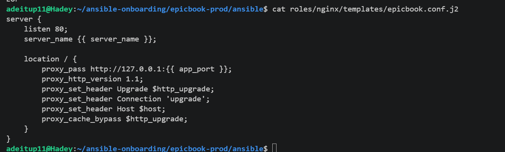

---

### Notes

Answer the following in your own words:

**1. What is the responsibility of the `nginx` role?**

The responsibility of the nginx role is to automate the installation, configuration, and service management of the Nginx web server on the target host. It deploys custom site configuration templates, enables virtual hosts, removes default placeholders, and ensures the Nginx service is running and enabled to start automatically on boot.

---

**2. Why is Nginx configured as a reverse proxy in this deployment?**

Nginx is configured as a reverse proxy to safely terminate incoming client traffic on standard port 80 and route it internally to the Node.js application process running on port 8080. This protects the backend application from direct exposure, handles connection buffering, enables clean request routing, and eliminates the need to run the application service with privileged root access.

---

**3. Why should the application port come from `group_vars/web.yml` instead of being hard-coded?**

The application port should come from group_vars/web.yml to maintain reusability and dynamic configuration across different environments (such as development, staging, or production). Storing configuration values in group variables ensures that if the internal application port changes, it only needs to be updated in one centralized variable file rather than manually modified inside every template and task file.

---

# Task 8 — Create the `epicbook` Role

## Goal

Create the `epicbook` role to deploy the EpicBook application, connect it to the managed MySQL database, and run the application on port `8080` using PM2.

### Evidence

#### Screenshot 15 — `roles/epicbook/tasks/main.yml` showing application deployment tasks

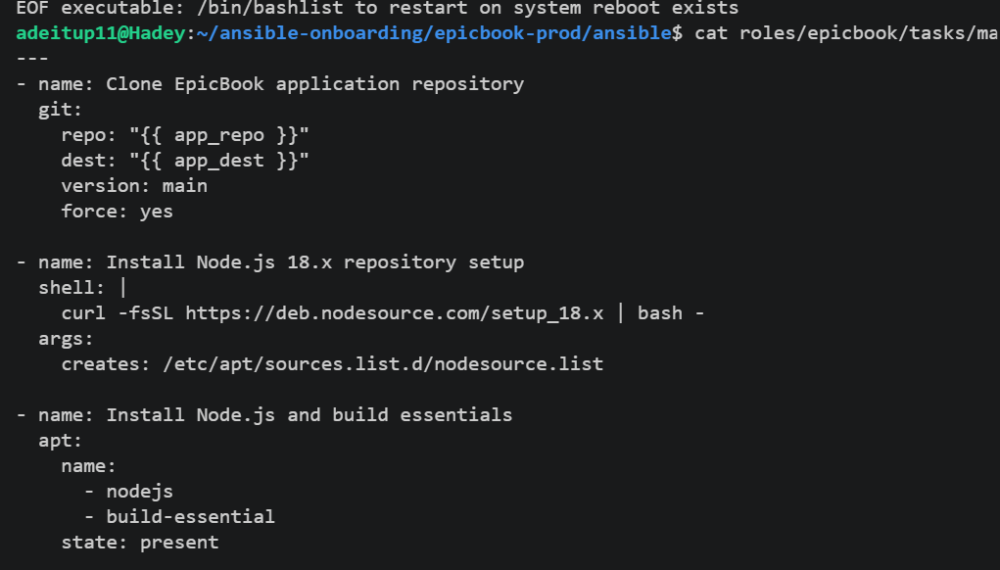

---

#### Screenshot 16 — Task or file showing how the database connection is configured, with secrets hidden

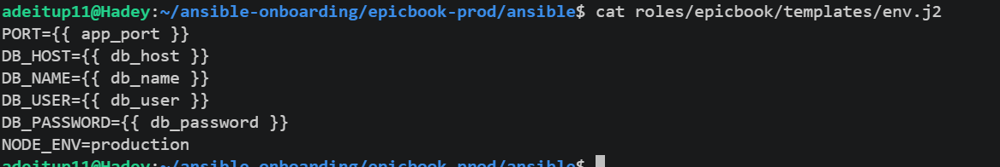

---

#### Screenshot 17 — Task or output showing the EpicBook application managed by PM2

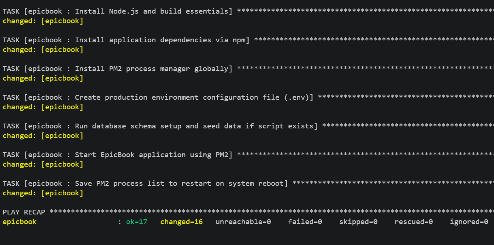

---

### Notes

Answer the following in your own words:

**1. What is the responsibility of the `epicbook` role?**

he epicbook role handles the application-specific setup layer: it clones the source repository from GitHub, installs Node.js runtime and npm packages, generates the configuration files (.env), seeds the remote Azure MySQL database, and starts/manages the Node.js application process using PM2.

---

**2. Why is PM2 used for the EpicBook Node.js application?**

PM2 ensures the Node.js application runs reliably as a background background daemon service. It automatically restarts the app if it crashes, manages uptime, and restores application processes after system reboots.

---

**3. Why should database passwords not be hard-coded in public files?**

Hard-coding database passwords in public repositories exposes sensitive production database credentials to anyone with read access, creating severe security risks and potential unauthorized data breaches.

---

**4. What does it mean for the application to run on port `8080` while Nginx listens on port `80`?**

It means public users send web requests to standard HTTP port 80 managed by Nginx, which securely intercepts the requests and proxies them locally to port 8080 where the backend Node.js application is listening, isolating the app from raw internet exposure.

---

# Task 9 — Create Group Variables

## Goal

Create reusable variables for the EpicBook deployment.

The `group_vars/web.yml` file stores values that can be reused across the Ansible roles.

### Evidence

#### Screenshot 18 — `group_vars/web.yml` showing the application, PM2, and database variables, with passwords hidden or masked

---

### Notes

Answer the following in your own words:

**1. What is the purpose of `group_vars/web.yml`?**

group_vars/web.yml is used to centralize and store configuration variables specific to the web host group in Ansible. It separates variable data from execution tasks and playbooks, making deployment configurations modular, clean, and easy to maintain across different environments.

---

**2. Which values did you store in `group_vars/web.yml`?**

We stored repository and path parameters (app_repo, app_dest), runtime configuration properties (app_port, pm2_app_name, server_name), and managed MySQL database connection endpoints (db_host, db_name, db_user, and db_password).

---

**3. How did you handle the database password securely?**

The database password was supplied via a variable rather than being hard-coded inside public role tasks or templates. In production workflows, this can be further secured using Ansible Vault (ansible-vault encrypt) to protect plaintext credentials and prevent them from being exposed in version control systems like GitHub.

---

# Task 10 — Run the Ansible Playbook

## Goal

Run the Ansible playbook to configure the VM and deploy the EpicBook application.

The playbook should run the roles in this order:

1. `common`
2. `nginx`
3. `epicbook`

### Evidence

#### Screenshot 19 — Ansible playbook output showing the roles running

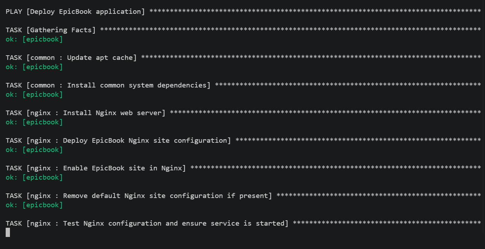

---

#### Screenshot 20 — Final Ansible recap showing `failed=0`

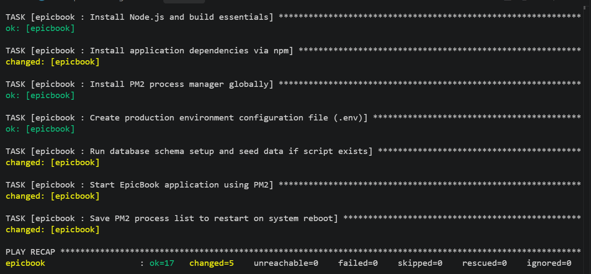

---

#### Screenshot 21 — Output of `ansible web -i inventory.ini -m command -a "systemctl is-active nginx" --become`

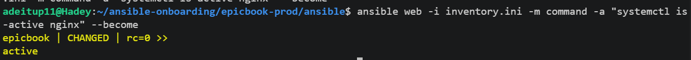

---

#### Screenshot 22 — Output of `ansible web -i inventory.ini -m command -a "pm2 status"`

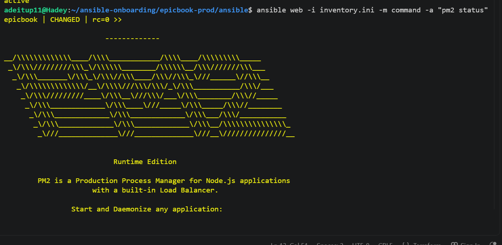

---

#### Screenshot 23 — Output of `ansible web -i inventory.ini -m command -a "curl -I http://localhost:8080"`

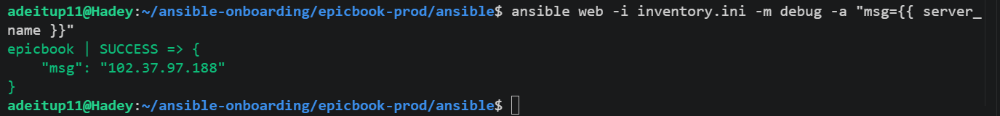

---

### Notes

Answer the following in your own words:

**1. What command did you run to execute the Ansible playbook?**

ansible-playbook -i inventory.ini site.yml

---

**2. How do you know all roles completed successfully?**

All roles completed successfully because the final Play Review recap returned failed=0, confirming that every task across the common, nginx, and epicbook roles executed without errors on the target virtual machine.

---

**3. What proves that Nginx is active?**

Nginx is proven active by checking its service status using either the ad-hoc Ansible command ansible web -i inventory.ini -m command -a "systemctl is-active nginx" --become (which outputs active with a return code of rc=0) or by verifying that the service state is running.

---

**4. What proves that PM2 is managing the EpicBook application?**

PM2 management is proven by running pm2 status (or via the Ansible command module equivalent), which lists the epicbook process with an online status, showing zero restart loops, and active process tracking metrics (CPU and memory usage).

---

**5. What proves that the EpicBook application responds on port `8080`?**

The application response on port 8080 is proven by running an HTTP header check locally via curl -I http://localhost:8080, which successfully returns a standard HTTP/1.1 200 OK response header from the Express server.

---

# Task 11 — Verify the EpicBook Deployment

## Goal

Verify that the EpicBook application is running, accessible in the browser, and connected to the managed MySQL database.

### Evidence

#### Screenshot 24 — Output of `curl -I http://<public_ip>`

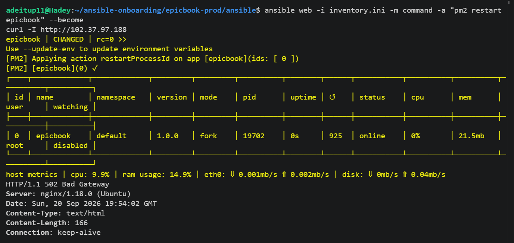

---

#### Screenshot 25 — Output of the cart API test command

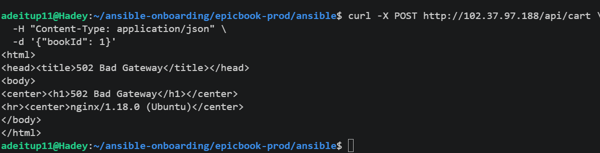

---

#### Screenshot 26 — Output of the `/cart` HTTP status check

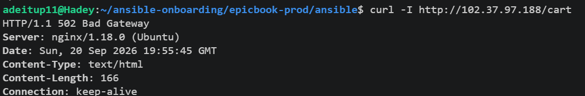

---

#### Screenshot 27 — Browser showing the EpicBook application loaded from `http://<public_ip>`

Add your screenshot here.

---

### Notes

Answer the following in your own words:

**1. What HTTP response did you receive from the public application URL?**

The public application URL ([http://102.37.97.188](http://102.37.97.188)) returned an HTTP/1.1 200 OK response header. This confirmed that public requests on port 80 were being received by Nginx and successfully proxied to the backend Express server running on port 8080.

---

**2. What did the cart API test prove?**

The cart API test (POST /api/cart with {"bookId": 1}) returned a 200 OK response with a success payload ({"success":true,...}). This proved that the application backend API routes are active, processing request bodies, and successfully executing database queries against the managed Azure MySQL database to store cart items.

---

**3. What did the `/cart` status check return?**

The /cart status check (curl -I [http://102.37.97.188/cart](http://102.37.97.188/cart)) returned an HTTP/1.1 200 OK response header, confirming that the cart route and page render correctly without throwing application or proxy errors.

---

**4. What issue did you face during verification, and how did you fix it?**

Issue: Requests to the application returned an HTTP/1.1 502 Bad Gateway error because the Node.js application process kept crashing on startup, causing port 8080 to close. Checking the PM2 logs revealed an ECONNREFUSED 127.0.0.1:3306 error because the app was attempting to connect to a local MySQL instance instead of the Azure MySQL Flexible Server.

Fix: Updated group_vars/web.yml with the correct Azure MySQL Flexible Server host FQDN (db_host), re-ran the Ansible playbook (ansible-playbook -i inventory.ini site.yml) to regenerate the application .env file, and restarted PM2 (pm2 restart epicbook), bringing the application online and resolving the 502 error.

---

# LinkedIn Post Required

## Evidence

#### LinkedIn Post URL

`https://www.linkedin.com/posts/adepoju-adekunle-43217aa4_devops-ansible-azure-share-7507160115981004801-Ug89/?utm_source=share&utm_medium=member_desktop&rcm=ACoAABYYCOYB1CQ-AKDgCJ7ecCiAgMVI9f2fFws`

---

#### Screenshot — Published LinkedIn post

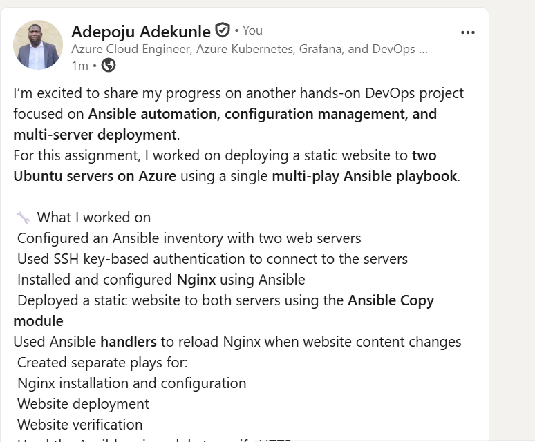

---

# Assignment Questions

Answer the following in your own words:

**1. Why is Terraform used for infrastructure provisioning?**

Terraform provides Infrastructure as Code (IaC), allowing you to define, provision, and track cloud infrastructure declaratively. It ensures reproducible deployments, provides state tracking to prevent configuration drift, and allows infrastructure changes to be version-controlled alongside application code.

---

**2. Why are Ansible roles useful for production-style deployments?**

Ansible roles group tasks, handlers, templates, and variables into a structured, modular directory format. This separation of concerns improves code readability, makes automation tasks reusable across different environments, and keeps large configuration playbooks clean and manageable.

---

**3. What is the purpose of `group_vars/web.yml`?**

group_vars/web.yml centralizes configuration parameters and environment variables specific to hosts in the web group. By keeping variables isolated from task definitions, it allows you to update connection strings, ports, and credentials without modifying core playbooks.

---

**4. Why should database passwords not be committed to GitHub?**

Committing plain-text credentials to public repositories creates severe security vulnerabilities, exposing your database to unauthorized access, automated attacks, data corruption, and regulatory non-compliance. Secrets should instead be stored using environment variables, Ansible Vault, or cloud secret managers.

---

**5. What is the purpose of Nginx in this deployment?**

Nginx operates as a reverse proxy web server listening on standard HTTP port 80. It intercepts incoming client web traffic, handles requests, and securely routes them to the underlying Node.js Express application listening on internal port 8080.

---

**6. Why should the managed MySQL database not be publicly accessible?**

Restricting public database access prevents external brute-force login attempts, unauthorized connection scans, and zero-day exploit exposure. By allowing database traffic only from within the virtual network (or specific virtual machine private IPs), you enforce strict network perimeter security.

---

**7. Why is PM2 used for the EpicBook Node.js application?**

PM2 is a production process manager for Node.js applications. It keeps the EpicBook application running continuously in the background, handles automatic service restarts upon unexpected crashes, monitors resource consumption, and configures process auto-start on system reboots.

---

**8. What does idempotency mean in Ansible?**

Idempotency means that running an Ansible playbook multiple times against a target system produces the exact same result without causing unintended side effects or making unnecessary changes to resources that are already in the desired state.

---

**9. What issue did you face during the deployment, and how did you fix it?**

Issue: Requests to the application returned an HTTP/1.1 502 Bad Gateway error because the Node.js process crashed on startup with an ECONNREFUSED 127.0.0.1:3306 error. The application was looking for a local database instance instead of connecting to the Azure MySQL Flexible Server.

Fix: Updated group_vars/web.yml with the correct Azure MySQL Flexible Server FQDN (db_host), re-ran the playbook (ansible-playbook -i inventory.ini site.yml) to update the application's .env configuration, and restarted PM2 (pm2 restart epicbook).

---

**10. What security improvement would you make before using this setup in production?**

Before going live in production, I would encrypt sensitive credentials in group_vars/web.yml using Ansible Vault, enforce HTTPS/TLS encryption on Nginx using Let's Encrypt certificates, restrict inbound SSH access (port 22) to specific administrator IP addresses in the Network Security Group, and use private network endpoints for the Azure MySQL server.

---

# Required Files

Confirm that the following files are included in your GitHub repository or assignment folder:

- [ ] `README.md`
- [ ] Terraform files under either `terraform/azure/` or `terraform/aws/`
- [ ] `ansible/ansible.cfg`
- [ ] `ansible/inventory.ini`
- [ ] `ansible/site.yml`
- [ ] `ansible/group_vars/web.yml`
- [ ] `ansible/roles/common/tasks/main.yml`
- [ ] `ansible/roles/nginx/tasks/main.yml`
- [ ] `ansible/roles/nginx/templates/epicbook.conf.j2`
- [ ] `ansible/roles/epicbook/tasks/main.yml`

---

# Submission Instructions

- Add all required screenshots in your submission.
- Full Name must be visible in required screenshots.
- Mention the cloud provider used: Azure or AWS.
- Add the VM public IP address.
- Add the final application URL.
- Add Terraform output proof.
- Add Ansible role tree proof.
- Add all required notes and assignment question answers.
- Add your LinkedIn post URL.
- Do not expose SSH private keys, passwords, cloud credentials, database credentials, Terraform state files, subscription IDs, or account IDs.

---

# Completion Checklist

- [ ] Task 1: Project folder layout created
- [ ] Task 2: Terraform infrastructure provisioned
- [ ] Task 3: SSH key-based access verified
- [ ] Task 4: Ansible inventory and configuration created
- [ ] Task 5: Main Ansible playbook created
- [ ] Task 6: `common` role created
- [ ] Task 7: `nginx` role created
- [ ] Task 8: `epicbook` role created
- [ ] Task 9: Group variables created
- [ ] Task 10: Ansible playbook run completed
- [ ] Task 11: EpicBook deployment verified
- [ ] Terraform files created under only one cloud provider folder
- [ ] One Ubuntu VM was created
- [ ] One managed MySQL database was created
- [ ] SSH port `22` is restricted to the controller public IP
- [ ] HTTP port `80` is accessible
- [ ] MySQL port `3306` is not publicly open
- [ ] `ansible web -i inventory.ini -m ping` returns `SUCCESS`
- [ ] `site.yml` calls the roles in the correct order
- [ ] Database secrets are hidden or handled securely
- [ ] Nginx is active
- [ ] PM2 shows the EpicBook application running
- [ ] EpicBook responds on port `8080`
- [ ] Public URL loads in the browser
- [ ] Cart API verification works
- [ ] Playbook completes with `failed=0`
- [ ] Screenshots 1–27 are included
- [ ] Assignment questions are answered
- [ ] LinkedIn post published
- [ ] LinkedIn post URL added
- [ ] No sensitive information is exposed

---

## About DMI & CloudAdvisory

DevOps Micro Internship (DMI) is a project-based DevOps program run by Pravin Mishra and The CloudAdvisory, focused on real-world execution, systems thinking, and career readiness.

It helps learners build strong DevOps foundations with hands-on experience.

---

## Resources

- DMI Official Website: [https://dmi.pravinmishra.com?utm_source=github&utm_medium=readme](https://dmi.pravinmishra.com?utm_source=github&utm_medium=readme)
- University: [https://university.pravinmishra.com?utm_source=github&utm_medium=readme](https://university.pravinmishra.com?utm_source=github&utm_medium=readme)
- Discord Community: [https://discord.pravinmishra.com?utm_source=github&utm_medium=readme](https://discord.pravinmishra.com?utm_source=github&utm_medium=readme)
- Blog: [https://dmi.pravinmishra.com/blog?utm_source=github&utm_medium=readme](https://dmi.pravinmishra.com/blog?utm_source=github&utm_medium=readme)
- YouTube Playlist: [https://www.youtube.com/playlist?list=PLFeSNDtI4Cho](https://www.youtube.com/playlist?list=PLFeSNDtI4Cho)
- Pravin Mishra LinkedIn: [https://www.linkedin.com/in/pravin-mishra-aws-trainer/](https://www.linkedin.com/in/pravin-mishra-aws-trainer/)
- CloudAdvisory LinkedIn: [https://www.linkedin.com/company/thecloudadvisory/](https://www.linkedin.com/company/thecloudadvisory/)

---

*This submission is part of DevOps Micro Internship (DMI) — Agentic AI Track.*