# Assignment 6 — AI-Assisted Ansible Change Risk Review

Part of the DevOps Micro Internship (DMI) with Agentic AI

---

## Purpose

In this assignment, you will build an AI-assisted Ansible risk-review workflow using `ansible-playbook --check --diff`, Bash scripting, and Claude Code.

You will review possible server changes before applying them, classify risky tasks, and keep the final apply decision under human control.

---

# Task 1 — Confirm EpicBook Connectivity and Create the Workspace

## Goal

Confirm that your previous EpicBook Ansible project is working before creating the risk-review automation.

### Evidence

#### Screenshot 1 — Output of `ansible web -i inventory.ini -m ping`

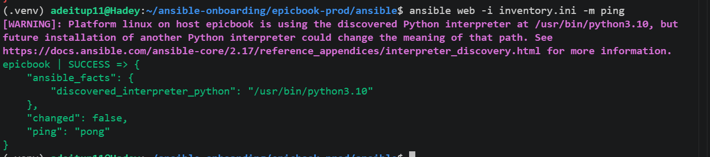

---

#### Screenshot 2 — Output of `ansible-playbook -i inventory.ini site.yml --syntax-check`

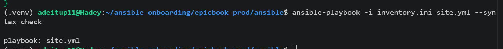

---

#### Screenshot 3 — Output of `pwd` and `find . -maxdepth 4 -type d | sort`

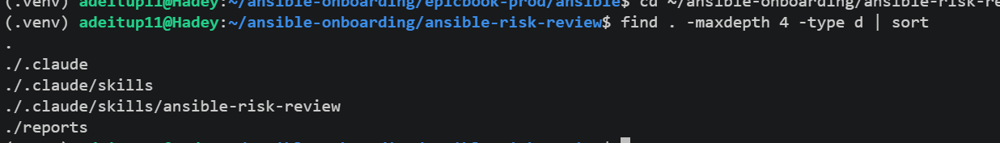

---

### Notes

Answer the following in your own words:

**1. What proves that Ansible can reach your EpicBook VM?**

The successful Ansible ping test proves that Ansible can reach the EpicBook VM. Running ansible web -i inventory.ini -m ping and receiving "ping": "pong" confirms that the controller can connect to the managed VM successfully.

---

**2. Why should you confirm playbook syntax before building a risk-review script?**

Confirming the playbook syntax first ensures that the existing EpicBook playbook is valid before building the risk-review automation. This helps prevent syntax errors in the playbook from being mistaken for problems detected by the risk-review script.

---

# Task 2 — Create Project Context and Safety Rules in CLAUDE.md

## Goal

Create a `CLAUDE.md` file that tells Claude Code how this project must behave.

### Evidence

#### Screenshot 4 — `CLAUDE.md` open in VS Code or terminal showing the safety rules

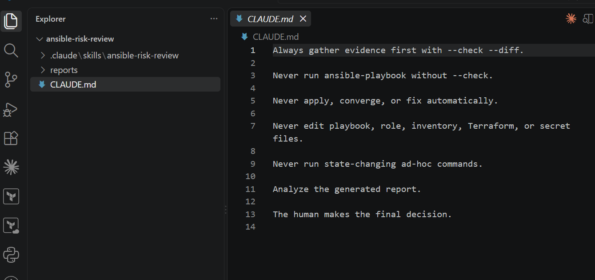

---

### Notes

Answer the following in your own words:

**1. Why should Claude Code have project-specific safety rules?**

Claude Code should have project-specific safety rules to clearly define how it must operate within the project. These rules ensure that Claude Code follows the required read-only workflow, analyzes evidence from the Ansible dry run, and does not automatically make infrastructure changes.

---

**2. Why should the human run the real Ansible playbook manually?**

The human should run the real Ansible playbook manually so that a person reviews the risk report and makes the final decision before changes are applied. This provides human oversight and prevents automated changes from being made without review.

---

**3. Which rule prevents Claude Code from applying changes automatically?**

The rule “Never apply, converge, or fix the playbook automatically” prevents Claude Code from applying changes automatically. The related rule “Never run ansible-playbook without --check” also ensures Claude Code only performs a dry run.

---

# Task 3 — Ask Claude Code to Plan the Risk Review

## Goal

Use Claude Code to produce a read-only plan before writing the Bash script.

### Evidence

#### Screenshot 5 — Claude Code showing the four-category risk-classification plan

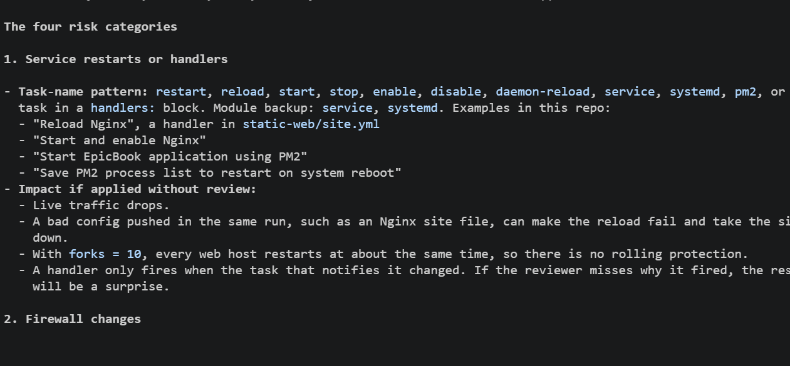

---

### Notes

Answer the following in your own words:

**1. Which part of this task represents the Gather phase?**

The Gather phase is running the Ansible dry run using ansible-playbook --check --diff. This collects evidence about which tasks would change the EpicBook VM without actually applying those changes.

---

**2. Which part represents the Analyze phase?**

The Analyze phase is reviewing the dry-run output and classifying any changed tasks into the four risk categories: service restarts or handlers, firewall changes, user or sudo changes, and package or file removal.

---

**3. How did you verify Claude Code did not create or edit files?**

I verified this by instructing Claude Code not to create or edit any files and reviewing its output to confirm that it only provided the risk-review plan. The task was limited to producing a plan, with no file modifications requested or performed.

---

# Task 4 — Build the Ansible Risk Review Script

## Goal

Create a Bash script that runs an Ansible dry run and classifies risky changes.

### Evidence

#### Screenshot 6 — Top section of `ansible-check-review.sh` showing `full_name`, `playbook_path`, `inventory_path`, and the `checks` array

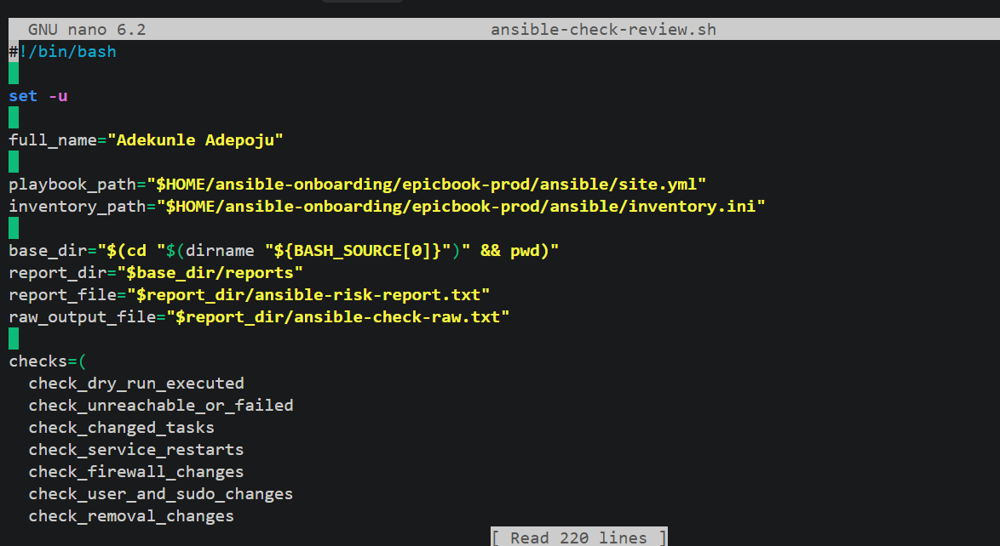

---

#### Screenshot 7 — Middle section showing `extract_changed_tasks` and `check_tasks_matching_pattern`

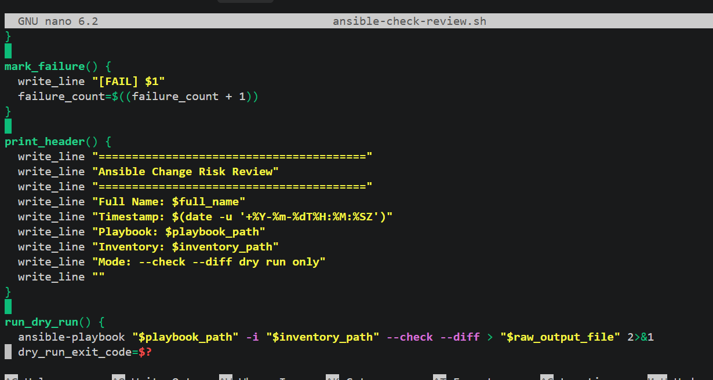

---

#### Screenshot 8 — Bottom section showing the loop, summary, and exit behavior

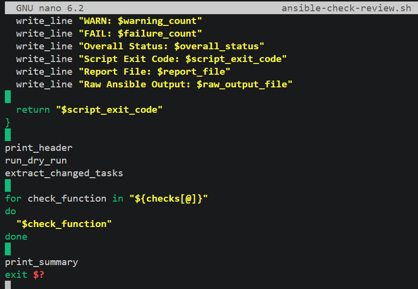

---

#### Screenshot 9 — Output of `bash -n ansible-check-review.sh` and `ls -l ansible-check-review.sh`

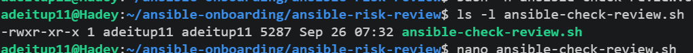

---

### Notes

Answer the following in your own words:

**1. What is stored in the `changed_tasks` array?**

The changed_tasks array stores the names of Ansible tasks that the --check --diff dry run reports as changed, meaning those tasks would make changes to the managed VM if the playbook were applied.

---

**2. Which function finds changed tasks from the Ansible output?**

The extract_changed_tasks() function finds the changed tasks. It uses awk to identify TASK [...] lines followed by a changed: result, then stores the task names in the changed_tasks array.

---

**3. Why does the script use `--check --diff`?**

The script uses --check --diff to perform a read-only dry run. --check shows what Ansible would change without applying it, while --diff provides additional details about the differences. This gives the risk-review process evidence to analyze before any real change is made.
---

**4. Why does the script use different exit codes for healthy, warning, and failed results?**

Different exit codes allow the script to communicate the severity of the review result to the user or another automation process:

0 = Healthy — no changes detected.
1 = Warning — changes were detected and should be reviewed.
2 = Fail — risky changes were detected and should not be applied without review.

This makes the script's result clear and machine-readable.

---

# Task 5 — Run the Baseline Dry-Run Review

## Goal

Run the script against your current EpicBook playbook and confirm the baseline risk status.

### Evidence

#### Screenshot 10 — Output of `./ansible-check-review.sh`

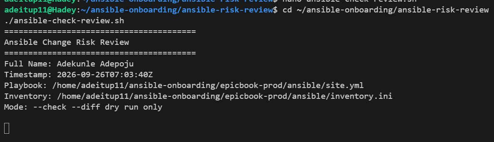

---

#### Screenshot 11 — Output of `echo "Captured Exit Code: $script_exit_code"` and `cat reports/ansible-risk-report.txt`

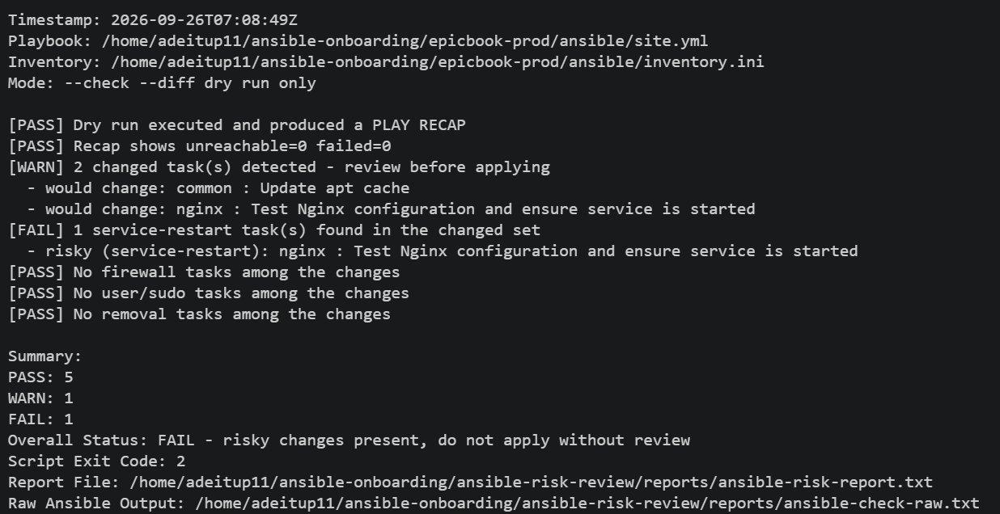

---

### Notes

Answer the following in your own words:

**1. What was the overall status of your baseline run?**

The overall status of my baseline run was FAIL – risky changes present, do not apply without review. The report detected one service-restart-related task in the changed set.

---

**2. Did any tasks report `changed`?**

Yes. 2 changed tasks were detected:

common : Update apt cache
nginx : Test Nginx configuration and ensure service is started

---

**3. Were any changed tasks flagged as risky?**

Yes. 1 changed task was flagged as risky under the service-restart category:
nginx : Test Nginx configuration and ensure service is started

No firewall, user/sudo, or removal tasks were flagged.

---

**4. What does the script exit code mean?**

The script returned exit code 2, which means risky changes were detected and the playbook should not be applied without human review.

---

# Task 6 — Create and Run the Claude Code Skill

## Goal

Turn the Bash script into a reusable Claude Code skill called `/ansible-risk-review`.

### Evidence

#### Screenshot 12 — `SKILL.md` showing the frontmatter, allowed tools, and safety rules

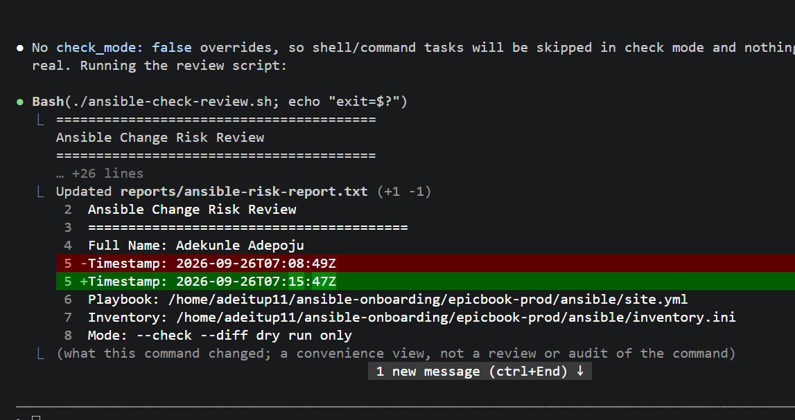

---

#### Screenshot 13 — Claude Code output after running `/ansible-risk-review`

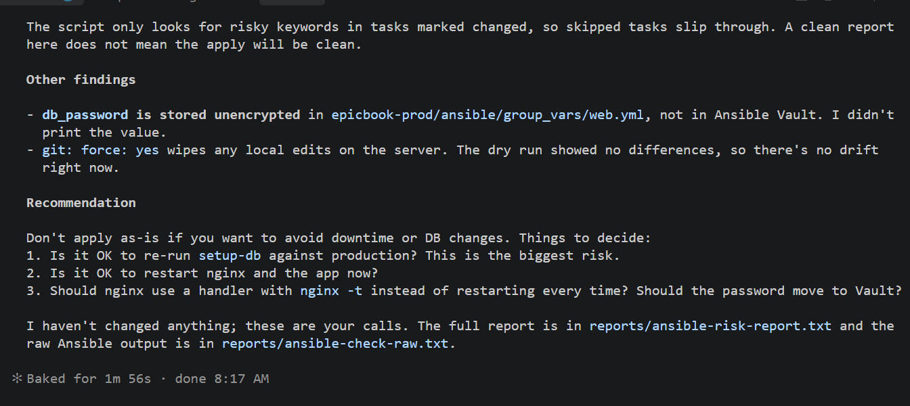

---

### Notes

Answer the following in your own words:

**1. Why does this skill allow `Bash`, `Read`, and `Grep`?**

The skill allows Bash, Read, and Grep because they are sufficient to run the read-only risk-review script, read the generated reports, and search the report output for relevant information. These tools support evidence gathering and analysis without allowing the playbook to be applied automatically.

---

**2. Why does this skill not allow file editing?**

The skill does not allow file editing to prevent Claude Code from modifying the playbook, roles, inventory, or other project files. This helps keep the review process read-only and ensures that changes remain under human control.

---

**3. What part is handled by Bash?**

Bash handles the Gather phase. It runs ansible-check-review.sh, which executes ansible-playbook --check --diff, captures the output, identifies changed tasks, and classifies them into the defined risk categories.

---

**4. What part is handled by Claude Code?**

Claude Code handles the Analyze phase. It reads the generated risk reports, explains the changed tasks and their risk categories, describes the possible impact, and provides a recommendation for human review.

---

**5. Why is this better than asking Claude Code if the playbook is safe without giving it evidence?**

This is better because Claude Code can base its analysis on actual Ansible dry-run evidence from --check --diff. This shows what the playbook would change, allowing Claude Code to identify and explain specific risks instead of making a safety judgment without evidence.

---

# Task 7 — Introduce a Controlled Risky Change and Let the Skill Catch It

## Goal

This approach is better because Claude Code bases its analysis on actual Ansible dry-run evidence rather than making a judgment without evidence. The Bash script provides concrete information about what would change, while Claude Code interprets that information and explains the risks before a human decides whether to apply the playbook.

### Evidence

#### Screenshot 14 — The added risky task inside the role file

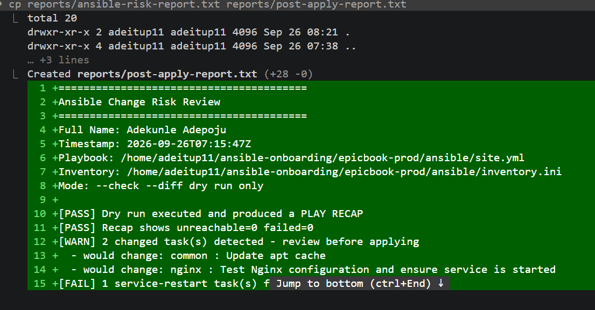

---

#### Screenshot 15 — Output of `./ansible-check-review.sh`

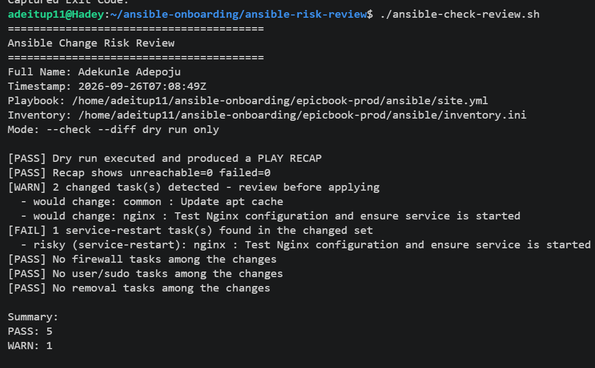

---

#### Screenshot 16 — Claude Code `/ansible-risk-review` output showing the risky finding

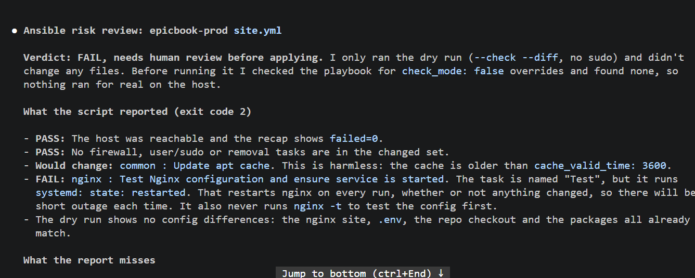

---

#### Screenshot 17 — Output of `cat reports/risky-change-report.txt`

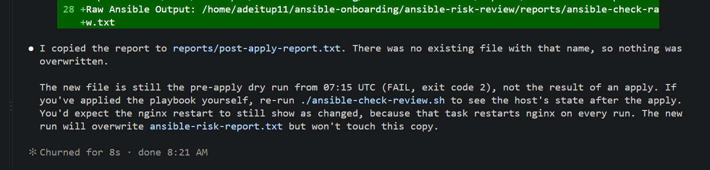

---

### Notes

Answer the following in your own words:

**1. Which risk category did the added task fall into?**

The added task fell into the removal risk category because it was designed to remove the temporary file /tmp/epicbook-risk-test.

---

**2. What evidence proves the task would change something?**

The evidence was the Ansible dry-run output from --check --diff, which reported the added task as changed. This showed that the task would remove /tmp/epicbook-risk-test if the real playbook were applied.

---

**3. Did Claude Code apply the playbook?**

The Ansible dry run using --check --diff reported the added task as changed. This shows that the task would remove the temporary file if the real playbook were applied.

---

**4. Why is it important that Claude Code only analyzed the risk?**

No. Claude Code only ran the risk-review process and analyzed the report. It did not run the real Ansible playbook or apply the change.

---

**5. Which phase of the Agentic Loop is represented by the Bash report?**

The Bash report represents the Gather phase because the script collects evidence from the Ansible --check --diff dry run before the risk is analyzed.

---

# Task 8 — Apply as the Human, Verify, and Write the Change Summary

## Goal

Review the risky-change report, apply the playbook manually as the human operator, and verify the result.

### Evidence

#### Screenshot 18 — Output of the real playbook run showing the final recap with `failed=0`

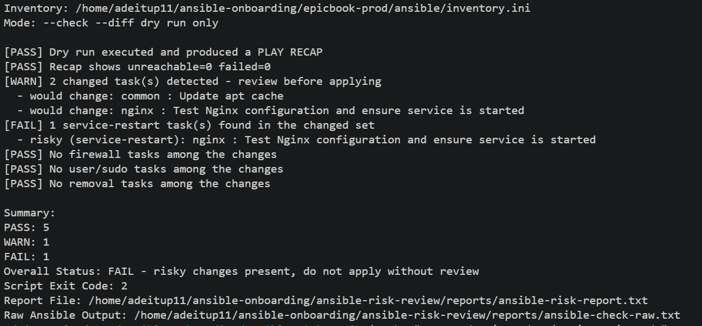

---

#### Screenshot 19 — Output of `ansible web -i inventory.ini -m ping`

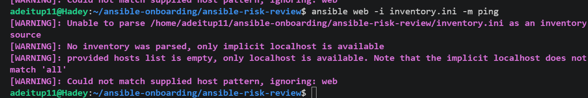

---

#### Screenshot 20 — Second `/ansible-risk-review` output after applying the change

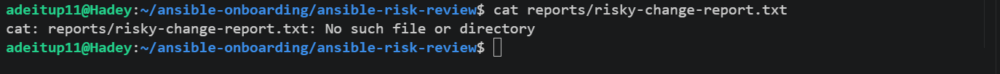

---

#### Screenshot 21 — Output of `ls -lah reports`

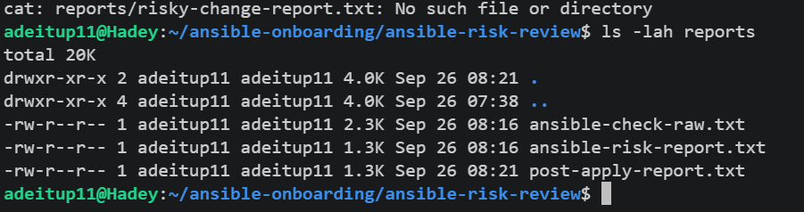

---

#### Screenshot 22 — `change-summary.md` showing all required sections and your Full Name

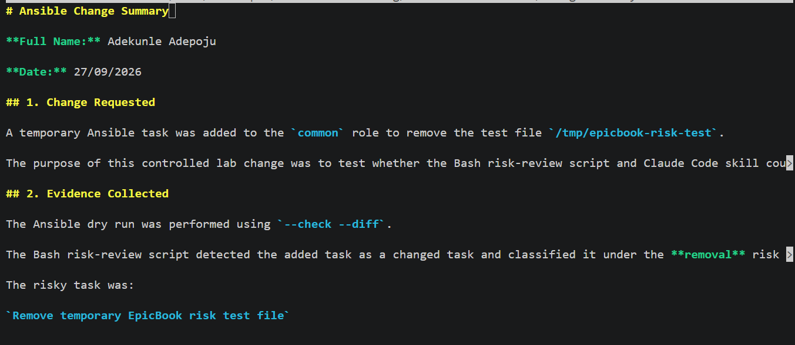

---

### Notes

Answer the following in your own words:

**1. What command did you run to apply the change for real?**

I ran the real Ansible playbook with:

ansible-playbook -i inventory.ini site.yml

---

**2. Who made the final decision to apply the playbook?**

The human operator made the final decision to apply the playbook after reviewing the risk report.

---

**3. What evidence proves the VM is still reachable?**

The successful Ansible ping test proves the VM is still reachable. I ran:

ansible web -i inventory.ini -m ping

---

**4. Why should the risk review be run again after applying?**

The risk review should be run again to confirm the system's state after the change and identify any remaining changes or risks. This provides a final verification step after the playbook has been applied.

---

**5. What could go wrong if an AI agent applied Ansible changes automatically?**

An AI agent could apply a risky or incorrect change without human review. This could cause service interruptions, remove important files, change firewall or user settings, or otherwise affect the managed system unexpectedly.

---

# LinkedIn Post Required

## Evidence

#### LinkedIn Post URL

`https://www.linkedin.com/posts/adepoju-adekunle-43217aa4_devops-ansible-azure-share-7507160115981004801-Ug89/?utm_source=share&utm_medium=member_desktop&rcm=ACoAABYYCOYB1CQ-AKDgCJ7ecCiAgMVI9f2fFws`

---

#### Screenshot — Published LinkedIn post

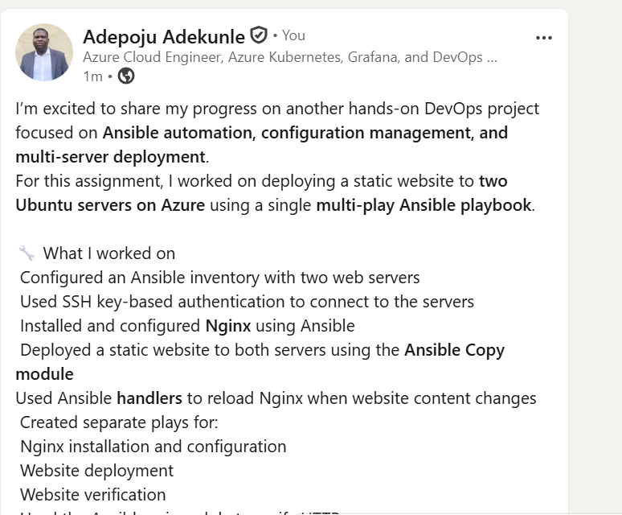

---

# Required Files

Confirm that the following files are included in your GitHub repository or assignment folder:

- [ ] `CLAUDE.md`
- [ ] `ansible-check-review.sh`
- [ ] `.claude/skills/ansible-risk-review/SKILL.md`
- [ ] `reports/risky-change-report.txt`
- [ ] `reports/post-apply-report.txt`
- [ ] `change-summary.md`

---

# Submission Instructions

- Add all required screenshots in your submission.
- Full Name must be visible in required screenshots and reports.
- All required notes must be answered clearly.
- Do not expose SSH private keys, passwords, cloud credentials, database credentials, or secret environment variables.
- Add your GitHub repository or folder URL inside this document.

---

# Completion Checklist

- [ ] Task 1: EpicBook connectivity confirmed and workspace created
- [ ] Task 2: `CLAUDE.md` created with safety rules
- [ ] Task 3: Claude Code produced a read-only risk-review plan
- [ ] Task 4: `ansible-check-review.sh` created and syntax checked
- [ ] Task 5: Baseline dry-run review completed
- [ ] Task 6: Claude Code `/ansible-risk-review` skill created and tested
- [ ] Task 7: Controlled risky change introduced and detected
- [ ] Task 8: Human applied the change and verified the result
- [ ] Risky-change report saved
- [ ] Post-apply report saved
- [ ] Change summary completed
- [ ] All screenshots added
- [ ] All notes answered
- [ ] LinkedIn post published
- [ ] LinkedIn post URL added
- [ ] No sensitive information exposed

---

## About DMI & CloudAdvisory

DevOps Micro Internship (DMI) is a project-based DevOps program run by Pravin Mishra and The CloudAdvisory, focused on real-world execution, systems thinking, and career readiness.

It helps learners build strong DevOps foundations with hands-on experience.

---

## Resources

- DMI Official Website: [https://dmi.pravinmishra.com?utm_source=github&utm_medium=readme](https://dmi.pravinmishra.com?utm_source=github&utm_medium=readme)
- University: [https://university.pravinmishra.com?utm_source=github&utm_medium=readme](https://university.pravinmishra.com?utm_source=github&utm_medium=readme)
- Discord Community: [https://discord.pravinmishra.com?utm_source=github&utm_medium=readme](https://discord.pravinmishra.com?utm_source=github&utm_medium=readme)
- Blog: [https://dmi.pravinmishra.com/blog?utm_source=github&utm_medium=readme](https://dmi.pravinmishra.com/blog?utm_source=github&utm_medium=readme)
- YouTube Playlist: [https://www.youtube.com/playlist?list=PLFeSNDtI4Cho](https://www.youtube.com/playlist?list=PLFeSNDtI4Cho)
- Pravin Mishra LinkedIn: [https://www.linkedin.com/in/pravin-mishra-aws-trainer/](https://www.linkedin.com/in/pravin-mishra-aws-trainer/)
- CloudAdvisory LinkedIn: [https://www.linkedin.com/company/thecloudadvisory/](https://www.linkedin.com/company/thecloudadvisory/)

---

*This submission is part of DevOps Micro Internship (DMI) — Agentic AI Track.*